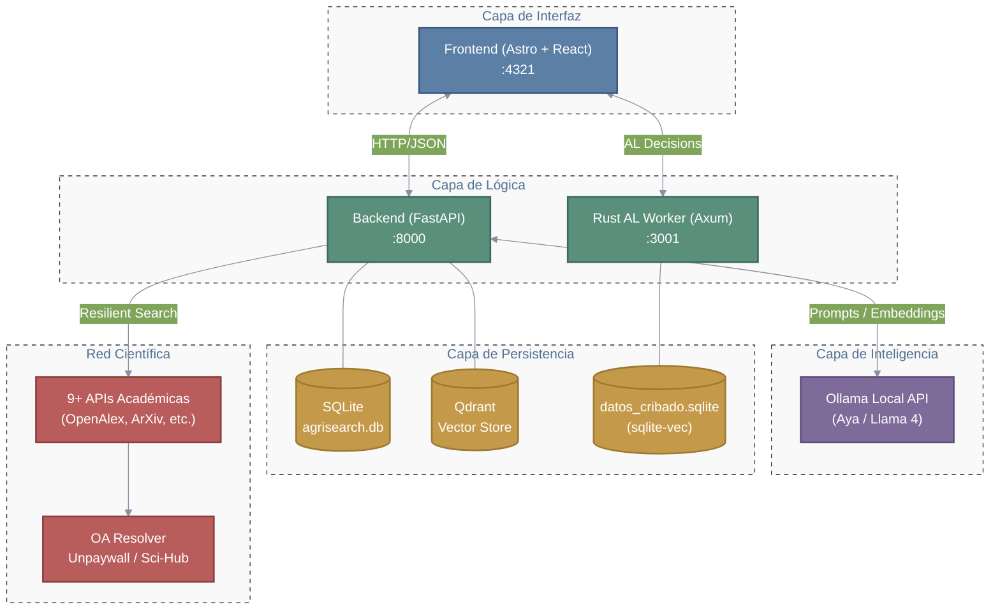
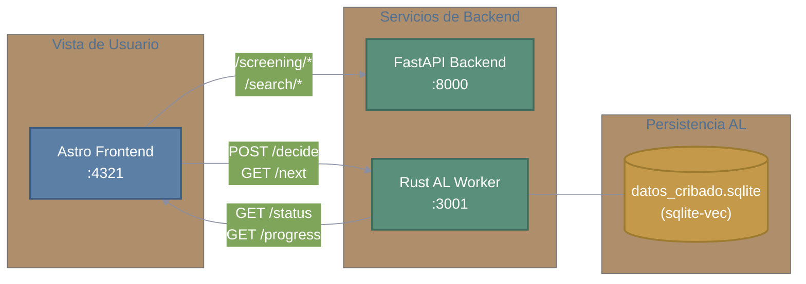

# AgriSearch 🌱

**AgriSearch** es una plataforma de **Búsqueda Sistemática y Asistente de Investigación Agrícola** diseñada para automatizar, agilizar y optimizar las fases de revisión bibliográfica y extracción de datos en investigaciones académicas, basándose estrictamente en las directrices de reporte **PRISMA 2020**.

El sistema integra **9 Bases de Datos Científicas** y Modelos de Lenguaje Grandes (LLMs) (vía Ollama/LiteLLM) en Arquitecturas de Generación Aumentada por Recuperación (RAG).

---

## Arquitectura General

AgriSearch se organiza en **4 capas principales**:

| Capa | Tecnología | Puerto |
|------|------------|--------|
| **Frontend** | Astro + React + TypeScript + Tailwind | 4321 |
| **Backend** | FastAPI + Python + SQLAlchemy Async | 8000 |
| **Active Learning** | Rust + Axum + Tokio + linfa | 3001 |
| **Procesamiento IA** | Ollama Local + LiteLLM | — |
| **Almacenamiento** | SQLite + Qdrant (vectorial) | — |



---

## Bases de Datos Integradas

| Base | Tipo | API Key | Acceso |
|------|------|---------|--------|
| OpenAlex | REST | Opcional (gratis) | [openalex.org](https://openalex.org/settings/api) |
| Semantic Scholar | REST | Opcional (gratis) | [semanticscholar.org](https://www.semanticscholar.org/product/api) |
| ArXiv | Atom/REST | No | — |
| Crossref | REST (`habanero`) | No (email recomendado) | — |
| CORE | REST v3 | Sí (gratis) | [core.ac.uk](https://core.ac.uk/api-keys/register) |
| SciELO | REST | No | — |
| Redalyc | REST | Sí (gratis) | [redalyc.org](https://redalyc.org) |
| AgEcon Search | OAI-PMH | No | — |
| Organic Eprints | OAI-PMH | No | — |

> 📌 Ver `backend/.env.example` para instrucciones de registro y configuración.

---

## Ciclo de Vida de una Revisión Sistemática (PRISMA 2020)

### Fase 1: Identificación

1. **Describir** — El usuario describe su tema en lenguaje natural.
2. **Elegir Modelo** — Selecciona un modelo LLM optimizado para su hardware.
3. **Extraer conceptos** — Un LLM local (Ollama) extrae conceptos clave, sinónimos AGROVOC y desglose PICO.
4. **Construir queries** — Un módulo determinista (`query_builder.py`) genera la query óptima para cada API.
5. **Buscar en paralelo** — Las queries se ejecutan concurrentemente contra las 9 bases de datos.
6. **Deduplicar** — Se eliminan duplicados por DOI exacto y título (fuzzy matching ≥85% con RapidFuzz).

### Fase 2: Recolección

7. **Extracción Open Access** — Unpaywall interviene resolviendo URLs ausentes para registros con DOI.
8. **Descarga PDFs** — Descarga automática de repositorios con rate-limiting. Si la descarga falla, interviene Sci-Hub (a petición manual).
9. **Parseo Dual-Parser** — Strata Reader (PDFs científicos, benchmark #1) + MarkItDown (DOCX, PPTX, HTML).
10. **Enriquecimiento LLM** — Extracción de metadatos, metodología, variables agrícolas y descripción VLM de figuras.

### Fase 3: Cribado

10. **Screening Interactivo** — Interfaz estilo Rayyan.ai con atajos de teclado, traducción de abstracts y sugerencias AI.
11. **Active Learning** — Microservicio Rust (Axum + linfa) con redes prototípicas (cold start) y clasificador lineal. Re-entrenamiento asíncrono cada 10 decisiones. Latencia <5ms.

### Fase 4: Análisis

12. **Indexación RAG** — Chunking semántico por secciones + embeddings nomic-embed-text → Qdrant.
13. **Chat RAG** — Conversación multi-documento con citación APA estricta.

---

## Tecnologías Principales

| Componente | Tecnología |
|------------|------------|
| **Frontend** | Astro (SSR Híbrido), React, TypeScript, Tailwind CSS |
| **Backend** | FastAPI (Python 3.12), SQLAlchemy Async, aiosqlite |
| **Active Learning** | Rust 1.95, Axum 0.8, Tokio, linfa, rusqlite + sqlite-vec |
| **Parsing PDF** | Strata Reader (artículos científicos), MarkItDown (multi-formato) |
| **IA** | LiteLLM, Ollama, Qdrant (vectorial local) |
| **Búsqueda** | MCP Clients para 9 APIs científicas |
| **Gestión Python** | [uv](https://docs.astral.sh/uv/) (recomendado) o pip |

---

## Estructura del Proyecto

```
AgriSearch/
├── backend/
│   ├── app/
│   │   ├── api/v1/          # Endpoints REST (projects, search, screening, events, system)
│   │   ├── services/        # Lógica de negocio (search, llm, download, query_builder, vector, etc.)
│   │   │   └── mcp_clients/ # Clientes para 9 APIs científicas
│   │   └── models/          # SQLAlchemy ORM + Pydantic schemas
│   └── temp/                # Scripts CLI para DB (create_tables, dump_schema, check_db)
├── active_learning_worker/
│   ├── src/
│   │   ├── main.rs          # Entry point Axum + Tokio mpsc worker
│   │   ├── api/             # Endpoints REST (decide, next, status, progress)
│   │   ├── db/              # Capa SQLite + sqlite-vec
│   │   └── ml/              # Motor ML (prototypical, linear, acquisition)
│   └── Cargo.toml           # Dependencias Rust
├── frontend/
│   ├── src/
│   │   ├── pages/           # Rutas Astro (index, project, search, screening)
│   │   ├── components/      # React Islands (Dashboard, SearchWizard, ScreeningSession, etc.)
│   │   ├── lib/             # Cliente API (api.ts — 29 funciones tipadas)
│   │   └── config.js        # Configuración AL_WORKER_URL
│   └── public/
├── data/                    # Datos locales (SQLite, PDFs por proyecto)
├── docs/                    # Documentación técnica y diagramas
└── start_agrisearch.bat     # Launcher automático (Windows)
```

---

## Requisitos Previos

| Requisito | Versión | Propósito |
|-----------|---------|-----------|
| **Python** | 3.12+ | Backend (FastAPI) |
| **Node.js** | 18+ | Frontend (Astro) |
| **Rust** | 1.75+ | Active Learning Worker (Axum) |
| **Ollama** | Última | LLM local para búsqueda y screening |
| **uv** *(recomendado)* | Última | Gestión de dependencias Python |

> ⚠️ **Ollama debe estar ejecutándose** antes de iniciar el backend.

---

## Configuración de Modelos (Ollama)

### Modelo Generalista por Hardware

| Perfil | Hardware | Modelo Ideal | Comando |
| :--- | :--- | :--- | :--- |
| **CPU Baja** | < 8GB RAM | `qwen3:1.5b` | `ollama pull qwen3:1.5b` |
| **CPU Media** | 16GB RAM | `phi4-mini:3.8b` | `ollama pull phi4-mini:3.8b` |
| **CPU Alta** | 32GB+ RAM | `gemma4:e4b` | `ollama pull gemma4:e4b` |
| **GPU Baja** | 4-6GB VRAM | `phi4-mini:3.8b` | `ollama pull phi4-mini:3.8b` |
| **GPU Media** | 8-12GB VRAM | `llama4:8b` | `ollama pull llama4:8b` |
| **GPU Alta** | 16GB+ VRAM | `gemma4:e4b` | `ollama pull gemma4:e4b` |

### Modelos por Tarea (Matriz de 24 Configuraciones)

| Tarea | CPU Baja | CPU Media | CPU Alta | GPU Baja | GPU Media | GPU Alta |
|-------|----------|-----------|----------|----------|-----------|----------|
| **Traducción** | `qwen3:0.6b` | `gemma3:2b` | `llama4:8b` | `phi4-mini:3.8b` | `aya-expanse:8b` | `aya-expanse:32b` |
| **Queries** | `deepseek-r1:1.5b` | `phi4-mini:3.8b` | `deepseek-r1:8b` | `qwen3:3b` | `deepseek-r1:14b` | `gpt-oss:20b` |
| **Screening** | `deepseek-r1:1.5b` | `phi4-mini:3.8b` | `phi4:14b` | `deepseek-r1:7b` | `deepseek-r1:14b` | `gpt-oss:20b` |
| **RAG** | `gemma3:1b` | `phi4-mini:3.8b` | `llama4:8b` | `deepseek-r1:8b` | `gpt-oss:20b` | `qwen3:30b-moe` |

> 💡 **Tip:** Los modelos **DeepSeek-R1** son ideales para Queries y Screening gracias a su modo `<think>` que reduce alucinaciones lógicas. Para RAG masivo, busca arquitecturas MoE (`qwen3`, `gpt-oss`).

> 📌 **Obligatorio:** Instalar el modelo de embeddings para RAG: `ollama pull nomic-embed-text-v2-moe:latest`

---

## Ejecución Rápida (Windows)

Haz doble clic en:
```
start_agrisearch.bat
```

El script automáticamente:
- Verifica/instala el entorno virtual con `uv`
- Descarga dependencias de Python y Node
- Crea carpetas de datos locales
- Abre terminales independientes y lanza el navegador

---

## Instalación Manual

### 1. Backend (con `uv` — Recomendado)

```bash
cd backend
uv sync                                    # Crea .venv e instala dependencias
uv run uvicorn app.main:app --port 8000    # Inicia el servidor
```

### 1b. Backend (con `pip` — Alternativa)

```bash
cd backend
python -m venv .venv
.\.venv\Scripts\activate   # En Windows
pip install -e .           # Instala desde pyproject.toml
uvicorn app.main:app --port 8000
```

La API estará disponible en `http://localhost:8000` (Swagger en `/docs`).

### 2. Frontend

```bash
cd frontend
pnpm install
pnpm run dev
```

La plataforma estará disponible en `http://localhost:4321`.

---

## Módulo de Screening (Cribado PRISMA)

Una vez completada la búsqueda y descarga de PDFs, el módulo de **Screening** permite:

- **Sesión con identidad:** Cada sesión tiene nombre y objetivo definidos por el usuario.
- **Solo artículos con PDF:** Únicamente artículos con PDF descargado exitosamente entran al screening.
- **Multi-Screening:** Soporte para múltiples sesiones concurrentes por proyecto (revisión por varios investigadores).
- **Extracción de Abstract desde PDF:** Lee directamente el documento si el abstract de la API es insuficiente.
- **Visualizador PDF integrado:** Iframe in-app con atajo `P` para abrir/cerrar.
- **Traducción automática:** Vía modelos Ollama configurables, actualizable durante la sesión.
- **AI Assist:** Sugerencias de relevancia PICO cada 10 decisiones (few-shot learning).
- **Active Learning:** Re-priorización automática por incertidumbre (uncertainty sampling).
- **Decisiones PRISMA:** Incluir / Excluir (con motivo) / Tal Vez, con atajos de teclado.
- **Vista dual:** Tarjeta individual o tabla completa.

---

## Módulo de Active Learning (Rust/Axum)

> **Estado:** 🟢 Completado

El módulo de Active Learning fue migrado desde Python (scikit-learn) a un microservicio independiente en **Rust (Axum + Tokio)**, reduciendo la latencia del bucle síncrono de **~100ms a <5ms**.

### Stack Implementado

| Componente | Tecnología Rust | Propósito |
|------------|-----------------|-----------|
| **API Web** | `axum` 0.8 | Framework HTTP de alto rendimiento |
| **Runtime** | `tokio` 1.x | Async multi-hilo + workers en background |
| **Base de Datos** | `rusqlite` 0.32 + `sqlite-vec` | SQLite embebido con búsqueda vectorial |
| **ML (Cold Start)** | `ndarray` 0.16 | Redes Prototípicas (centroide geométrico) |
| **ML (Estable)** | `linfa` 0.8 + `linfa-linear` | Clasificador lineal (Ridge/SGD) |
| **Adquisición** | Módulo propio | Uncertainty, most relevant, balanced |

### Arquitectura Implementada



### Métricas Reales

| Métrica | Python (scikit-learn) | Rust (Axum + linfa) |
|---------|----------------------|---------------------|
| Latencia de respuesta | ~100ms | <5ms |
| Re-entrenamiento | Síncrono (bloquea UI) | Asíncrono (mpsc background worker) |
| Vectorización | TF-IDF en tiempo real | Embeddings densos pre-computados (ONNX) |
| Cold Start (<20 labels) | Muestreo aleatorio | Redes Prototípicas (centroide geométrico) |
| Régimen estable (≥20 labels) | LogisticRegression | linfa LinearRegression |
| Binario release | N/A | ~3.08MB |

### Endpoints del Worker

| Método | Ruta | Descripción | Latencia objetivo |
|--------|------|-------------|-------------------|
| `POST` | `/decide` | Registra decisión y retorna siguiente artículo | <5ms |
| `GET` | `/next` | Retorna el artículo con mayor prioridad | <2ms |
| `GET` | `/status` | Estadísticas (decididos, pendientes, accuracy) | <1ms |
| `GET` | `/progress` | Datos para gráfico de progreso | <2ms |

### Ejecución

```bash
# Pre-vuelo: generar embeddings
cd backend && uv run python ../scripts/prepare_embeddings.py --project-id <UUID>

# Compilar y ejecutar el worker
cd active_learning_worker
cargo build --release
cargo run --release
```

### Integración Frontend

El componente `ScreeningSession.tsx` envía decisiones al worker Rust vía `POST /decide` con fallback automático al backend Python si el worker no responde (timeout 2s). Configuración en `frontend/src/config.js`.

---

## Documentación

| Documento | Contenido |
|-----------|-----------|
| [`docs/architecture/arquitectura.md`](docs/architecture/arquitectura.md) | Arquitectura completa, diagramas Mermaid, flujos de datos, modelo ER |
| [`docs/documentation.md`](docs/documentation.md) | Registro técnico de funcionalidades, dependencias, matriz de modelos |
| [`ejecucion.md`](ejecucion.md) | Guía visual de ejecución paso a paso |

---

## Autoría

Desarrollado y mantenido por **Alex Prieto Romani** (@AlexPrietoRomani).

## Licencia

Este proyecto se distribuye bajo la licencia **MIT**. Eres libre de usar, modificar y distribuir el código, manteniendo siempre el reconocimiento al autor original. Licencia abierta con fines investigativos y educativos.
