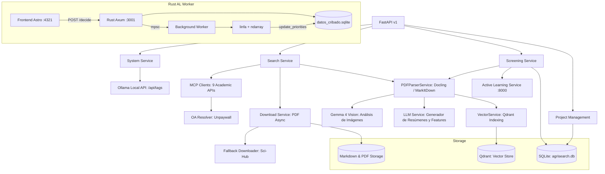

# AgriSearch Backend 🌾🤖

Backend de alto rendimiento para el sistema de Revisiones Sistemáticas AgriSearch. Construido con **FastAPI**, **SQLAlchemy**, **Docling** y RAG Vectorial indexado por **Qdrant**. Integración modular de **Ollama** para LLMs y VLMs locales.

## 🏗️ Arquitectura del Sistema (Actualizado Fase 2)

El backend sigue una arquitectura de servicios desacoplados para el procesamiento científico:



### Funcionalidades Dinámicas Implementadas
*   **Auto-descubrimiento de Ollama**: El endpoint `/system/ollama-models` lista todos los modelos locales disponibles automáticamente mediante comunicación directa con la API de Ollama y clasifica según capacidades (Multimodal, Embedding).
*   **Gestión Inteligente de Motores (MCP Clients)**: Arquitectura resiliente con 9 bases de datos (OpenAlex, Semantic Scholar, ArXiv, CrossRef, CORE, SciELO, Redalyc, AgEcon, Organic Eprints), empleando **CircuitBreaker** y **RetryClient** con retardos exponenciales contra baneos (HTTP 429) y validación estricta (`QueryVerifier`).
*   **Resolución OA de Última Milla**: Consulta automática a Unpaywall para URLs Open Access faltantes en DOIs, y fallback de Descarga Forzada interactiva integrada nativamente contra los mirrors encriptados de Sci-Hub (`scihub_service.py`).
*   **Tests de Integración y Mocks**: Cobertura estandarizada (Pytest) cubriendo constructores deterministas (`test_query_builder_comprehensive.py`), parseo estructurado del esquema (`test_client_parsing.py`) e ingesta PDF automatizada con Active Learning RAG mockups.
*   **Re-parsing Forzado (MD)**: Endpoint dinámico en `/search/reparse` para iterar, reprocesar y mejorar métricas de los PDFs descargados, regenerando los documentos Markdown y su indexación vectorial RAG bajo demanda de forma asíncrona.
*   **Métricas de Calidad Automatizadas**: Clasifica la extracción Markdown como `alta`, `media` o `baja` en base a parámetros del formato exportado por Docling / MarkItDown.

## 🛠️ Tecnologías Clave

- **FastAPI**: Framework web asíncrono de alto rendimiento.
- **SQLAlchemy + aiosqlite**: ORM asíncrono para persistencia de metadatos bibliográficos.
- **Docling**: Motor avanzado de conversión de PDF a Markdown estructurado con preservación de tablas (IBM).
- **Gemma 4 (e4b)**: Modelo visual sugerido para la interpretación estructural y descripción de diagramas científicos.
- **Qdrant**: Base de datos vectorial embebida.
- **UV**: Gestor de paquetes ultrarrápido (Reemplaza a pip).

## 📁 Estructura del Proyecto

```text
backend/
├── app/
│   ├── api/          # Endpoints de la API (v1)
│   │   ├── system.py    # Auto-descubrimiento de infraestructura
│   │   ├── search.py    # Buscador y re-parseo MD
│   │   └── screening.py # Lógica iterativa PRISMA
│   ├── core/         # Configuración general y de seguridad
│   ├── db/           # Conexión a la base de datos local SQLite
│   ├── models/       # Entidades SQLAlchemy (Project, Article, SearchQuery, etc.)
│   └── services/     # Casos de uso de negocio (Search, PDF, LLM, Vector)
├── data/             # Root de almacenamiento local de proyectos
├── pyproject.toml    # Definición centralizada del entorno (UV compatible)
├── requirements.txt  # Exportación legacy para compatibilidad
└── agrisearch.db     # Base de datos local
```

## 🚀 Flujo de Procesamiento

1. **Definición Dinámica**: Creación de proyecto consumiendo modelos disponibles localmente (VLM recomendado).
2. **Búsqueda**: Conversión de Lenguaje Natural a booleano complejo validando términos AGROVOC.
3. **Descarga**: Obtención P2P asíncrona de PDF Open Access.
4. **Parsing y Enriquecimiento**: Generación generativa MD vía Docling. Las imágenes y gráficos son transcritas empleando modelos Multimodales (ej. `gemma4:e4b`).
5. **Generación RAG Vectorial**: Qdrant vectoriza embeddings para ser analizados posteriormente en el Screening interactivo.
6. **Active Learning (Rust)**: Microservicio en `active_learning_worker/` (Axum + linfa) que prioriza artículos por incertidumbre. Latencia <5ms. Re-entrenamiento asíncrono cada 10 decisiones. Ver `docs/process/plan/plan_active_learning_rust.md`.

## 🛠️ Instalación y Desarrollo (Con UV)

uv es el manejador de proyectos estándar. Reemplaza pip y poetry siendo magnitudes más rápido.

Para instalar dependencias y crear el entorno:
```bash
uv sync
```

Para arrancar el servidor asíncrono en modo desarrollo (Hot-Reloading activo):
```bash
uv run uvicorn app.main:app --reload
```

---
*Backend preparado para análisis semántico intensivo en el ámbito agrícola.*
