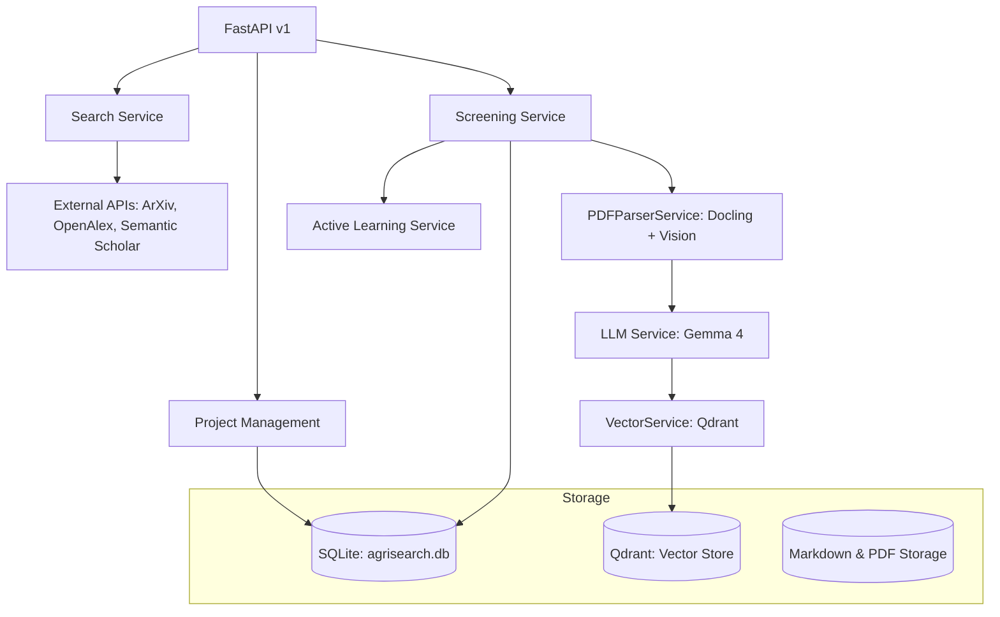

# AgriSearch Backend 🌾🤖

Backend de alto rendimiento para el sistema de Revisiones Sistemáticas AgriSearch. Construido con **FastAPI**, **SQLAlchemy** y **Ollama**.

## 🏗️ Arquitectura del Sistema

El backend sigue una arquitectura de servicios desacoplados para el procesamiento científico:



## 🛠️ Tecnologías Clave

- **FastAPI**: Framwork web asíncrono de alto rendimiento.
- **SQLAlchemy + aiosqlite**: ORM asíncrono para persistencia de metadatos bibliográficos.
- **Docling**: Motor de IBM para conversión de PDF a Markdown estructurado.
- **Gemma 4 (e4b)**: Modelo de lenguaje y visión local para análisis profundo y descripción de diagramas.
- **Nomic Embed MoE**: Modelo de embeddings para recuperación semántica (RAG).
- **Qdrant**: Base de datos vectorial para búsqueda semántica.
- **UV**: Gestor de paquetes y entorno virtual ultrarrápido.

## 📁 Estructura del Proyecto

```text
backend/
├── app/
│   ├── api/          # Endpoints de la API (v1)
│   ├── core/         # Configuración y seguridad
│   ├── db/           # Conexión a la base de datos
│   ├── models/       # Modelos SQLAlchemy y esquemas Pydantic
│   └── services/     # Lógica de negocio (Search, PDF, LLM, Vector)
├── data/             # Almacenamiento local de proyectos y PDFs
├── tests/            # Suite de pruebas automatizadas
├── pyproject.toml    # Configuración de UV y dependencias
└── agrisearch.db     # Base de datos centralizada
```

## 🚀 Flujo de Procesamiento

1. **Búsqueda**: Traduce consultas de lenguaje natural a booleanas y consulta APIs científicas.
2. **Descarga**: Recupera PDFs de acceso abierto.
3. **Parsing**: Utiliza Docling para generar Markdown y Gemma 4 Vision para describir figuras.
4. **Enriquecimiento**: Extrae variables agrícolas, metodologías y puntúa la relevancia.
5. **RAG**: Indexa fragmentos en Qdrant para permitir consultas semánticas durante el screening.
6. **Active Learning**: Sugiere inclusiones/exclusiones basándose en decisiones previas del usuario.

## 🛠️ Instalación y Desarrollo

Para instalar dependencias y sincronizar el entorno:
```bash
uv sync
```

Para arrancar el servidor de desarrollo:
```bash
uv run uvicorn app.main:app --reload
```

---
*Desarrollado para la optimización de revisiones sistemáticas en agricultura.*
