# Arquitectura de AgriSearch - Chat de Búsqueda Sistemática

Este documento describe la arquitectura, la estructura de archivos y el flujo de llamadas desde que el usuario interactúa con la interfaz de AgriSearch hasta que se genera una respuesta.

## 1. Estructura de Componentes Principales

La aplicación se compone de tres bloques fundamentales:

### **A. Interfaz de Usuario (Frontend: Astro + React + TypeScript + Tailwind)**
Ubicación: `/frontend`
- **Astro (`src/pages/*.astro`)**: Administra las páginas estáticas y el ruteo base de la app. Por ejemplo, `index.astro`, `project.astro`, `search.astro`, `screening.astro`.
- **Componentes React (`src/components/*.tsx`)**: Proveen toda la experiencia visual e interacciones dinámicas. 
  - *ProjectList.tsx / ProjectDashboard.tsx / SearchWizard.tsx / ScreeningApp.tsx*.
- **Cliente API (`src/lib/api.ts`)**: Archivo central de TypeScript que realiza todas las peticiones `fetch()` HTTP hacia el backend y tipa firmemente los datos de entrada/salida.

### **B. Lógica de Servidor y REST API (Backend: FastAPI + Python + SQLAlchemy)**
Ubicación: `/backend/app`
- **Enrutadores (`api/v1/*.py`)**: Son las vías de entrada. Definen los `endpoints` REST como `/projects`, `/search`, `/screening`. Extraen parámetros y llaman a la respectiva capa de servicio.
- **Servicios (`services/*.py`)**: Donde sucede toda la lógica de negocio pesada, como procesamiento, orquestamiento de llamadas a LLM y limpieza de datos.
- **Modelos y Schemas (`models/*.py`)**: 
  - *project.py*, *screening.py*: Es donde SQLAlchemy define las tablas SQLite.
  - *schemas.py*: Colección de clases Pydantic que aseguran la validación estricta de la información bidireccional cliente-servidor API REST.

### **C. MCP Clients y LLM**
Ubicación: `/backend/app/services/mcp_clients`
- AgriSearch se abstrae a través del *Model Context Protocol* para poder mandar tareas especializadas de búsqueda y recuperación a repositorios científicos u otras herrmaientas conectadas.
- **`Search Build LLM` (`query_builder.py`)**: Para procesar el prompt inicial que describe lo que quiere el usuario y convertirlo a representaciones booleanas/semánticas.

---

## 2. Flujo Completo - "Realizar una Búsqueda"

Para ejemplificar, se describe detalladamente qué pasa tras bambalinas cuando un usuario ingresa y crea una búsqueda AI.

### Paso 1: Seleccionar el Proyecto (Frontend)
1. **Archivo Relevante:** `frontend/src/pages/index.astro` 
2. **Acción:** El usuario hace click en crear o en abrir un proyecto. 
3. **Redirección:** Entramos a `/project.astro -> <ProjectDashboard />`.

### Paso 2: Ir a "Búsqueda AI" 
1. **Acción:** Click en "Búsqueda AI", nos lleva a `frontend/src/pages/search.astro`. Que a su vez renderiza `<SearchWizard />`.
2. **Estado Inicial:** `step="describe"`. 

### Paso 3: Definición del Prompt (Generar Queries)
1. **Archivo Relevante:** `frontend/src/components/SearchWizard.tsx`
2. **Acción:** El usuario escribe su consulta en lenguaje natural (ej., "uso de biofertilizantes en soya") y hace click en "Generar Sugerencias".
3. **Llamada API (`api.ts`):** Envia un POST a `buildQuery(data)` hacia la ruta base del backend `POST /api/v1/search/build-query`.

### Paso 4: Backend construye la Búsqueda
1. **Entrada Backend:** `backend/app/api/v1/search.py` (Endpoint `/build-query`).
2. **Capa Funcional (`services/search_service.py`):**
   - El servicio llama a `generate_search_concepts(user_input, language)`.
   - Esto inyecta un *Prompt de Sistema* a un modelo LLM (Ollama) para extraer conceptos clave y descomponer la petición en PICO.
3. **Respuesta:** Retorna el objeto `GeneratedQuery` de vuelta al UI.

### Paso 5: Vista Previa y Confirmación (Frontend)
1. **Estado (`SearchWizard.tsx`):** Pasa al `step="review"`.
2. **Acción:** El usuario verifica e incluso puede cambiar las BD a consultar (Redalyc, arXiv, OpenAlex, Semantic Scholar, etc.). Luego da click en "Ejecutar Búsqueda en Bases de Datos".

### Paso 6: Orquestar las Bases de Datos 
1. **Llamada (`executeSearch` en `api.ts`):** Apunta al POST `/api/v1/search/execute`.
2. **Capa de Servicio Orquestadora (`search_service.py` -> `execute_search`):**
   - Guarda el `SearchQuery` inicial en la base de datos (junto con el string del prompt).
   - A través de la función de `build_all_queries`, transforma la búsqueda general a las sintaxis requeridass de cada Base de Datos seleccionada (JSON final almacenado en el registro).
   - Genera Tareas Asíncronas (`asyncio.gather`) y paraleliza las llamadas a cada Base de datos a través de los diversos *MCP/Clients* situados en `backend/app/services/mcp_clients/*_client.py`.

### Paso 7: Procesamiento y Unificación 
1. **Regreso de Tareas:** Todos los *clients* retornan su lista de artículos.
2. **Filtrado Centralizado:**
   - Estandarización de `doi` e IDs unicos.
   - Eliminación de Duplicados intrafuente e inter-fuente mediante coincidencia estricta y comparativa difusa de títulos (Fuzzy Match / RapidFuzz).
   - Construcción y almacenamiento de objetos SQLAlchemy clase `Article` en la Base de Datos asociadas al Proyecto (`project_id`) y Búsqueda (`search_query_id`).
3. **Retorno GUI:** FastAPI responde el objeto JSON del esquema de Respuesta SearchResult.

### Paso 8: Visualizar y Descargar (Resultados)
1. **Estado:** `SearchWizard` pasa a `step="results"` y muestra `<SearchWizardResults />`.
2. **Nuevos Cambios Incorporados:** 
   - Se pinta un panel tipo Accordion con el **Prompt de Usuario** y las **Queries Adaptadas** específicas que fueron tiradas por comando a cada Base de Datos gracias a los atributos `prompt_used` y `adapted_queries` proveidos.
3. **Acción Descarga (`downloadArticles`):** La descarga extrae todos los URLs abiertos/DOIs de sus fuentes Open Access y guarda localmente dentro del directorio del proyecto respetando metadatos.

---

## 3. Flujo - Historial e Interacción entre Páginas

- **Historial de Búsquedas (`ProjectDashboard.tsx`):**
  - Solicita `GET /projects/{id}/searches`.
  - Presenta un panel de tarjetas. Al hacer click en una, viaja a la URL `/search?query_id=ABC`.
  - El `<SearchWizard />` captura ese ID en el `useEffect()`, cambia directamente a `results` e infla el estado recuperando todo desde SQLite.
- **Historial de Revisiones (`ProjectDashboard.tsx` -> Screening):**
  - Solicita `GET /screening/eligibility/{project_id}` antes de permitir crear una revisión. El servidor valida artículos disponibles cruzando datos con sesiones activas.
  - Al hacer click en "Revisiones", el usuario puede crear una nueva (`new=true`) si cumple elegibilidad.
  - Igual metodología en acceso histórico (`setup_session=...`). La presentación dinámica redirige hacia `<ScreeningApp />` en otra URL aislada por ID de sesión.
- **Eliminaciones Inteligentes (`DELETE /projects`, `DELETE /search`, o `DELETE /screening/session`):**
  - **Eliminar Proyecto/Búsqueda**: Se orquestan en Cascada estricta (Cascading Delete). Al eliminar desde el Dashboard, emerge un **Modal Interactivo de Alerta** pidiendo confirmación explícita para evitar errores destructivos. Un `SearchQuery` o proyecto eliminado erradica su metadata en BD (incluyendo forzados a artículos huérfanos), y mediante hooks y servicios **se destruyen todos los archivos PDF locales** asociados junto con los registros de Screening que dependían de ellos. El sistema re-calcula sumas dinámicamente post-borrado.
  - **Eliminar Revisión (Screening Session)**: "Eliminación Segura". Se destruye la revisión y todas sus decisiones de inclusión/exclusión, pero **los PDFs descargados no sufren ninguna alteración**. Permanecen listos y disponibles subyacentemente en su carpeta sanitizada o para ser asignados a una nueva revisión concurrente.

---

## 4. Diagramas de Computación y Flujos

> Todos los diagramas usan una paleta de colores unificada compatible con fondos blancos y oscuros. Los `classDef` aplicados a los nodos garantizan legibilidad en cualquier tema.

### Paleta de Estilos Global

> Colores mate/strtolower para legibilidad en fondos claros y oscuros.

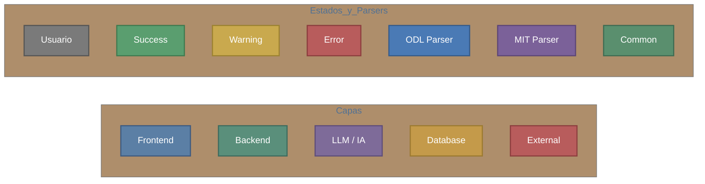

---

### 4.1 Arquitectura General del Sistema

A nivel macro, AgriSearch se organiza en 4 capas principales: la interfaz de usuario (Astro + React), el servidor FastAPI con su lógica de negocio, el motor de inferencia local Ollama, y la red de bases de datos científicas externas. SQLite y Qdrant actúan como almacenes locales.

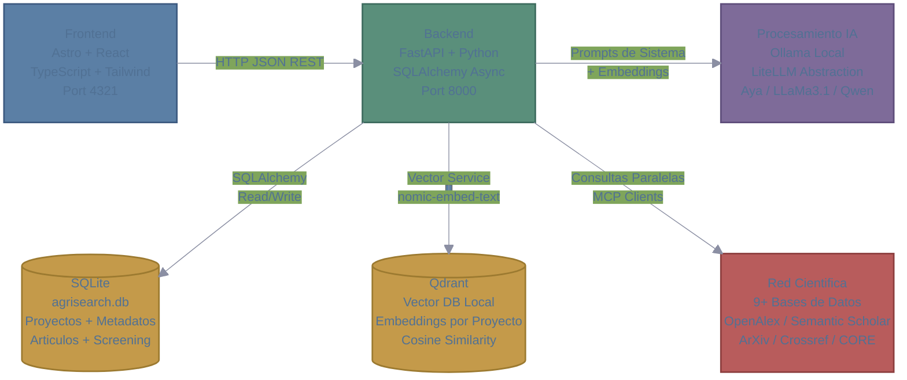

---

### 4.2 Flujo Macro: Ciclo de Vida de una Revisión Sistemática

Este diagrama muestra los 6 macro-procesos del sistema alineados con las fases de PRISMA 2020. Cada fase se desglosa en micro-procesos en las secciones subsiguientes.

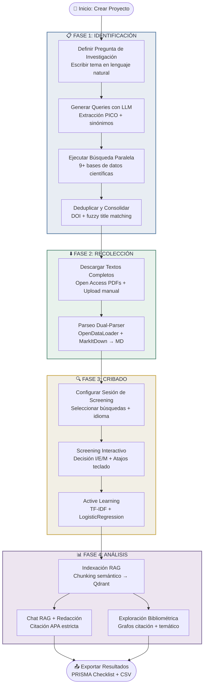

---

### 4.3 Flujo de Búsqueda — Generación de Queries

Micro-proceso desglosado de la Fase 1: Transformar la necesidad del investigador en una estrategia de búsqueda formal. El LLM solo abstrae la matriz de conceptos; **nunca** genera la sintaxis SQL/API directamente.

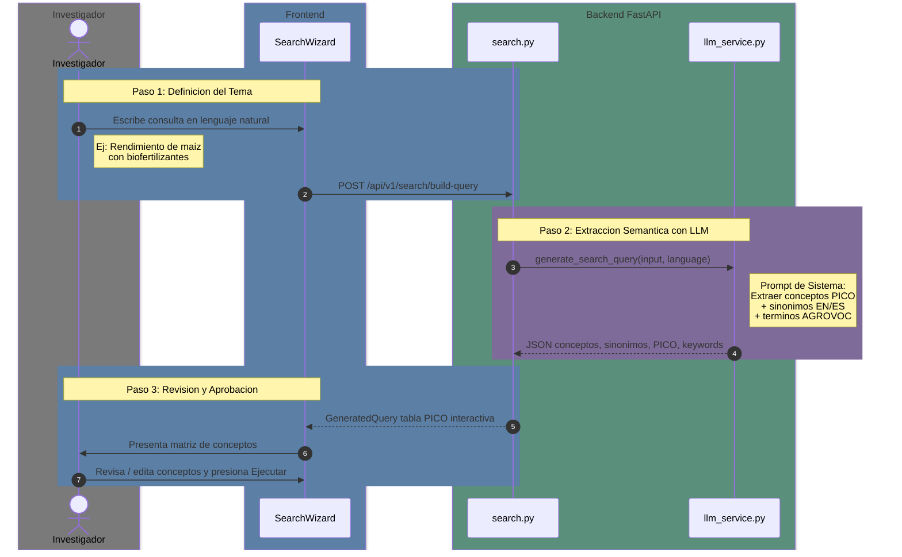

---

### 4.4 Flujo de Búsqueda — Ejecución y Deduplicación

Micro-proceso de la Fase 1: Las queries aprobadas se adaptan determinísticamente a la sintaxis de cada API y se ejecutan en paralelo. Luego se fusionan y deduplican los resultados.

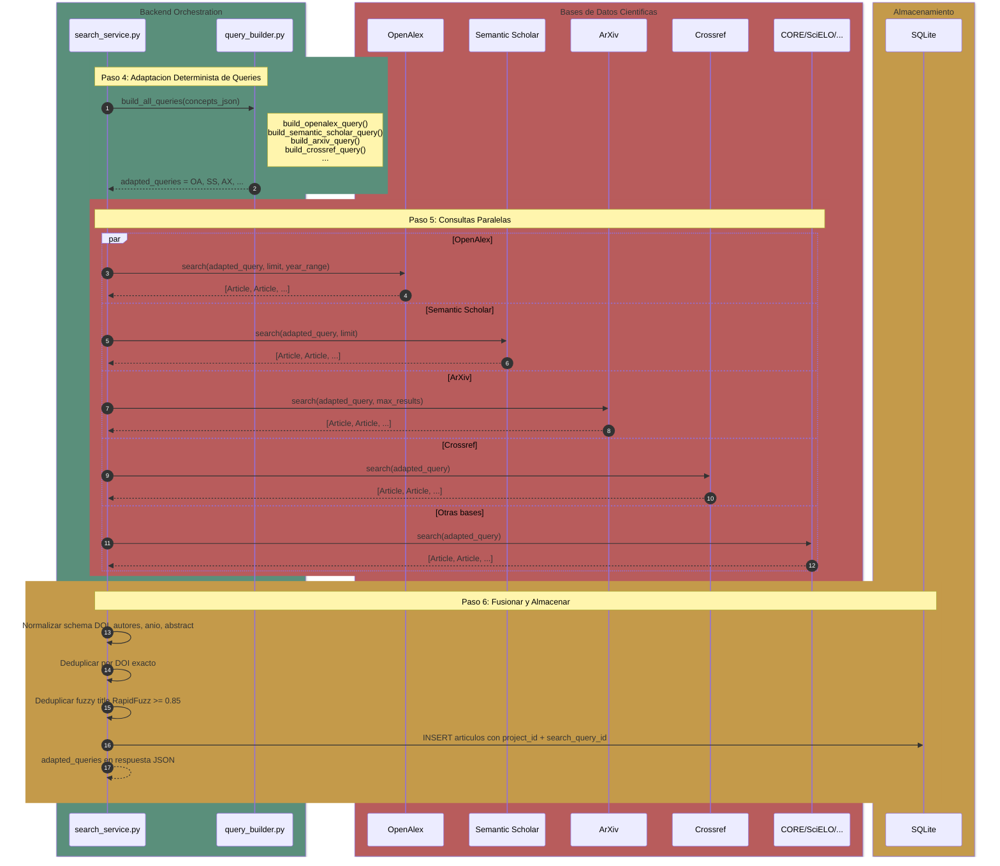

---

### 4.5 Flujo de Descarga y Enriquecimiento PDF

Micro-proceso entre Fase 1 y Fase 2: Descarga de textos completos open access y trigger automático del pipeline de enriquecimiento (parseo → LLM → indexación).

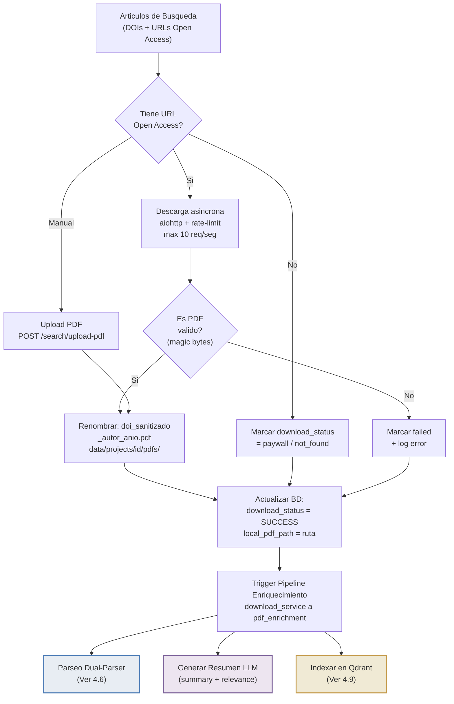

---

### 4.6 Pipeline de Parseo Dual-Parser

Micro-proceso de Fase 2: Cada documento se procesa con el parser óptimo según su tipo. OpenDataLoader (Java, benchmark #1) para PDFs científicos; MarkItDown (CPU, Microsoft) para todo lo demás. Ambos pipelines convergen en TableFlattener y front-matter YAML.

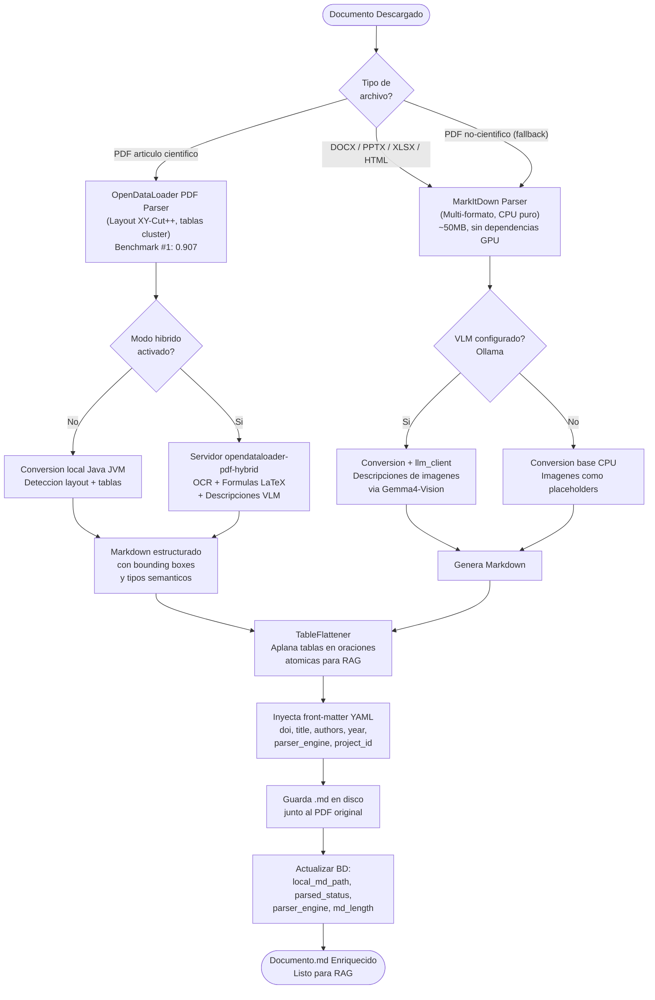

---

### 4.7 Flujo de Screening — Setup y Sesión

Micro-proceso de Fase 3: Configuración de la sesión de cribado y el loop interactivo de decisión artículo por artículo, incluyendo traducción de abstracts y.Active Learning.

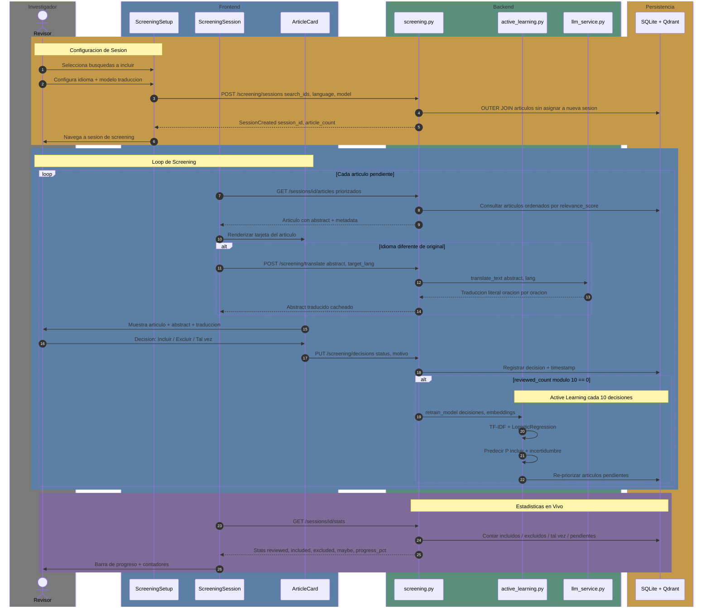

---

### 4.8 Flujo de Active Learning

Micro-proceso del sistema de cribado: Cada 10 decisiones del usuario, el sistema re-entrena un clasificador ligero para priorizar los artículos con mayor incertidumbre (uncertainty sampling), maximizando la información ganada por cada decisión humana.

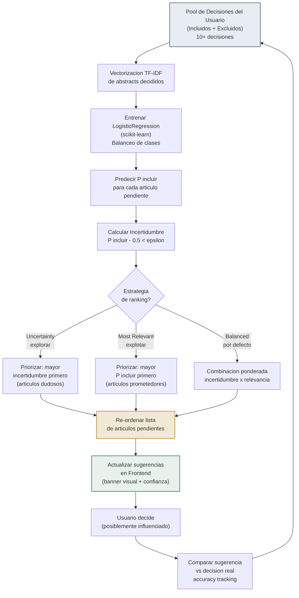

---

### 4.9 Flujo de Indexación RAG

Micro-proceso de Fase 4: Los Markdown procesados de artículos incluidos se fragmentan semánticamente por secciones, se enriquecen con metadatos de procedencia y se vectorizan para habilitar recuperación semántica precisa en el chat RAG.

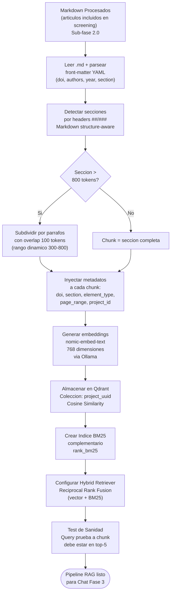

---

### 4.10 Modelo de Datos — Diagrama ER

Las 5 entidades core del sistema SQLite. Todas usan `UUIDv4` como clave primaria para garantizar aislamiento entre proyectos concurrentes.

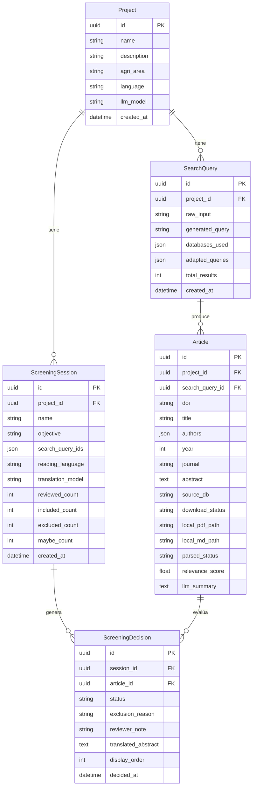

---

### 4.11 Diagrama de Componentes y Deployment

Vista técnica de los servicios y puertos que componen la infraestructura local de AgriSearch.

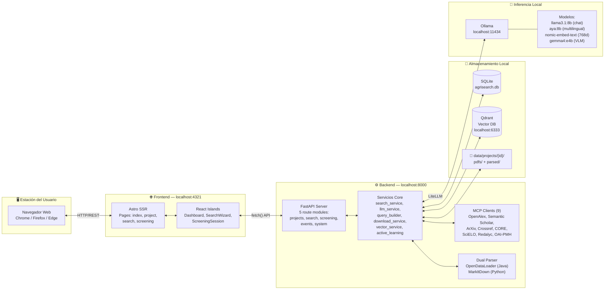

---

### 4.12 Estados del Proyecto — Flujo PRISMA

Diagrama de estados que muestra cómo evoluciona un proyecto a través del flujo PRISMA 2020, desde la identificación inicial hasta la inclusión final.

```mermaid
graph LR
    A["📋 Proyecto\nCreado"]:::user -->|"Crear búsquedas"| B["🔍 Búsquedas\nGeneradas"]:::frontend
    B -->|"Ejecutar search"| C["📚 Artículos\nIdentificados\n(N de cada base)"]:::external
    C -->|"Deduplicación"| D["🔄 Duplicados\nRemovidos\n(N únicos)"]:::warning
    D -->|"Descargar PDFs"| E["⬇️ Texto Completo\nDescargado\n(N con PDF)"]:::backend
    D -->|"Paywall/Error"| F["❌ Sin Texto\nCompleto"]:::error
    E -->|"Parseo MD"| G["📄 Markdown\nProcesado\n(N con MD)"]:::common
    G -->|"Screening"| H["🔍 Screeneados\n(Incluidos / Excluidos)"]:::llm
    H -->|"Incluidos"| I["✅ Artículos\nIncluidos\n(Base del conocimiento)"]:::success
    H -->|"Excluidos"| J["❌ Artículos\nExcluidos\n(con motivo PRISMA)"]:::error
    I -->|"Indexar RAG"| K["🧠 Qdrant\nVectorizado\n(listo para Chat)"]:::database
    K -->|"Chat RAG"| L["💬 Chat + Redacción\nCitación APA"]:::llm
    K -->|"Explorar"| M["🕸️ Grafos de Citación\ny Relación Temática"]:::common
    I -->|"Exportar"| N["📤 PRISMA\nChecklist + CSV"]:::success
    L --> N
    M --> N

    style A fill:#e8e8e8,stroke:#7a7a7a,stroke-width:2px
    style C fill:#f0ead5,stroke:#c49a4a,stroke-width:2px
    style D fill:#f0ead5,stroke:#c49a4a,stroke-width:2px
    style I fill:#e8f2ec,stroke:#5a8f7b,stroke-width:2px
    style J fill:#f5e0e0,stroke:#b85c5c,stroke-width:2px
    style K fill:#ede5f0,stroke:#7e6b99,stroke-width:2px
    style N fill:#e8f2ec,stroke:#5a8f7b,stroke-width:2px
```
