# Arquitectura de AgriSearch - Chat de Búsqueda Sistemática

Este documento describe la arquitectura, la estructura de archivos y el flujo de llamadas desde que el usuario interactúa con la interfaz de AgriSearch hasta que se genera una respuesta.

## 1. Estructura de Componentes Principales

La aplicación se compone de tres bloques fundamentales:

### **A. Interfaz de Usuario (Frontend: Astro + React + TypeScript + Tailwind)**
Ubicación: `/frontend`

**Páginas Astro** (`src/pages/*.astro`) — ruteo estático base, cada una renderiza un React Island:

| Archivo | Ruta | Componente React |
|---|---|---|
| `index.astro` | `/` | `<Dashboard />` |
| `project.astro` | `/project` | `<ProjectDashboard />` |
| `search.astro` | `/search` | `<SearchWizard />` |
| `screening.astro` | `/screening` | `<ScreeningPage />` |

**Componentes React** (`src/components/*.tsx`) — toda la lógica dinámica:

| Componente | Propósito |
|---|---|
| `Dashboard.tsx` | Página principal: lista de proyectos con crear/eliminar. Modales de confirmación. |
| `ProjectDashboard.tsx` | Detalle del proyecto: editar metadata, historial de búsquedas, historial de revisiones, eliminar con cascada. |
| `SearchWizard.tsx` | Wizard multi-paso: `describe → review_query → searching → results`. Orquesta todo el ciclo de búsqueda AI. |
| `SearchWizardDescribe.tsx` | Paso 1: formulario para tema, idioma, bases de datos, rango de años, modelo LLM. |
| `SearchWizardReview.tsx` | Paso 2: revisar/editar la query booleana generada antes de ejecutar. |
| `SearchWizardSearching.tsx` | Paso 3: spinner animado mientras se ejecuta la búsqueda en paralelo. |
| `SearchWizardResults.tsx` | Paso 4: tabla ordenable de resultados con descarga, reparseo, subida de PDFs, y expansión de abstracts. |
| `ScreeningPage.tsx` | Router de entrada: renderiza `ScreeningSetup` o `ScreeningSession` según el parámetro `?session`. |
| `ScreeningSetup.tsx` | Configuración de sesión: selección de búsquedas, idioma, modelo de traducción, continuar/eliminar existentes. |
| `ScreeningSession.tsx` | Interfaz de cribado artículo por artículo (estilo Rayyan.ai): atajos de teclado, traducción de abstracts, sugerencias AI, vista tarjeta/tabla. |
| `ProgressModal.tsx` | Modal de progreso en tiempo real vía SSE para tareas de fondo (reparseo, enriquecimiento). |

**Cliente API** (`src/lib/api.ts`) — 29 funciones exportadas, todas tipadas con TypeScript. Realiza peticiones `fetch()` HTTP hacia `http://localhost:8000/api/v1`. Maneja errores, parsing JSON, y multipart para subida de PDFs.

### **B. Lógica de Servidor y REST API (Backend: FastAPI + Python + SQLAlchemy)**
Ubicación: `/backend/app`

- **Enrutadores (`api/v1/*.py`)** — 5 módulos de rutas:

| Módulo | Prefijo | Función |
|---|---|---|
| `projects.py` | `/projects` | CRUD de proyectos con conteos de artículos y revisiones. |
| `search.py` | `/search` | Construcción de queries, ejecución multi-DB, descarga de PDFs, reparseo. |
| `screening.py` | `/screening` | Sesiones de cribado, decisiones, sugerencias AI, reranking, traducción, análisis profundo. |
| `events.py` | `/events` | Stream SSE para notificaciones de progreso en tiempo real. |
| `system.py` | `/system` | Estado del sistema y modelos Ollama disponibles. |

- **Servicios (`services/*.py`)** — lógica de negocio pesada:

| Servicio | Responsabilidad principal |
|---|---|
| `search_service.py` | Orquesta búsqueda paralela en 9+ bases, deduplicación DOI + fuzzy title, almacenamiento. |
| `llm_service.py` | Wrapper sobre LiteLLM: generación de queries, traducción, sugerencias de relevancia, análisis de artículos, descripción de imágenes (VLM). |
| `download_service.py` | Descarga paralela de PDFs con rate-limiting, validación magic bytes, pipeline de enriquecimiento automático post-descarga. |
| `query_builder.py` | Construcción determinista (sin LLM) de queries específicas por cada API de base de datos. |
| `pdf_enrichment_service.py` | Coordinación del parseo dual-parser (OpenDataLoader + MarkItDown), extracción de metadatos, publicación de eventos SSE. |
| `document_parser_service.py` | Motor dual de parseo PDF→Markdown: `ParserRouter` selecciona OpenDataLoader (PDFs científicos) o MarkItDown (resto). |
| `vector_service.py` | Gestión de Qdrant: chunking semántico, embeddings nomic-embed-text, indexación y búsqueda vectorial. |
| `active_learning_service.py` | Clasificador TF-IDF + LogisticRegression para priorización de artículos en screening (uncertainty sampling). |
| `summarization_service.py` | Generación de resúmenes estructurados via LLM (objetivo, metodología, resultados, relevancia agrícola). |
| `pdf_parser.py` | Parser Docling legacy para enriquecimiento (ruta alternativa). |

- **Modelos y Schemas (`models/*.py`)**:
  - `project.py`, `screening.py`: SQLAlchemy ORM — tablas SQLite (Project, SearchQuery, Article, ScreeningSession, ScreeningDecision).
  - `schemas.py`: Clases Pydantic para validación estricta de request/response.

### **C. MCP Clients y LLM**
Ubicación: `/backend/app/services/mcp_clients`

AgriSearch se abstrae a través del *Model Context Protocol* para enviar tareas de búsqueda a repositorios científicos. Cada cliente implementa la interfaz específica de cada API:

| Cliente | Base de Datos | Nota |
|---|---|---|
| `openalex_client.py` | OpenAlex | REST API, búsqueda full-text |
| `semantic_scholar_client.py` | Semantic Scholar | REST API, abstracts enriquecidos |
| `arxiv_client.py` | ArXiv | API Atom, formato `all:"term"` |
| `crossref_client.py` | Crossref | REST API, metadatos de citación |
| `core_client.py` | CORE | API v3, acceso abierto |
| `scielo_client.py` | SciELO | REST API, literatura LATAM |
| `redalyc_client.py` | Redalyc | API propia, revistas iberoamericanas |
| `oai_pmh_client.py` | AgEcon + Organic Eprints | OAI-PMH harvesting, post-filtrado local |

**Motor LLM** (`llm_service.py`): Abstracción sobre LiteLLM/Ollama para todas las inferencias:

| Función | Modelo por defecto | Uso |
|---|---|---|
| `generate_search_query()` | Configurable (ej. `deepseek-r1:14b`) | Extraer conceptos PICO + sinónimos AGROVOC |
| `translate_text()` | `llama3.1:8b` | Traducción de abstracts |
| `generate_relevance_suggestion()` | `gemma4:e4b` | Sugerencia few-shot de incluir/excluir |
| `analyze_article_content()` | `gemma4:e4b` | Análisis profundo (resumen, metodología, variables agrícolas) |
| `describe_image_content()` | `gemma4:e4b` | Descripción de figuras vía VLM |

---

## 2. Flujo Completo - "Realizar una Búsqueda"

El SearchWizard gestiona un ciclo de 5 pasos con estados bien definidos: `describe → review_query → searching → results → downloading`. A continuación se detalla cada transición con los archivos, funciones y llamadas API reales.

### Paso 1: Definición del Tema (Frontend — Step `"describe"`)
1. **Componente:** `SearchWizardDescribe.tsx` (renderizado por `SearchWizard.tsx`).
2. **Acción del usuario:** Completa el formulario con:
   - Tema en lenguaje natural (ej. "uso de biofertilizantes en soya para mejorar rendimiento").
   - Áreas agrícolas (multi-select de 10 opciones: general, entomología, fitopatología, etc.).
   - Idioma de búsqueda (`es` / `en`).
   - Modelo LLM (dropdown dinámico de Ollama, default `deepseek-r1:14b`).
   - Bases de datos a consultar (9 opciones, todas seleccionadas por defecto).
   - Rango de años (opcional) y máximo de resultados por fuente (default 50).
3. **Transición:** Al enviar, `SearchWizard` llama `handleGenerateQuery()` que invoca `buildQuery()` de `api.ts`.

### Paso 2: Generación de Query con LLM (Backend)
1. **Endpoint:** `POST /api/v1/search/build-query` → `search.py::build_query()`.
2. **Servicio:** `llm_service.py::generate_search_query(user_input, agri_area, language, year_from, year_to, model)`.
3. **Proceso:**
   - Se inyecta un **prompt de sistema** al LLM que actúa como "bibliotecario agrícola para revisiones sistemáticas".
   - El LLM extrae: `concepts`, `sinonyms` (con terminos AGROVOC), `boolean_query`, `suggested_terms`, `pico_breakdown`, y `explanation`.
   - Temperature: 0.3, max_tokens: 1500, response_format: json_object.
4. **Respuesta:** Objeto `GeneratedQuery` con la tabla PICO interactiva y la query booleana formateada.

### Paso 3: Revisión y Confirmación (Frontend — Step `"review_query"`)
1. **Componente:** `SearchWizardReview.tsx`.
2. **Acción del usuario:**
   - Visualiza la query booleana generada en un editor.
   - Puede **editar manualmente** la query (campo `editedQuery`).
   - Confirma presionando "Ejecutar Búsqueda en Bases de Datos".
3. **Transición:** Llama `handleExecuteSearch()` que invoca `executeSearch()` de `api.ts`.

### Paso 4: Ejecución Paralela y Deduplicación (Backend)
1. **Endpoint:** `POST /api/v1/search/execute` → `search.py::execute_search_endpoint()`.
2. **Servicio:** `search_service.py::execute_search(db, project_id, query, databases, ...)`.
3. **Proceso paso a paso:**
   - **Persistencia inicial:** Crea registro `SearchQuery` en SQLite con el prompt raw y la query generada.
   - **Extracción de conceptos:** `_extract_concepts_from_query()` parsea la query booleana en conceptos limpios (max 10).
   - **Construcción de queries por DB:** `query_builder.py::build_all_queries(concepts, synonyms, databases)` — función **determinista** (sin LLM) que adapta los conceptos a la sintaxis específica de cada API:
     - OpenAlex: `build_openalex_query()` → términos separados por espacio, max 2 sinónimos.
     - ArXiv: `build_arxiv_query()` → formato `all:"término"`, sinónimos con OR, conceptos con AND.
     - Semantic Scholar, Crossref, CORE, SciELO, Redalyc: `build_*_query()` → separados por espacio.
     - AgEcon, Organic Eprints: `build_oaipmh_query()` → harvesting OAI-PMH con post-filtrado local.
   - **Consultas paralelas:** `asyncio.gather()` ejecuta simultáneamente los 9+ MCP clients (`mcp_clients/*_client.py`).
   - **Deduplicación en 3 pasadas:**
     1. DOI exacto: `_normalize_doi()` estandariza y compara.
     2. Título fuzzy: `_is_duplicate_title()` con RapidFuzz ratio >= 0.85.
     3. Contra artículos existentes del proyecto (evita duplicados entre búsquedas).
   - **Almacenamiento:** INSERT de objetos `Article` en SQLite con `project_id` + `search_query_id`.
4. **Respuesta:** JSON `SearchResultsResponse` con `articles`, `counts_by_source`, `adapted_queries`, `duplicates_removed`.

### Paso 4.5: Visualización de Resultados (Frontend — Step `"results"`)
1. **Componente:** `SearchWizardResults.tsx`.
2. **Transición:** El estado `step` cambia a `"results"`, se muestra la tabla de artículos.
3. **Elementos UI:**
   - **Accordion** con el Prompt de Usuario y las Queries Adaptadas por base de datos.
   - **Tabla ordenable** por título, año, fuente, estado de descarga.
   - **Badges de estado** por cada base de datos (colores diferenciados vía `sourceColor()`).
   - **Expansión de abstracts** in-place.
   - **Indicador de duplicados removidos** y conteo por fuente.

### Paso 5: Descarga de PDFs y Enriquecimiento (Backend + Frontend)
1. **Trigger:** El usuario presiona "Descargar PDFs" → `handleDownload()` cambia `step = "downloading"`.
2. **Endpoint:** `POST /api/v1/search/download` → `search.py::download_pdfs()`.
3. **Servicio:** `download_service.py::download_articles(db, project_id, article_ids)`.
4. **Proceso de descarga:**
   - Filtra artículos con `download_status == PENDING` y `open_access_url` no nula.
   - Descarga paralela con `asyncio.gather()` acotada por `Semaphore` (rate-limit configurable).
   - Valida **magic bytes `%PDF`** en el contenido descargado.
   - Nombra archivos: `{año}_{autorApellido}_{títuloSlug}.pdf` → `data/projects/{id}/pdfs/`.
   - Estados posibles: `SUCCESS`, `PAYWALL` (403/401), `FAILED`, `NOT_FOUND`.
5. **Pipeline de enriquecimiento automático** (post-descarga, por cada artículo exitoso):
   - **PDF → Markdown:** `pdf_parser.parse_article()` con ParserRouter (OpenDataLoader para científicos, MarkItDown para otros).
   - **Markdown → LLM:** `llm_service::analyze_article_content()` → extrae `llm_summary`, `relevance_score`, `methodology_type`, `agri_variables` (cultivos, plagas, tratamientos, factores ambientales).
   - **Indexación RAG:** `vector_service.index_article()` → chunking semántico por secciones + embeddings nomic-embed-text → upsert a Qdrant.
6. **Retorno:** El frontend recibe `DownloadProgress` con conteos de éxito/fallo/paywall, y refresca la lista de artículos con `listArticles()`.

---

## 3. Flujo - Historial e Interacción entre Páginas

### Navegación General

El ruteo de Astro sirve las 4 páginas base. Cada una delega en un React Island que gestiona su propio estado:

```
/ (index.astro)  →  <Dashboard />           →  click proyecto  →  /project?id=X
/project          →  <ProjectDashboard />    →  click "BUSQUEDA IA"  →  /search?id=X
                                        →  click "REVISIONES"  →  /screening?id=X&new=true
/search           →  <SearchWizard />        ←  /search?id=X&query_id=Y (histórico)
/screening        →  <ScreeningPage />       →  <ScreeningSetup /> o <ScreeningSession />
```

### Historial de Búsquedas (`ProjectDashboard.tsx`)

1. **Carga:** Al montar, llama `GET /projects/{id}/searches` y `GET /screening/sessions/project/{id}` en paralelo.
2. **Presentación:** Grid de tarjetas de búsqueda. Cada tarjeta muestra:
   - Fecha de creación, prompt original (`raw_input`), total de resultados.
   - Conteo de bases de datos utilizadas y artículos descargados.
   - Artículos no asignados a ninguna sesión de screening.
3. **Acceso a histórico:** Al hacer click en una tarjeta de búsqueda, navega a `/search?id={projectId}&query_id={queryId}`.
4. **Rehidratación en SearchWizard:** El componente detecta el parámetro `?query_id=` en `useEffect()`, salta directamente al `step="results"`, y llama:
   - `getProject(id)` → `GET /projects/{id}` para metadata del proyecto.
   - `listArticles(projectId, 0, 1000, undefined, queryId)` → `GET /search/articles/{projectId}?search_query_id=...` para recuperar los artículos almacenados en SQLite.
5. **Resultado:** El usuario ve exactamente los mismos resultados que generó originalmente, sin re-ejecutar la búsqueda.

### Historial de Revisiones (Screening)

1. **Verificación de elegibilidad:** Antes de crear una nueva revisión, el usuario presiona "REVISIONES" → `ProjectDashboard` llama `GET /screening/eligibility/{projectId}`.
2. **Respuesta del servidor:** `ScreeningEligibility` contiene:
   - `total_downloaded`: artículos con `download_status=SUCCESS`.
   - `assigned_articles`: artículos ya asignados a sesiones existentes.
   - `eligible_articles`: descargados menos asignados (disponibles para nueva sesión).
   - `screening_names`: nombres de sesiones existentes.
3. **Creación de sesión:** Si `eligible_articles > 0`, navega a `/screening?id={projectId}&new=true`.
4. **Setup (`ScreeningSetup.tsx`):**
   - Selecciona qué búsquedas incluir (multi-select con conteos).
   - Configura idioma de lectura y modelo de traducción.
   - Al confirmar: `POST /screening/sessions` con `search_query_ids`, `reading_language`, `translation_model`.
   - El backend ejecuta `enrich_articles_from_pdfs()` (parseo dual si hay PDFs sin Markdown) y crea `ScreeningDecision` para cada artículo no asignado.
5. **Acceso a histórico:** Si ya existe una sesión, se muestra un resumen con Continue/Delete. Click en "Continue" navega a `/screening?id={projectId}&setup_session={sessionId}`.

### Loop de Screening (`ScreeningSession.tsx`)

1. **Carga:** `GET /screening/sessions/{sessionId}` + `GET /screening/sessions/{sessionId}/articles?skip=0&limit=50`.
2. **Interfaz estilo Rayyan.ai:**
   - Vista de tarjeta o tabla (toggle).
   - Abstract traducido bajo demanda: `POST /screening/translate` con `decision_id` y `target_language`.
   - Sugerencia AI por artículo: `GET /screening/sessions/{sessionId}/articles/{articleId}/suggestion`.
   - Atajos de teclado para incluir/excluir/marcar tal vez.
3. **Decisión:** `PUT /screening/decisions/{decisionId}` con `decision` (include/exclude/maybe) y `exclusion_reason` cuando aplica.
4. **Active Learning:** Cada 10 decisiones, el sistema re-entrena el clasificador TF-IDF + LogisticRegression para re-priorizar artículos pendientes (uncertainty sampling). Also disponible vía `POST /screening/sessions/{sessionId}/rerank?mode=uncertainty|most_relevant|balanced`.
5. **Estadísticas en vivo:** `GET /screening/sessions/{sessionId}/stats` → barras de progreso y contadores.

### Eliminaciones Inteligentes

**Eliminar Proyecto** (`DELETE /projects/{id}`):
- **Cascada estricta:** Elimina el directorio completo del proyecto en disco (`shutil.rmtree`) y todos los registros asociados en BD (SearchQuery → Article → ScreeningSession → ScreeningDecision).
- **Modal de confirmación:** `Dashboard.tsx` muestra un modal con advertencia explícita sobre la destrucción de PDFs, datos y revisiones.
- **Post-borrado:** La lista de proyectos se refresca automáticamente y los contadores se recalculan.

**Eliminar Búsqueda** (`DELETE /search/{projectId}/{queryId}`):
- Elimina el `SearchQuery` y todos sus `Article` asociados.
- **Destruye archivos PDF y Markdown locales** del directorio de esa búsqueda.
- Las sesiones de screening que referenciaban esos artículos pierden las referencias (los artículos desaplican de las decisiones).
- `ProjectDashboard` refresca las listas de búsquedas y revisiones post-borrado.

**Eliminar Revisión (Screening Session)** (`DELETE /screening/sessions/{sessionId}`):
- **"Eliminación Segura":** Destruye la sesión y todas sus `ScreeningDecision`, pero **los PDFs descargados no se alteran**.
- Los artículos permanecen en la tabla `Article` y siguen disponibles para ser asignados a una nueva sesión de screening.
- `ProjectDashboard` refresca la lista de revisiones post-borrado.

---

## 4. Diagramas de Computación y Flujos

> Todos los diagramas usan una paleta de colores unificada compatible con fondos blancos y oscuros. Los `classDef` aplicados a los nodos garantizan legibilidad en cualquier tema.

### Paleta de Estilos Global

> Colores mate/strtolower para legibilidad en fondos claros y oscuros.

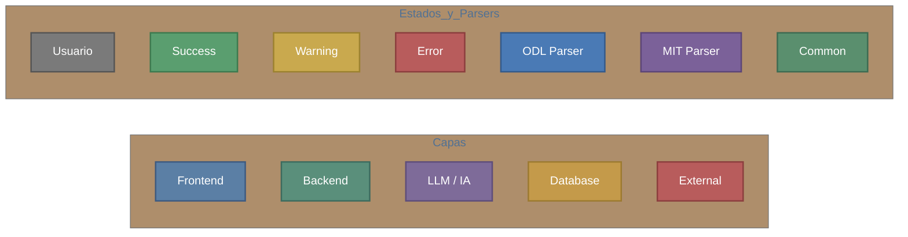

---

### 4.1 Arquitectura General del Sistema

A nivel macro, AgriSearch se organiza en 4 capas principales: la interfaz de usuario (Astro + React), el servidor FastAPI con su lógica de negocio, el motor de inferencia local Ollama, y la red de bases de datos científicas externas. SQLite y Qdrant actúan como almacenes locales.

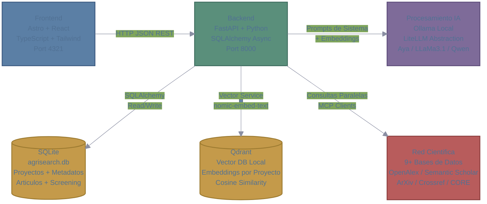

---

### 4.2 Flujo Macro: Ciclo de Vida de una Revisión Sistemática

Este diagrama muestra los 6 macro-procesos del sistema alineados con las fases de PRISMA 2020. Cada fase se desglosa en micro-procesos en las secciones subsiguientes.

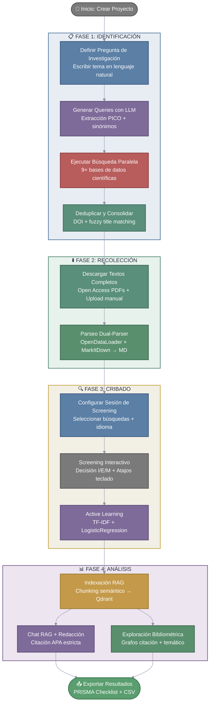

---

### 4.3 Flujo de Búsqueda — Generación de Queries

Micro-proceso desglosado de la Fase 1: Transformar la necesidad del investigador en una estrategia de búsqueda formal. El LLM solo abstrae la matriz de conceptos; **nunca** genera la sintaxis SQL/API directamente.

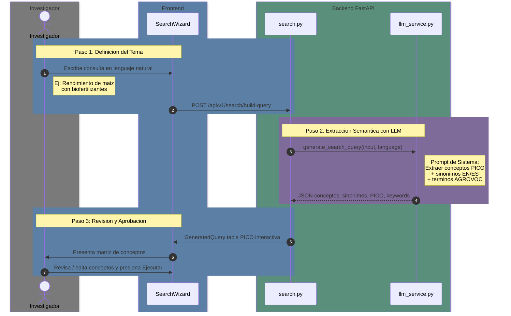

---

### 4.4 Flujo de Búsqueda — Ejecución y Deduplicación

Micro-proceso de la Fase 1: Las queries aprobadas se adaptan determinísticamente a la sintaxis de cada API y se ejecutan en paralelo. Luego se fusionan y deduplican los resultados.

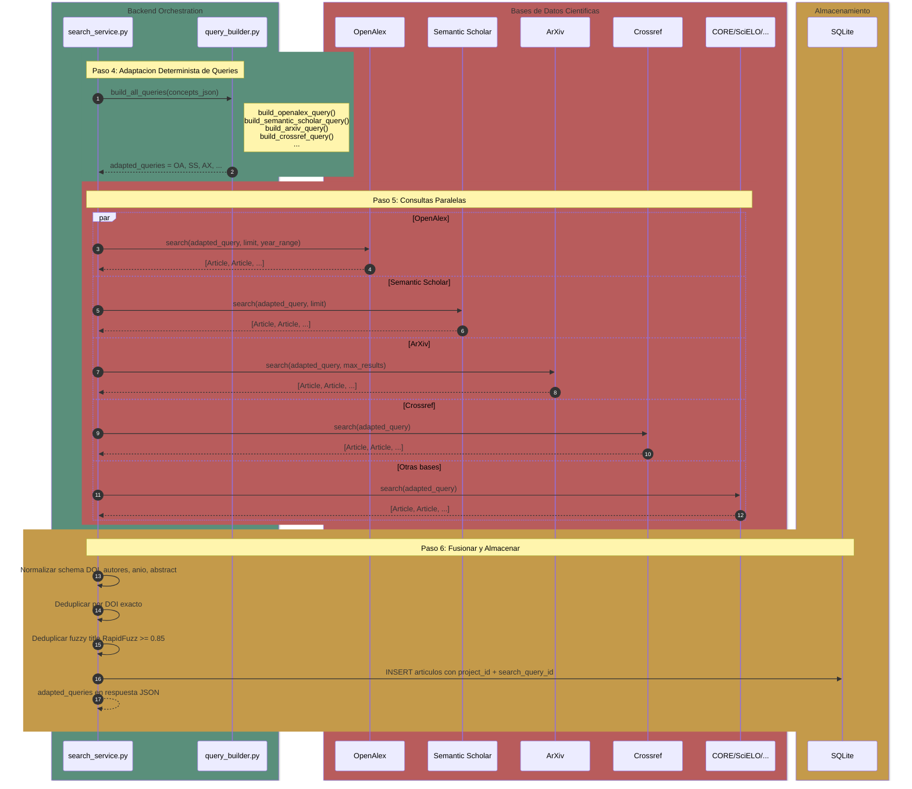

---

### 4.5 Flujo de Descarga y Enriquecimiento PDF

Micro-proceso entre Fase 1 y Fase 2: Descarga de textos completos open access y trigger automático del pipeline de enriquecimiento (parseo → LLM → indexación).

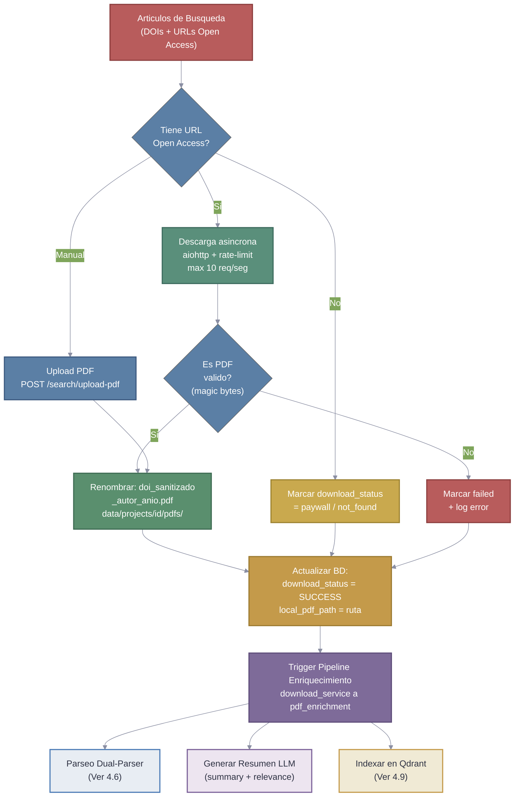

---

### 4.6 Pipeline de Parseo Dual-Parser

Micro-proceso de Fase 2: Cada documento se procesa con el parser óptimo según su tipo. OpenDataLoader (Java, benchmark #1) para PDFs científicos; MarkItDown (CPU, Microsoft) para todo lo demás. Ambos pipelines convergen en TableFlattener y front-matter YAML.

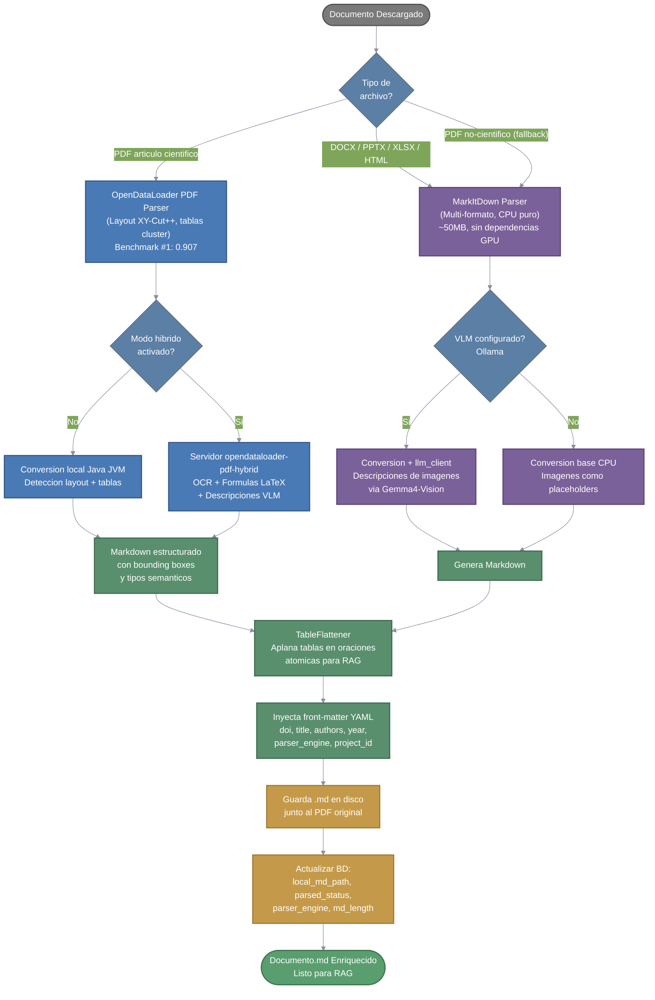

---

### 4.7 Flujo de Screening — Setup y Sesión

Micro-proceso de Fase 3: Configuración de la sesión de cribado y el loop interactivo de decisión artículo por artículo, incluyendo traducción de abstracts y.Active Learning.

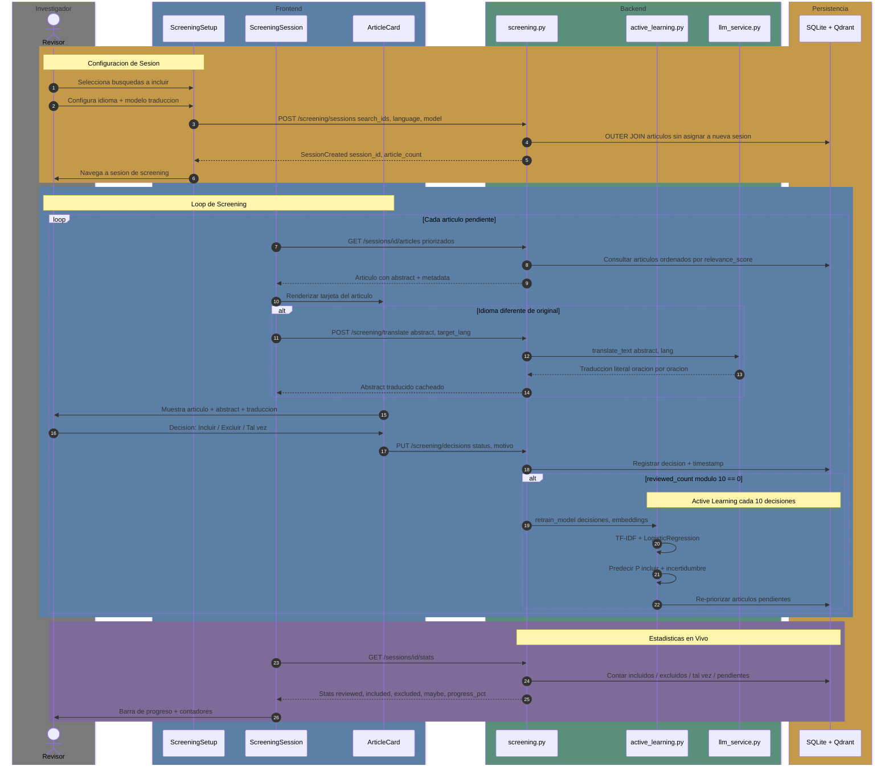

---

### 4.8 Flujo de Active Learning

Micro-proceso del sistema de cribado: Cada 10 decisiones del usuario, el sistema re-entrena un clasificador ligero para priorizar los artículos con mayor incertidumbre (uncertainty sampling), maximizando la información ganada por cada decisión humana.

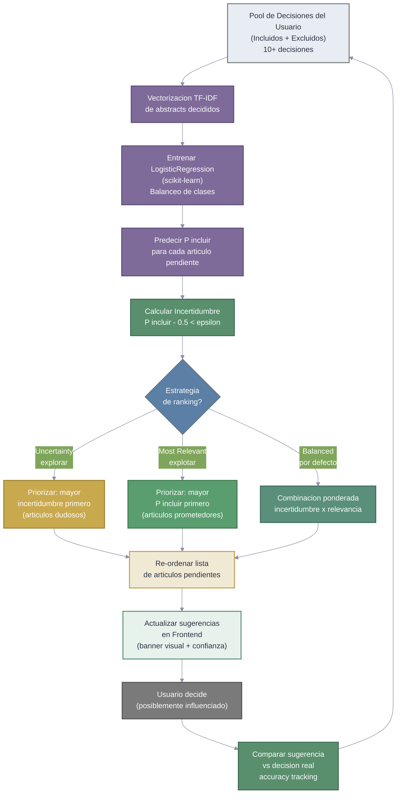

---

### 4.9 Flujo de Indexación RAG

Micro-proceso de Fase 4: Los Markdown procesados de artículos incluidos se fragmentan semánticamente por secciones, se enriquecen con metadatos de procedencia y se vectorizan para habilitar recuperación semántica precisa en el chat RAG.

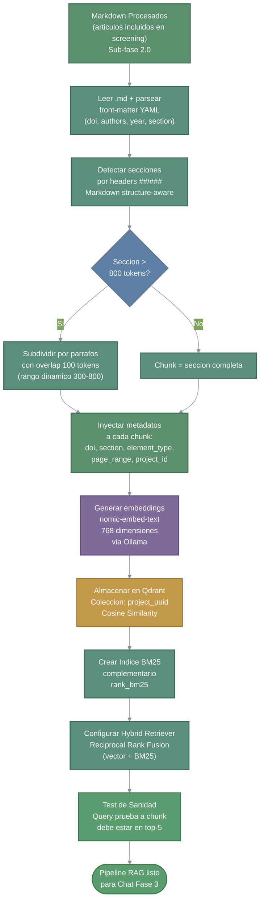

---

### 4.10 Modelo de Datos — Diagrama ER

Las 5 entidades core del sistema SQLite. Todas usan `UUIDv4` como clave primaria para garantizar aislamiento entre proyectos concurrentes.

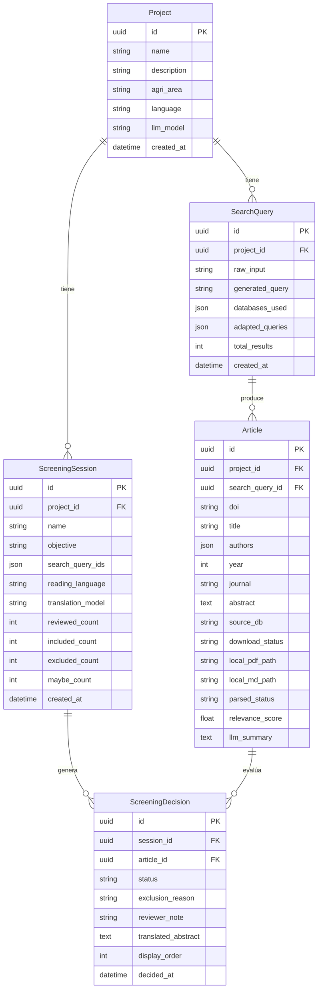

---

### 4.11 Diagrama de Componentes y Deployment

Vista técnica de los servicios y puertos que componen la infraestructura local de AgriSearch.

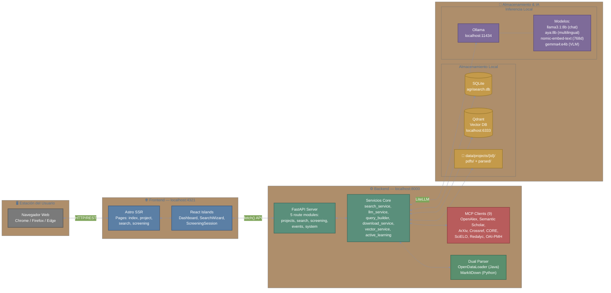

---

### 4.12 Estados del Proyecto — Flujo PRISMA

Diagrama de estados que muestra cómo evoluciona un proyecto a través del flujo PRISMA 2020, desde la identificación inicial hasta la inclusión final.

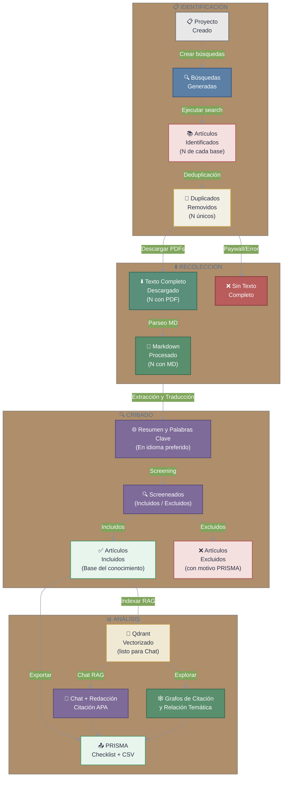
