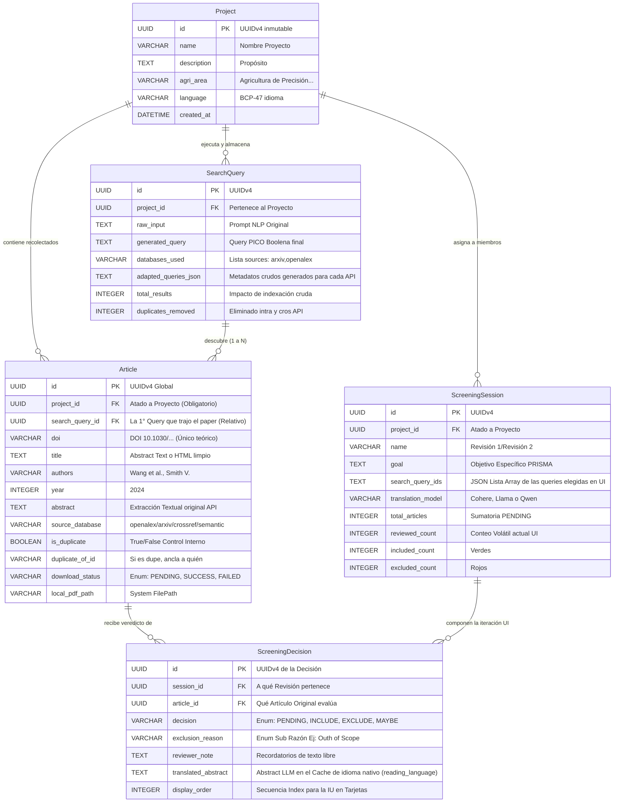

# Arquitectura de Base de Datos - Agrisearch

El sistema backend de AgriSearch utiliza **SQLite** y el framework ORM **SQLAlchemy** (modo asíncrono con `aiosqlite`). 
La arquitectura prioriza en un 100% la aislación e integridad de datos usando llaves principales `UUIDv4`, logrando una estructura descentralizada inmune a colisiones de inter-proyectos y multi-sesiones. 

## Diagrama Entidad-Relación (ER Diagram)

El siguiente diagrama Mermaid ilustra la jerarquía y cómo se propaga la recolección desde la entidad Raíz `Project` hasta el último veredicto de decisión (`Screening Decision`).

## Relación Dinámica de Sesiones y Limitaciones

Una base principal del sistema AgriSearch es el **Blindaje Anti-Repeticiones** para metodologías PRISMA:

1. **Un solo Artículo Múltiples Búsquedas:** Si la Búsqueda 1 baja un paper de YOLO por Arxiv, y la Búsqueda 2 halla exactamente el mismo paper por OpenAlex, la capa backend detecta por similitud de DOI/título y setea `is_duplicate=True` atando este hallazgo inoperante (`duplicate_of_id`) al hallazgo maestro del origen original. El artículo duplicado no podrá participar de Screening.
2. **Revisión Continua Multi-Agente (Screening):** Al crear una `ScreeningSession`, se invoca un SQL Outer Join masivo para identificar artículos de `project_id` que **tengan éxito en PDF**, **no sean is_duplicate** y que **no existan** sus UUID combinados en la tabla `screening_decisions`. 
3. **Generación Instantánea de Decisiones:** La inicialización UI crea un registro masivo de `ScreeningDecision(status=PENDING)` para anclarlos irrompiblemente a esa Revisión, impidiendo lógicamente que al mismo tiempo, en otra pestaña u otro computador, alguien pueda "Re-Revisar" la misma porción de artículos ya pre-reservados. Múltiples analistas pueden trabajar concurrentemente en un mismo Proyecto de la mano de UUIDs matemáticamente invulnerables.
