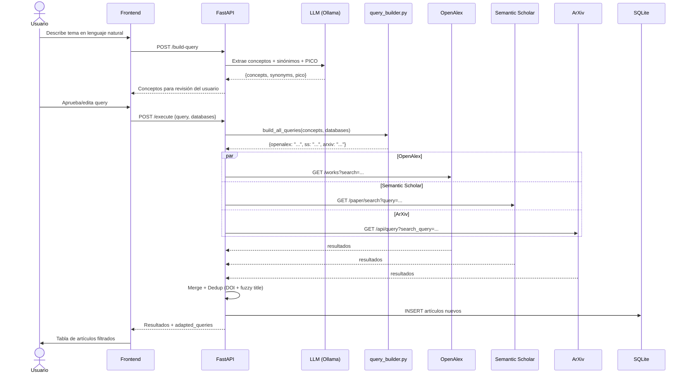

# Documentación Técnica - AgriSearch

Este documento contiene el registro de cambios funcionales, decisiones técnicas, flujos de datos relevantes y posibles errores para mantener la trazabilidad de la aplicación AgriSearch.

---

## Registro de Cambios y Funcionalidades

### Búsqueda y Obtención de PDFs (Fase 1)
- **Extracción Inteligente:** Ejecuta queries a OpenAlex, Semantic Scholar y Arxiv, deduplica e inserta en SQLite.
- **Adaptación Determinista por Base de Datos:** Para evitar fallos de sintaxis en búsquedas complejas (ej. consultas booleanas con paréntesis que rompen las APIs), el backend usa un módulo determinista (`query_builder.py`) que construye la query óptima para cada API. No depende de un LLM para la adaptación, eliminando la impredecibilidad.
  - **OpenAlex**: Texto plano con keywords separados por espacios.
  - **Semantic Scholar**: Keywords concisas (no acepta nested boolean logic).
  - **ArXiv**: Formato `all:"concepto1" AND all:"concepto2"` con sinónimos agrupados por OR.
  - **Crossref**: Keywords separados por espacio, API via `habanero` (no requiere key).
  - **CORE**: Keywords con filtros de año, requiere API key gratuita.
  - **SciELO**: Keywords multilingüe (es/en/pt), API libre.
  - **Redalyc**: Keywords con token, ideal para Iberoamérica.
  - **AgEcon Search**: OAI-PMH libre, filtrado local por keywords.
  - **Organic Eprints**: OAI-PMH libre, filtrado local por keywords.
- **Extracción de Conceptos por LLM:** El LLM (Ollama) se usa **solo una vez** para extraer conceptos, sinónimos y desglose PICO del input del usuario. Retorna un JSON estructurado (no una query booleana libre).
- **Descarga Múltiple Open Access:** El servicio `download_service.py` obtiene automáticamente los PDFs vía requests asíncronas de las URLs enlazadas, los guarda en `data/projects/{id}/pdfs` y los nombra automáticamente usando la convención `[Año]_[PrimerAutor]_[Slug_Titulo].pdf`.
- **Subida Manual (Upload):** Endpoint `POST /search/upload-pdf/{article_id}`. Para los artículos que están bloqueados por un paywall, el usuario puede subir localmente su archivo PDF desde el dashboard de resultados. El archivo se enlaza directamente a su base de datos.
- **Eliminación de Búsquedas Segura:** Los usuarios pueden eliminar consultas del historial preventivamente. Esta acción ejecuta un Cascade Delete en la base de datos (eliminando `SearchQuery` y sus `Article`s) e intercepta el almacenamiento local, eliminando automáticamente los archivos PDF asociados a tales IDs para liberar espacio en disco. En la UI, el botón de eliminación está correctamente posicionado por encima del bloque redireccionador (con `z-index` y `stopPropagation`) para evitar colisiones de clics.
- **Transparencia Total de Queries:** `ArticleResponse` incluye `local_pdf_path` para que el frontend pueda mostrar el nombre del archivo local en la tabla de resultados. `SearchResultsResponse` incluye la propiedad `prompt_used` y `adapted_queries` con precisión literal. Además se ha modificado la tabla `SearchQuery` en SQLite (añadiendo la columna en texto plano `adapted_queries_json`) para preservar perennemente qué le fue enviado a cada API. En la Interfaz de Resultados, un Acordeón desplegable de "Depuración" expone ambos parámetros al investigador.
- **Selección Flexible de Modelos LLM:** Los usuarios pueden elegir qué modelo de Ollama utilizar para la generación de queries. 
  - **Preferencia por Proyecto:** Se puede definir un modelo por defecto al crear o editar un proyecto.
  - **Selección en Caliente:** Durante la fase de "Descripción", el usuario puede cambiar el modelo recomendado (GPU o CPU) o ingresar manualmente cualquier nombre de modelo de Ollama.
  - **Modelos Recomendados:**
    - **GPU (Alto rendimiento):** `llama3.1:8b` (defecto), `qwen2.5:7b`, `mistral-nemo:12b`, `gpt-oss20b`.
    - **CPU (Bajos recursos):** `phi3:3.8b`, `gemma2:2b`.
- **Dashboard Integrado:** La portada de cada proyecto (`ProjectDashboard.tsx`) amalgama eficientemente tanto el **Historial de Búsquedas** como el **Historial de Revisiones (Screening)**, creando un ecosistema completo para monitorear el progreso del cribado PRISMA en una sola vista central. Asimismo se han refactorizado las asignaciones de estado (`useState`) iniciales en base a parámetros URl para eliminar destellos visuales o pestañeos transaccionales del renderizado (Flicker Fixes).

#### Flujo de Búsqueda (Diagrama de Secuencia)

#### Archivos clave del flujo
| Archivo | Responsabilidad |
|---------|----------------|
| `services/query_builder.py` | Genera queries deterministas para las 9 APIs |
| `services/llm_service.py` | Extrae conceptos del input (solo 1 llamada LLM) |
| `services/search_service.py` | Orquesta búsqueda paralela, dedup y almacenamiento |
| `services/mcp_clients/openalex_client.py` | Cliente OpenAlex REST API |
| `services/mcp_clients/semantic_scholar_client.py` | Cliente Semantic Scholar API |
| `services/mcp_clients/arxiv_client.py` | Cliente ArXiv Atom API |
| `services/mcp_clients/crossref_client.py` | Cliente Crossref via `habanero` |
| `services/mcp_clients/core_client.py` | Cliente CORE API v3 |
| `services/mcp_clients/scielo_client.py` | Cliente SciELO Search API |
| `services/mcp_clients/redalyc_client.py` | Cliente Redalyc REST API |
| `services/mcp_clients/oaipmh_client.py` | Cliente OAI-PMH (AgEcon + Organic Eprints) |

#### Bases de datos — Resumen de acceso
| Base | Tipo | API Key | Link de registro |
|------|------|---------|------------------|
| OpenAlex | REST | Opcional (gratis) | [openalex.org](https://openalex.org/settings/api) |
| Semantic Scholar | REST | Opcional (gratis) | [semanticscholar.org](https://www.semanticscholar.org/product/api) |
| ArXiv | Atom/REST | No | — |
| Crossref | REST (`habanero`) | No (email recomendado) | — |
| CORE | REST v3 | Sí (gratis) | [core.ac.uk](https://core.ac.uk/api-keys/register) |
| SciELO | REST | No | — |
| Redalyc | REST | Sí (gratis) | [redalyc.org](https://redalyc.org) |
| AgEcon Search | OAI-PMH | No | — |
| Organic Eprints | OAI-PMH | No | — |

### Screening (Cribado PRISMA) (Fase 2)

#### Reglas de Negocio
- **Solo artículos con PDF** (`download_status = SUCCESS`) se incluyen en una sesión de screening.
- **1 sesión activa por proyecto.** Se retorna HTTP 409 si se intenta crear una segunda.
- **Identidad de sesión:** Cada sesión tiene `name` (requerido) y `goal` (opcional) para darle contexto descriptivo.

#### Endpoints Relevantes
| Endpoint | Método | Descripción |
|----------|--------|-------------|
| `/screening/sessions` | POST | Crea sesión (solo PDFs, max 1 por proyecto) |
| `/screening/sessions/{session_id}` | GET | Detalle de sesión |
| `/screening/sessions/{session_id}` | DELETE | Elimina sesión y todas sus decisiones (cascade) |
| `/screening/sessions/project/{project_id}` | GET | Lista sesiones del proyecto |
| `/screening/sessions/{session_id}/articles` | GET | Artículos en la sesión con sus decisiones |
| `/screening/sessions/{session_id}/articles/{article_id}/pdf` | GET | Retorna el archivo PDF asociado en formato `application/pdf` |
| `/screening/decisions/{decision_id}` | PUT | Actualizar decisión (include/exclude/maybe) |
| `/screening/translate` | POST | Traducir abstract vía LLM |
| `/screening/enrich/{project_id}` | POST | Enriquecimiento pre-screening desde PDFs |
| `/screening/sessions/{session_id}/articles/{article_id}/suggestion` | GET | Obtener sugerencia IA de relevancia (AI Assist) |

#### Flujo del Frontend (`ScreeningSetup.tsx`)
1. Al entrar a `/screening?id=X`, se verifica si hay sesión existente.
2. **Si hay sesión:** Muestra tarjeta resumen con estadísticas → Continuar o Eliminar.
3. **Si no hay:** Formulario de creación con nombre, objetivo, selección de búsquedas, idioma y modelo.
4. Al crear, ejecuta enriquecimiento automático (PyMuPDF) y luego crea la sesión (filtrada solo PDFs).

#### Pantalla Previa `ScreeningSetup`
- Permite elegir qué consultas integrar en el proceso actual y con qué modelo traducir los resúmenes.
-    *   **Enriquecimiento Automático:** Se mejoró sustancialmente la extracción de abstracts desde PDFs en `pdf_enrichment_service.py`. En caso de no hallar formalmente el *Abstract* con regex debido a PDFs sin un formato estándar (proceedings, revistas antiguas), se extrae inteligentemente el primer bloque extenso o un pasaje limpio inicial, reemplazando con éxito textos previos demasiado breves, resolviendo fallas con algunos archivos MCP.
    *   **Traducción de Abstracts**: Se llama a LLMs en tiempo real para traducir la versión enriquecida del abstract del PDF, sin depender de datos faltantes iniciales. Es posible elegir el modelo de LLM al crear **o continuar** una sesión de screening.
#### Proceso Interactivo (`ScreeningSession`)
Interfaz interactiva para screening:
- **Botones de decisión**: "Incluir", "Excluir" (con sub-razones), "Tal vez".
- **Visualizador Integrado**: Mediante el botón "Ver PDF" (atajo `P`), se invoca el endpoint `/pdf` para renderizar el documento PDF mediante un iframe de tamaño adaptable en la misma pantalla.
- **Asistencia Inteligente (AI Assist)**: Después de 10 decisiones manuales, el sistema genera sugerencias de inclusión/exclusión usando *Few-shot learning*. El LLM analiza el progreso y ayuda a mantener consistencia en los criterios.
- **Formateos automáticos**: Autores largos se truncan y abstracts se traducen con Ollama local.

#### Soporte Multi-Screening (Revisiones)
El sistema ahora soporta formalmente la creación de **múltiples sesiones de screening concurrentes** en un mismo proyecto. 
Esto permite que varias personas trabajen simultáneamente dividiéndose los artículos.
- Al hacer clic en "Revisiones" dentro del Dashboard, un endpoint de validación (`GET /eligibility/{project_id}`) verifica cuántos artículos que fueron descargados con éxito (`SUCCESS`) aún están libres de asignación.
- **Visualización Condicional**: En la pantalla de creación, se ocultan del listado aquellas búsquedas que ya completaron la asignación de todos sus artículos (es decir, aquellas con 0 artículos pendientes por evaluar). Las tarjetas de búsqueda muestran detalladamente la numeración original, prompt usado, artículos totales, duplicados y finalmente los "descargados por revisar".
- **Lógica Estricta de Asignación (OuterJoin)**: Al registrar la sesión final, el backend cruza la base de datos (con `outerjoin`) para extraer matemáticamente SOLO los artículos elegibles exentos de participar en otra revisión activa. Ningún artículo se repetirá a través de múltiples revisiones.
- **Nombres Automáticos:** El campo de "nombre de la sesión" ahora sugiere secuencias inteligentes opcionales ("Revisión 1", "Revisión 2") y el "Objetivo" es estrictamente prescindible.
- **Regla de Bloqueo General**: Si todos los artículos exitosos del proyecto ya están aglomerados en las sesiones existentes, el sistema levanta una alerta gráfica (Popup) impidiendo la creación de una revisión vacía y exigiendo realizar más búsquedas previamente.
- **Control de Colisiones en Base de Datos (Estrategia UUID)**: En el sistema backend, todos los modelos (`projects`, `search_queries`, `articles`, `screening_sessions`, `screening_decisions`) utilizan `UUIDv4` como Clave Primaria inmutable (`String`). Esta decisión arquitectónica avala que es computacional y probabilísticamente imposible que un artículo o revisión de un proyecto sufra una "colisión de IDs" (cruce de información) con sesiones o artículos de otro proyecto, blindando la integridad referencial.

#### Funcionalidades Recientes
- **Eliminación Segura de Revisiones:** Desde el Dashboard del Proyecto, se puede eliminar definitivamente una revisión (Screening Session). Esto elimina en cascada las decisiones (incluido/excluido), pero **respeta de forma segura e intacta los PDFs**, de manera que estén disponibles para futuras revisiones.
- **Trazabilidad del Prompt Natural:** Se guarda e incluye explícitamente el prompt natural inicial (`raw_prompt`) para diferenciarlo de la Query generada en la interfaz gráfica del Dashboard y los Resultados.
- **Rutas de PDF Sanitizadas Human-Readable:** Los archivos PDF se agrupan en carpetas locales con el nombre del proyecto y la búsqueda transformados dinámicamente a 'Snake_Case' (removiendo acentos y reemplazando espacios por subguiones).
- **Contador de Artículos "No Encontrados/Sin Enlace":** Monitoreo visible post-búsqueda para aquellos artículos a los cuales los MCPs (ej. Crossref) no devolvieron explícitamente un Open Access URL, transparentando qué PDFs faltarían.
- **Modal Interactivo de Eliminación de Proyectos:** Pop-up estilizado con Glassmorphism que previene eliminaciones accidentales en cascada, garantizando una mejor experiencia de usuario al pedir confirmación para borrar de raíz búsquedas, registros y PDFs físicos integrales del disco.
- **Contador Dinámico de Revisiones:** El Dashboard muestra independientemente la figura estricta de documentos "revisados" a partir del cruce de sumas SQL (subconsultas escalares), erradicando reportes inconsistentes de metadatos huérfanos.

#### Arquitectura de Base de Datos y Diccionarios Funcionales (`/docs`)
La robustez contra duplicados intra e inter APIs, revisiones concurrentes e inmutabilidad multi-usuario descansa en un modelado de Base de Datos robusto documentado explícitamente en tres artefactos fundacionales:
1. `docs/database_schema_expected.json`: Diccionario canónico que delimita el objetivo, tipo de dato y restricciones SQL lógicas (Ejemplo y Explicación) sobre cada tabla de `agrisearch.db`.
2. `docs/database_schema_current.json`: Snapshot auto-generado de SQLite usando pragmas para evidenciar el estado 1:1 real del servidor.
3. `docs/database_diagram.md`: Diagrama de Arquitectura ER (Entity Relationship) escrito nativamente en código `mermaid`. Ilustra el proceso de cómo 1 Proyecto se ramifica atando fuertemente el destino de una "Búsqueda" o "Revisión" hasta las múltiples "Decisiones PRISMA" usando UUIDs.
---

## Dependencias Críticas
- **PyMuPDF**: Necesario en el backend para la extracción limpia de texto de archivos PDF durante la fase pre-screening. (`pip install PyMuPDF`).
- **Ollama**: Requiere tener en ejecución instancias de modelos LLM. Por ejemplo, `gemma4:e4b` como opción multilingüe y de razonamiento óptima.
- **Nomic MoE**: El modelo de embeddings `nomic-embed-text-v2-moe:latest` es el estándar para la vectorización de artículos.

## Configuración de Inteligencia Artificial (Ollama)

AgriSearch escala su rendimiento según tu hardware. Hemos definido **6 Perfiles de Hardware** y **4 Casos de Uso** principales. A continuación, la matriz completa de 24 recomendaciones validadas.

### 1. Perfiles de Hardware (Modelos Generalistas)
Si prefieres descargar **un solo modelo** que rinda de manera sobresaliente en todas las tareas diarias de tu equipo (redacción, resumen, chat general y código básico):

| Perfil | Hardware Referencia | Modelo "Todoterreno" | Comando de Descarga |
| :--- | :--- | :--- | :--- |
| **CPU Baja** | < 8GB RAM / Intel i3 | `qwen3:1.5b` | `ollama pull qwen3:1.5b` |
| **CPU Media** | 16GB RAM / Intel i5-i7 | `phi4-mini:3.8b` | `ollama pull phi4-mini:3.8b` |
| **CPU Alta** | 32GB+ RAM / Ryzen 7-9 | `gemma4:e4b` | `ollama pull gemma4:e4b` |
| **GPU Baja** | 4-6GB VRAM (RTX 3050) | `phi4-mini:3.8b` | `ollama pull phi4-mini:3.8b` |
| **GPU Media** | 8-12GB VRAM (RTX 4060) | `llama4:8b` | `ollama pull llama4:8b` |
| **GPU Alta** | 16GB+ VRAM (RTX 4090) | `gemma4:e4b` | `ollama pull gemma4:e4b` |

> 💡 **¿Por qué estos modelos?**
> * **`qwen3:1.5b`:** Es el rey indiscutible de los pesos pluma. Responde increíblemente rápido en CPUs antiguas y tiene un vocabulario en español mucho más natural que la generación anterior.
> * **`phi4-mini:3.8b`:** Microsoft logró empaquetar la inteligencia de un modelo de 14B en menos de 4B. Es el punto dulce absoluto para laptops modernas (MacBooks base o PCs con 16GB), sirviendo tanto para redactar correos como para estructurar datos.
> * **`llama4:8b`:** El "Gold Standard" de Meta. Si tienes la RAM o VRAM para correrlo, es el modelo generalista más robusto, seguro y versátil del mercado abierto.
> * **`deepseek-r1` (8B y 14B):** Al ser modelos destilados con capacidades de razonamiento (RL), son perfectos para GPUs. Actúan como asistentes brillantes: pueden desde tener una charla casual hasta resolver un bug complejo de Python o estructurar un artículo entero, pensando los pasos antes de responder.

---

### 2. Matriz de Especialidad: 24 Modelos Recomendados (Actualización 2026)
Para usuarios avanzados que buscan optimizar cada fase del proceso PRISMA utilizando modelos de razonamiento (RL) y arquitecturas MoE de última generación:

#### 2.1 Modelos para Traducción (ES/EN/PT)

| Perfil | RAM necesaria | Modelo | Comando de Descarga | Por qué es el mejor (Métrica) |
| :--- | :--- | :--- | :--- | :--- |
| **CPU Baja** | ~1.5 GB | `qwen3:0.6b` | `ollama pull qwen3:0.6b` | La mayor densidad de conocimiento <1B actual; fluidez gramatical superior a antiguos 3B. |
| **CPU Media** | ~3 GB | `gemma3:2b`  | `ollama pull gemma3:2b`  | Eficiencia bruta de Google; excelente manejo de terminología técnica en strings cortos. |
| **CPU Alta** | ~8 GB | `llama4:8b`  | `ollama pull llama4:8b`  | El nuevo estándar multilingüe (entrenado en 200 idiomas); captura matices técnicos EN/ES a la perfección. |
| **GPU Baja** | ~4 GB | `phi4-mini:3.8b`| `ollama pull phi4-mini:3.8b`| Rendimiento multilingüe top-tier (Microsoft) rivalizando con modelos de 14B. |
| **GPU Media** | ~8 GB | `aya-expanse:8b`| `ollama pull aya-expanse:8b`| **Especialista:** Supera a Llama 3.1 por amplio margen en win-rate multilingüe (Cohere). |
| **GPU Alta** | ~24 GB| `aya-expanse:32b`| `ollama pull aya-expanse:32b`| **State-of-the-Art:** Traducción nativa y fluida de abstracts científicos complejos en 23 idiomas sin perder rigor académico. |

**Explicación:** La traducción técnica agrícola y médica no admite pérdida de contexto. Mientras `aya-expanse` sigue dominando el multilingüismo puro, `llama4` y `phi4-mini` ofrecen una asombrosa comprensión de idiomas con muy bajo coste computacional.

#### 2.2 Modelos para Queries (Búsqueda y Lógica Booleana)

[Image of Boolean search logic Venn diagram]

| Perfil | RAM necesaria | Modelo | Comando de Descarga | Por qué es el mejor (Métrica) |
| :--- | :--- | :--- | :--- | :--- |
| **CPU Baja** | ~1.5 GB | `deepseek-r1:1.5b`| `ollama pull deepseek-r1:1.5b`| Usa Chain-of-Thought (RL) para planificar la query antes de escribirla. Cero errores de sintaxis. |
| **CPU Media** | ~4 GB | `phi4-mini:3.8b`| `ollama pull phi4-mini:3.8b`| Altísima adherencia a instrucciones (IFEval) y formato estricto. |
| **CPU Alta** | ~8 GB | `deepseek-r1:8b`| `ollama pull deepseek-r1:8b`| (Destilado de Llama/Qwen) **Líder en Lógica:** 91.8% de precisión en tareas complejas. |
| **GPU Baja** | ~4 GB | `qwen3:3b`   | `ollama pull qwen3:3b`   | Balance perfecto entre velocidad de tokenización y seguimiento de esquemas JSON. |
| **GPU Media** | ~10 GB | `deepseek-r1:14b`| `ollama pull deepseek-r1:14b`| Generación masiva de queries complejas (`AND`, `OR`, `NOT`, anidaciones) sin alucinaciones de formato. |
| **GPU Alta** | ~16 GB | `gpt-oss:20b`| `ollama pull gpt-oss:20b`| **Nivel Industrial:** El modelo abierto de OpenAI. Comportamiento de agente perfecto para tool-calling y APIs. |

**Explicación:** La generación de queries booleanas para PubMed o Scopus es un problema de *código y lógica*, no de lenguaje natural. Los modelos `deepseek-r1` piensan paso a paso (generan `<think>`) para estructurar los operadores booleanos antes de escupir el JSON, reduciendo a cero los rechazos de las APIs.

#### 2.3 Modelos para Screening (Cribado / Criterios PICO)

| Perfil | RAM necesaria | Modelo | Comando de Descarga | Por qué es el mejor (Métrica) |
| :--- | :--- | :--- | :--- | :--- |
| **CPU Baja** | ~1.5 GB | `deepseek-r1:1.5b`| `ollama pull deepseek-r1:1.5b`| Razonamiento lógico que aplasta a los modelos de 7B de 2024 en clasificación binaria. |
| **CPU Media** | ~4 GB | `phi4-mini:3.8b`| `ollama pull phi4-mini:3.8b`| **MMLU Elevado:** Capacidad de análisis lógico comparable a modelos masivos. |
| **CPU Alta** | ~12 GB | `phi4:14b`   | `ollama pull phi4:14b`   | Análisis profundo de papers; especialista en GPQA (preguntas científicas de nivel graduado). |
| **GPU Baja** | ~5 GB | `deepseek-r1:7b`| `ollama pull deepseek-r1:7b`| Destilado de Qwen; entiende perfectamente si un abstract cumple los criterios PICO. |
| **GPU Media** | ~10 GB | `deepseek-r1:14b`| `ollama pull deepseek-r1:14b`| Evalúa meticulosamente exclusiones e inclusiones explicando su razonamiento científico. |
| **GPU Alta** | ~16 GB | `gpt-oss:20b`| `ollama pull gpt-oss:20b`| Capacidad de razonamiento tipo GPT-4 en local; no se deja engañar por falsos positivos en los abstracts. |

**Explicación:** En el screening PICO, la precisión lo es todo. La familia `phi4` fue entrenada con datos sintéticos de altísima densidad de razonamiento, mientras que `deepseek-r1` y `gpt-oss` dedican tokens a "pensar" por qué un artículo debe incluirse o excluirse, haciendo que el cribado semi-automático sea auditable y confiable.

#### 2.4 Modelos para RAG Estricto (Chat / APA / Extracción)

| Perfil | RAM necesaria | Modelo | Comando de Descarga | Por qué es el mejor (Métrica) |
| :--- | :--- | :--- | :--- | :--- |
| **CPU Baja** | ~2 GB | `gemma3:1b`  | `ollama pull gemma3:1b`  | Sorprendente precisión en citas y brevedad para su tamaño ultra-compacto. |
| **CPU Media** | ~4 GB | `phi4-mini:3.8b`| `ollama pull phi4-mini:3.8b`| Mantiene la coherencia argumental en chats sobre bibliografía (128k de contexto). |
| **CPU Alta** | ~8 GB | `llama4:8b`  | `ollama pull llama4:8b`  | El nuevo estándar para pipelines de RAG por su masiva ventana de contexto y fidelidad al documento. |
| **GPU Baja** | ~8 GB | `deepseek-r1:8b`| `ollama pull deepseek-r1:8b`| Razona sobre los fragmentos recuperados antes de redactar, evitando mezclar conceptos. |
| **GPU Media** | ~16 GB | `gpt-oss:20b`| `ollama pull gpt-oss:20b`| Excelencia en RAG: comportamiento determinista para citar en APA estricto sin inventar fuentes. |
| **GPU Alta** | ~24 GB | `qwen3:30b-moe`| `ollama pull qwen3:30b...`| **RAG-Specialist 2026:** Arquitectura MoE muy eficiente, ventana de 262k tokens, ideal para cruzar decenas de PDFs completos. |

**Explicación:** El chat RAG requiere fidelidad absoluta a los documentos recuperados (Cero Alucinaciones) y ventanas de contexto masivas. `qwen3` (con sus 262K) y `llama4` lideran el procesamiento de documentos largos, mientras que `gpt-oss` es insuperable aplicando formatos APA estrictos.

> 💡 **Tip de Rendimiento 2026:** Los modelos **DeepSeek-R1** (versiones destiladas de 7B a 14B) son obligatorios para **Queries** y **Screening** debido a su `<think> mode`, que reduce las alucinaciones lógicas casi a cero. Para RAG masivo, busca modelos con arquitecturas MoE (Mixture of Experts) como `qwen3` o `gpt-oss` que procesan cientos de páginas consumiendo muy poca VRAM activa.

---

> **Nota Crítica sobre RAG:** Independientemente del perfil, es **obligatorio** tener instalado el modelo de embeddings para que el chat funcione: 
> `ollama pull nomic-embed-text-v2-moe:latest`

---

## UI/UX Global
- **Modo claro/oscuro:** Toggle global persistente (localStorage) en la barra de navegación, disponible en todas las páginas.

---

*Nota: Este documento debe ser actualizado iterativamente al realizar modificaciones importantes, en cumplimiento con el flujo `update-documentation.md`.*
