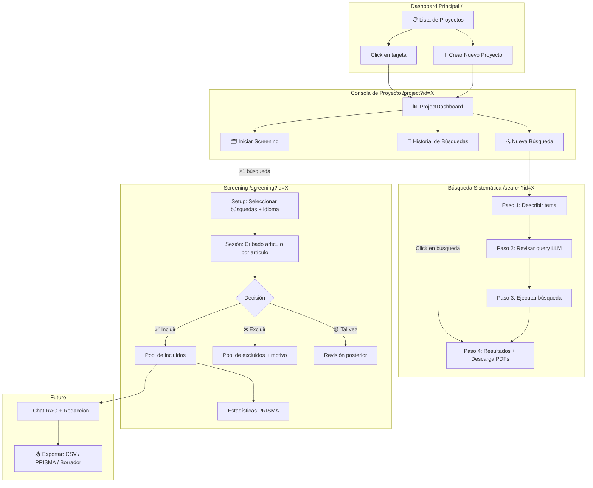
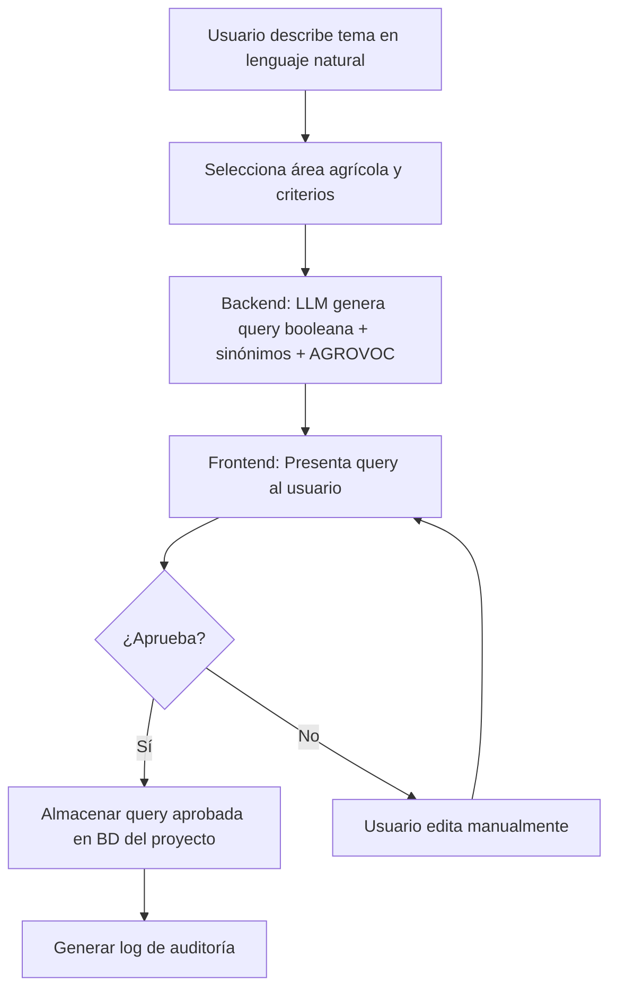
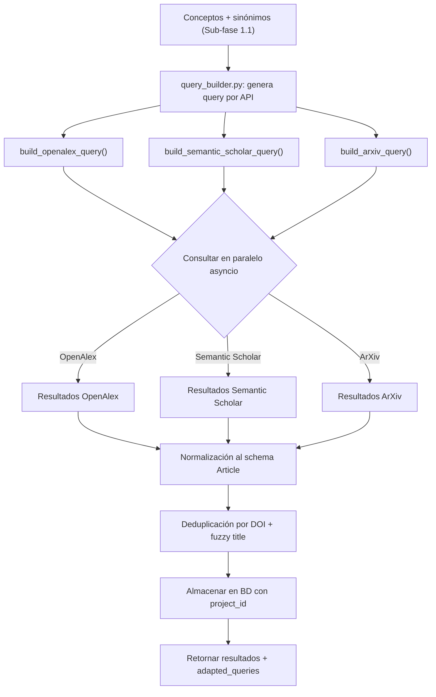
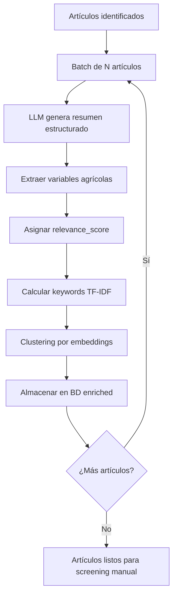
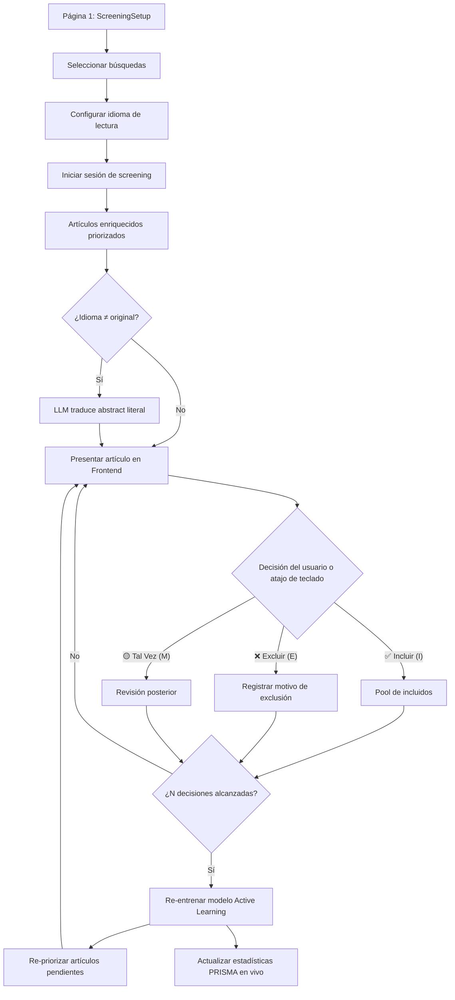
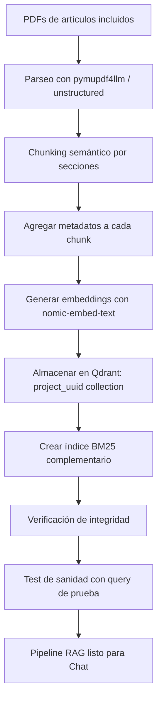
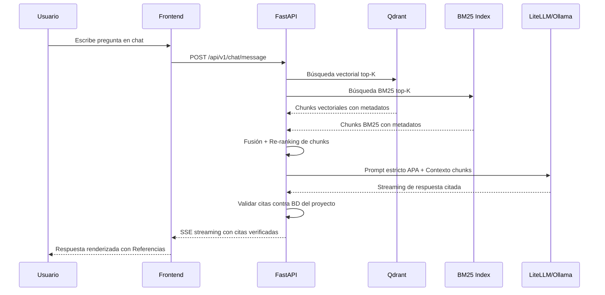

# AgriSearch: Plataforma de Búsqueda Sistemática y Asistente de Investigación Agrícola basada en PRISMA 2020

---

## 1. Propósito General

Desarrollar una aplicación web local, modular, segura y orientada a Clean Code, especializada en **ciencias agrícolas** (ensayos en campo, biotecnología, entomología, fitopatología, breeding, agricultura de precisión, entre otros). La plataforma asistirá a investigadores en la realización de revisiones sistemáticas siguiendo rigurosamente la metodología **PRISMA 2020** (Page et al., 2021).

La herramienta integrará tres capacidades clave mediante una arquitectura desacoplada (Frontend Astro + Backend FastAPI):

1. **Búsqueda Sistemática Exhaustiva** — Identificación y descarga masiva de artículos científicos desde múltiples bases de datos (OpenAlex, Semantic Scholar, ArXiv, Web) con generación de queries semánticas asistidas por LLM.
2. **Screening Inteligente Estilo Rayyan** — Cribado semi-automático con Active Learning donde el LLM aprende de las decisiones del usuario para priorizar artículos, siguiendo el flujo de PRISMA 2020 desde la identificación hasta la inclusión.
3. **Chat RAG Conversacional con Citación APA Estricta** — Interfaz de diálogo sobre el corpus incluido, con capacidad de asistir en la redacción académica de TFMs, tesis y artículos científicos.

Todo gestionado **por proyectos independientes**, permitiendo al usuario llevar simultáneamente 2, 3 o más revisiones completamente aisladas entre sí (cada una con su propia base de datos vectorial, historial de screening y chat).

---

## 2. Estructura de Carpetas del Código Fuente

```text
Chat_busqueda_sistematica/
│
├── frontend/                          # Aplicación Astro (UI)
│   ├── src/
│   │   ├── layouts/                   # Layouts base
│   │   │   └── MainLayout.astro       # Layout principal (✅)
│   │   ├── pages/                     # Rutas de la app
│   │   │   ├── index.astro            # Dashboard principal — listado de proyectos (✅)
│   │   │   ├── project.astro          # Dashboard individual por proyecto (✅)
│   │   │   ├── search.astro           # Wizard de búsqueda sistemática (✅)
│   │   │   └── screening.astro        # Screening / Cribado (⏳ pendiente)
│   │   ├── components/                # Componentes React
│   │   │   ├── Dashboard.tsx          # Gestor de proyectos (✅)
│   │   │   ├── ProjectDashboard.tsx   # Panel de detalles e historial de cada proyecto (✅)
│   │   │   ├── SearchWizard.tsx       # Asistente multi-paso para búsqueda — orchestrator (✅)
│   │   │   ├── SearchWizardDescribe.tsx # Paso 1: Descripción de la búsqueda (✅)
│   │   │   ├── SearchWizardReview.tsx   # Paso 2: Revisión de la query generada (✅)
│   │   │   ├── SearchWizardSearching.tsx# Paso 3: Interfaz de búsqueda en curso (✅)
│   │   │   ├── SearchWizardResults.tsx  # Paso 4: Resultados con tabla, LaTeX y descarga (✅)
│   │   │   ├── ScreeningSetup.tsx     # Config screening: selección búsquedas + idioma (⏳)
│   │   │   ├── ScreeningSession.tsx   # Sesión de cribado artículo por artículo (⏳)
│   │   │   ├── ScreeningArticleCard.tsx # Tarjeta de artículo con abstract + traducción (⏳)
│   │   │   ├── ScreeningStats.tsx     # Panel lateral: progreso y contadores (⏳)
│   │   │   └── ScreeningListView.tsx  # Vista tabla alternativa de todos los artículos (⏳)
│   │   ├── styles/                    # CSS global y Tailwind
│   │   │   └── global.css
│   │   └── lib/                       # Utilidades y cliente API
│   │       └── api.ts
│   │   └── react-latex-next.d.ts      # Declaración de tipos para LaTeX (✅)
│   ├── public/                        # Assets estáticos
│   ├── astro.config.mjs
│   └── package.json
│
├── backend/                           # Servidor Python (FastAPI)
│   ├── app/
│   │   ├── main.py                    # Punto de entrada FastAPI
│   │   ├── core/
│   │   │   ├── config.py              # Variables de entorno y settings (Pydantic Settings)
│   │   │   ├── security.py            # Rate limiting, CORS, sanitización de inputs
│   │   │   └── logging_config.py      # Configuración centralizada de logs
│   │   ├── api/
│   │   │   ├── v1/
│   │   │   │   ├── projects.py        # CRUD de proyectos
│   │   │   │   ├── search.py          # Endpoints de búsqueda sistemática
│   │   │   │   ├── screening.py       # Endpoints de screening (clasificación)
│   │   │   │   ├── chat.py            # Endpoints de chat RAG
│   │   │   │   ├── documents.py       # Upload/download de PDFs
│   │   │   │   └── writing.py         # Endpoints de asistencia de redacción
│   │   │   └── deps.py                # Dependencias inyectadas (DB sessions, etc.)
│   │   ├── services/
│   │   │   ├── search_service.py      # Lógica de búsqueda (MCP clients, dedup)
│   │   │   ├── download_service.py    # Descarga de PDFs con rate-limit y validación DOI
│   │   │   ├── screening_service.py   # Active Learning + clasificación LLM
│   │   │   ├── rag_service.py         # Pipeline RAG (chunking, embedding, retrieval)
│   │   │   ├── chat_service.py        # Orquestación de chat con citaciones APA
│   │   │   ├── writing_service.py     # Análisis de borradores y feedback
│   │   │   ├── llm_service.py         # Wrapper sobre LiteLLM (abstracción de modelos)
│   │   │   └── mcp_clients/
│   │   │       ├── openalex_client.py
│   │   │       ├── semantic_scholar_client.py
│   │   │       ├── arxiv_client.py
│   │   │       └── browser_client.py
│   │   ├── models/
│   │   │   ├── project.py             # Modelo de Proyecto (SQLAlchemy / Pydantic)
│   │   │   ├── article.py             # Modelo de Artículo con metadatos
│   │   │   ├── screening_decision.py  # Modelo de decisiones de screening
│   │   │   └── chat_history.py        # Modelo de historial de chat
│   │   ├── db/
│   │   │   ├── database.py            # Engine y Session de SQLAlchemy
│   │   │   └── migrations/            # Alembic migrations
│   │   └── utils/
│   │       ├── pdf_parser.py          # Extracción de texto de PDFs
│   │       ├── doi_validator.py       # Validación y resolución de DOIs
│   │       ├── apa_formatter.py       # Formateador de citas APA 7ma ed.
│   │       ├── deduplication.py       # Algoritmos de deduplicación fuzzy
│   │       └── csv_exporter.py        # Exportador CSV/Excel compatible PRISMA
│   ├── requirements.txt
│   └── alembic.ini
│
├── data/                              # Datos locales POR PROYECTO
│   └── projects/
│       └── {project_uuid}/
│           ├── raw/                   # CSVs de búsquedas crudas
│           ├── pdfs/                  # Artículos descargados
│           ├── processed/             # Datos filtrados post-screening
│           └── exports/               # Reportes exportados
│
├── vector_db/                         # Qdrant colecciones POR PROYECTO
│   └── {project_uuid}/               # Colección aislada por proyecto
│
├── tests/
│   ├── unit/
│   ├── integration/
│   └── e2e/
│
├── docs/
│   └── plan_a_seguir.md               # Este documento
│
├── .agents/
│   └── workflows/                     # Skills y workflows para desarrollo
│
├── .gitignore
├── README.md
└── docker-compose.yml                 # (Opcional) Qdrant + Ollama containerizados
```

---

## 3. Estructura de la Plataforma (Diseño de UI/UX)

### 3.1 Dashboard Principal (`/` → `index.astro` → `Dashboard.tsx`)

Pantalla de inicio donde se listan todos los **Proyectos de Revisión** del usuario. Cada proyecto es una revisión sistemática independiente.

**Estado actual (✅ Implementado):**
- **Crear Nuevo Proyecto:** Formulario con nombre, descripción, selección múltiple de áreas agrícolas (entomología, fitopatología, breeding, biotecnología, agricultura de precisión, ciencias del suelo, agronomía, malherbología, otro), e idioma (ES/EN).
- **Tarjetas de Proyecto:** Cada tarjeta muestra el nombre del proyecto, descripción truncada (con `text-overflow: ellipsis`), áreas agrícolas como badges, conteo de artículos, y fecha de última actualización.
- **Eliminar Proyecto:** Botón con confirmación.
- **Acceso directo:** Click en tarjeta navega a `/project?id=X`.

### 3.2 Vista de Proyecto (`/project?id=X` → `project.astro` → `ProjectDashboard.tsx`)

Consola individual del proyecto con la información y acciones disponibles.

**Estado actual (✅ Implementado):**
- **Cabecera editable:** Nombre, descripción y áreas agrícolas editables inline (modo vista / modo edición).
- **Historial de Búsquedas:** Tabla listando todas las `SearchQuery` del proyecto (fecha, input original, query generada, BDs usadas, total resultados, duplicados removidos). Cada fila es clicable y redirige al Wizard con los resultados precargados.
- **Botón "Nueva Búsqueda":** Navega a `/search?id=X` para iniciar el Wizard desde cero.
- **Botón "Abrir Carpeta":** Abre la carpeta local del proyecto en el explorador de archivos.
- **Notificaciones tipo toast:** Confirmación visual de acciones exitosas/erróneas.

**Pendiente:**
- **Botón "Iniciar Screening"** (habilitado solo si hay ≥1 búsqueda con artículos): navega a `/screening?id=X`.
- **Diagrama PRISMA en vivo** (futuro).

#### 3.2.1 Búsqueda Sistemática (`/search?id=X` → `search.astro` → `SearchWizard.tsx`)

**Estado actual (✅ Implementado):**

Wizard multi-paso modularizado en 4 sub-componentes React independientes:

| Paso | Componente | Descripción |
|------|-----------|-------------|
| 1. Describir | `SearchWizardDescribe.tsx` | El usuario escribe en lenguaje natural qué investiga. Selecciona área agrícola, rango de años e idioma. |
| 2. Revisar | `SearchWizardReview.tsx` | El LLM genera una query booleana optimizada, términos AGROVOC/MeSH sugeridos y desglose PICO/PEO. El usuario puede editar la query. |
| 3. Buscando | `SearchWizardSearching.tsx` | Ejecución concurrente. El backend usa primero otro llamado al LLM para **adaptar la sintaxis de la query** estrictamente según los requerimientos nativos de cada API elegida (OpenAlex, Semantic Scholar, ArXiv) mejorando drásticamente la relevancia de resultados sin fallar en sintaxis complejas. |
| 4. Resultados | `SearchWizardResults.tsx` | Tabla interactiva con todos los artículos encontrados. Soporte para **renderizado LaTeX** (KaTeX + `react-latex-next`) en títulos y abstracts. Columnas: título, autores (truncados a "et al." si son muy largos), año, journal, DOI (enlace), fuente (badge coloreado), estado de descarga, nombre de archivo PDF local. Botones de descarga masiva de PDFs (con nomenclatura automática `[año]_[primer_autor]_[título].pdf`) y **botón para subir PDF manualmente** si la descarga automática falla o está bloqueada por paywall. |

**Bases de datos soportadas:**
- 📚 OpenAlex (>200M works)
- 🔬 Semantic Scholar (AI-powered)
- 📄 ArXiv (preprints)
- 🌐 Web (BrowserMCP — backup)

#### 3.2.2 Screening / Cribado (`/screening?id=X` — ✅ Implementado)

Interfaz de cribado inspirada en **Rayyan.ai**, organizada en una única vista unificada (island renderizado con client:only="react") que intercala entre **2 sub-fases** lógicas, con traducción de abstracts vía LLM local.

**Reglas de negocio:**
- **Solo artículos con PDF descargado** (`download_status = SUCCESS`) entran al screening. Los artículos sin PDF (paywall, failed, pending) quedan excluidos.
- **Soporte Multi-Screening:** Se permite tener crear sesiones concurrentes por proyecto, ideal para que diversas personas trabajen simultáneamente (multi-persona).
- **Control de Artículos Libres (*Eligibility*):** Al crear una nueva revisión, el sistema contabiliza estrictamente si todos los artículos descargados ya están aglomerados por sesiones anteriores. En tal caso, bloquea la creación de revisiones vacías hasta recopilar más literatura.
- **Estrategia de Integridad de Base de Datos y UUIDs:** Todos los modelos (Proyectos, Búsquedas, Artículos, Revisiones y Decisiones) usan obligatoriamente un `UUIDv4` como Clave Primaria (tipo `String`). Esto asegura que es matemáticamente imposible que un ID de artículo de un proyecto se cruce con una revisión de otro proyecto, favoreciendo entornos asíncronos y manteniendo las relaciones Foreign Key inmutables.

##### Página 1: Configuración del Screening (`/screening?id=X` → `ScreeningSetup.tsx`)

**Si ya existe una sesión activa:**
- Muestra tarjeta con nombre, fecha, objetivo, estadísticas (total, revisados, incluidos, excluidos, tal vez), barra de progreso.
- Botón **"▶️ Continuar Screening"** → navega a la sesión activa.
- Botón **"🗑️ Eliminar sesión y crear nueva"** → elimina la sesión y todas sus decisiones (cadena de borrado en cascada del UUID), regresa al formulario de creación.

**Si no hay sesión existente (formulario de creación de Nueva Revisión):**
- **Soporte Multi-Screening Inteligente:** Por omisión al dar clic, buscará artículos no asignados y sugerirá nombres de revisión en base al contador.
- **Nombre de la sesión y Objetivo:** Ambos son opcionales. El sistema asume nombres por default (Revisión N).
- **Selección de búsquedas (Filtro Condicional):** Checklist. Se ocultan por defecto todas las búsquedas que ya no contengan artículos disponibles (0 artículos no asignados). Las tarjetas visuales marcan la métrica y fuentes exactas por cada query del prompt.
- **Resumen consolidado:** Muestra el total de artículos no asignados únicos elegibles, con advertencia excluyente de lo que ya fue asignado previamente.
- **Idioma de lectura:** Selector (español/inglés/portugués).
- **Modelo de traducción:** Por defecto `aya:8b` (Cohere, multilingüe avanzado). Opciones: Llama 3.1 8B, Qwen 2.5 7B.
- **Enriquecimiento previo:** Al crear la sesión, se ejecuta automáticamente la extracción de abstracts y keywords desde los PDFs descargados (vía PyMuPDF).
- **Construcción Segura SQL:** Al hacer click en crear, un OUTER JOIN se encarga de acoplar matemática y exclusivamente a los artículos sin asignar con su nueva ronda invocando sus UUIDs, sin afectar el histórico PRISMA.

##### Página 2: Sesión de Screening (`/screening?id=X&session=Y` → `ScreeningSession.tsx`)

Interfaz principal de cribado artículo-por-artículo, estilo Rayyan:

**Área central — Tarjeta del artículo:**
- **Título** (con renderizado LaTeX si contiene fórmulas).
- **Autores** (truncados a 3 + "et al." si son más de 3), **Año**, **Journal**, **DOI** (enlace clicable al artículo original).
- **Abstract original** completo.
- **Abstract traducido** (si el idioma de lectura ≠ idioma original): traducción estrictamente literal ejecutada por el LLM local. **No se resume ni se parafrasea**: se traduce oración por oración manteniendo exactamente el contenido original.
- **Visor de PDF integrado:** Un botón permite desplegar un visor de PDF (iframe) directamente debajo del abstract para consultar el artículo original sin salir de la sesión.
- **Keywords** del artículo (si disponibles).
- **Fuente de la búsqueda** (badge: OpenAlex / Semantic Scholar / ArXiv).

**Botones de decisión:**
- ✅ **Incluir** (verde) — El artículo es relevante para la revisión.
- ❌ **Excluir** (rojo) — El artículo no cumple los criterios. Se solicita un **motivo de exclusión** (dropdown configurable: "Fuera de alcance", "No es artículo original", "Idioma no aceptado", "Duplicado no detectado", "Sin acceso al texto completo", "Otro").
- 🟡 **Tal Vez** (amarillo) — Dudoso, se revisará después.
- 📄 **Ver PDF** (gris) — Abre un iframe inferiør para visualizar el PDF cargado localmente.
- 📝 **Nota** (gris) — Campo de texto opcional para anotar observaciones.

**Atajos de teclado:**
- `I` → Incluir
- `E` → Excluir
- `M` → Tal Vez (Maybe)
- `←` / `→` → Artículo anterior / siguiente
- `N` → Abrir campo de nota
- `P` → Abrir / Cerrar visor de PDF

**Panel lateral — Estadísticas en vivo:**
- Barra de progreso: N revisados / N total.
- Contadores: N incluidos, N excluidos, N tal vez, N pendientes.
- Filtros rápidos: ver solo "Tal vez", ver solo pendientes, ir a un artículo específico por índice.

**Vista alternativa — Tabla completa:**
- Toggle para cambiar entre vista tarjeta (uno a uno) y vista tabla (todos los artículos con su estado de decisión).
- Permite revisión rápida del panorama general.

**Sub-componentes React:**

| Componente | Responsabilidad |
|-----------|----------------|
| `ScreeningSetup.tsx` | Gestión sesión existente (continuar/eliminar), formulario de nueva sesión (nombre, objetivo, búsquedas, idioma, modelo) |
| `ScreeningSession.tsx` | Orquestador de la sesión (carga artículos, gestión estado, teclado) |
| `ScreeningArticleCard.tsx` | Tarjeta individual del artículo con abstract + traducción |
| `ScreeningStats.tsx` | Panel lateral con progreso y contadores |
| `ScreeningListView.tsx` | Vista tabla alternativa con todos los artículos y estados |

#### 3.2.3 Chat RAG (`chat` — ⏳ Futuro, post-screening)
- **Chat conversacional** tipo NotebookLM con streaming de respuestas.
- Cada respuesta incluye **citaciones APA inline** (Autor et al., Año) y al final un bloque de "**Referencias**" con los DOI clicables.
- **Indicador de fuentes:** Cada fragmento de respuesta tiene un tooltip que señala de qué artículo y página se extrajo.
- **Modo Redacción:** Panel dividido donde a la izquierda está el chat y a la derecha un editor para el borrador del usuario (Introducción, Discusión, etc.). El LLM propone mejoras contextualizadas con la literatura indexada.
- **Exportar conversación:** Descarga en Markdown o PDF con las citas completas.

#### 3.2.4 Configuración del Proyecto (`settings` — ⏳ Futuro)
- Editar nombre, descripción, área agrícola. *(Parcialmente implementado en `ProjectDashboard.tsx`)*
- Configurar modelo LLM preferido (vía LiteLLM: Ollama local, OpenAI, Anthropic, etc.).
- Parámetros de RAG: tamaño de chunk, top-K de recuperación, umbral de similitud.
- Exportar/Importar proyecto completo (backup).

#### 3.2.5 Base de Datos (`data/agrisearch.db` — ✅ Implementado)
La arquitectura backend cuenta con su propia base de código documental que expone el comportamiento, ejemplos vivos y la estructura atómica de las tablas SQLite (`agrisearch.db`) mediante SQLAlchemy Async (`aiosqlite`).

*   **Identificadores Inmutables y Seguros (`UUIDv4`):** El mayor pilar del diseño de AgriSearch contra colisiones entre las revisiones concurrentes y los proyectos. Toda asignación genera dinámicamente UUIDs con cero colisiones probabilísticas.
*   **Recursos Aprobados:**
    *   `docs/database_schema_expected.json`: El diccionario exacto de qué información y restricciones de tabla requiere cada modelo SQLAlchemy en producción.
    *   `docs/database_schema_current.json`: Generado automáticamente mediante PRAGMAs para auditar el SQLite real.
    *   `docs/database_diagram.md`: Un diagrama ER completo construido en Mermaid ilustrando las relaciones Muchos-a-Muchos y Uno-a-Muchos que dominan la selección de artículos para screening y el almacenamiento histórico PRISMA.

### 3.3 Wireframe Conceptual del Flujo General



**Leyenda de estados de implementación:**
- ✅ **Implementado:** Dashboard, Consola de Proyecto, Búsqueda Sistemática completa (4 pasos), Screening (Setup + Sesión interactivas con LLM).
- ⏳ **En proceso/diseño:** RAG vectorización de textos completos.
- 🔮 **Futuro:** Chat RAG, Redacción, Exportación PRISMA.

---

## 4. Plan de Acción: Fases y Sub-fases

---

### FASE 1: IDENTIFICACIÓN — Búsqueda Sistemática y Recopilación (🟢 COMPLETADO - PARCIAL)

> Corresponde a la etapa de **"Identification"** del diagrama de flujo PRISMA 2020. En esta fase ya tenemos conectividad con MCP (OpenAlex, Semantic Scholar, ArXiv), creación de proyectos e interfaz Astro/React conectada a FastAPI (SQLite).

---

#### Sub-fase 1.1: Definición de la Pregunta de Investigación y Construcción de Queries (✅ Completado)


**Propósito:**
Transformar la necesidad del investigador expresada en lenguaje natural en una estrategia de búsqueda bibliográfica formal, reproducible y con alta sensibilidad, adaptada al dominio agrícola.

**Argumentación Científica:**
PRISMA 2020 exige reportar de forma transparente la estrategia de búsqueda utilizada, incluyendo los términos, operadores booleanos y filtros aplicados en cada base de datos para garantizar la reproducibilidad (Page et al., 2021). En el dominio agrícola, la utilización de vocabularios controlados como AGROVOC de la FAO mejora sustancialmente el recall de las búsquedas (Aubin et al., 2006).

**Inputs:**
1. Descripción en lenguaje natural del tema de interés por parte del usuario.
2. Selección del área agrícola (entomología, fitopatología, breeding, etc.).
3. Criterios preliminares de inclusión/exclusión (rango de años, idiomas aceptados, tipos de publicación).
4. ID del proyecto activo en la plataforma.

**Acciones a Realizar:**
1. Capturar el input del usuario mediante el Wizard multi-paso en el frontend.
2. Enviar al backend vía `POST /api/v1/search/build-query`.
3. El `search_service.py` invoca a `llm_service.py` (vía LiteLLM → Ollama) con un prompt especializado que:
   - Identifica los conceptos PICO/PEO del input.
   - Genera sinónimos y variaciones terminológicas (EN/ES).
   - Propone términos AGROVOC relevantes.
   - Construye la query booleana final optimizada para cada base de datos.
4. Presentar la query propuesta al usuario para revisión y ajuste manual.
5. Almacenar la query aprobada en la base de datos del proyecto (`SearchQuery` model, tabla `search_queries`).
6. Permitir la iteración: el usuario puede refinar y re-ejecutar cuantas veces necesite.
7. Generar un log de auditoría de la query final (fecha, base, operadores) para el reporte PRISMA.
8. Validar que la query no esté vacía y que al menos una base de datos esté seleccionada.
9. Ofrecer templates de queries preconstruidas para áreas agrícolas comunes (ej. "control biológico en soja", "resistencia a fungicidas en trigo").
10. Guardar versiones históricas de las queries para trazabilidad.

**Outputs:**
- Query booleana/semántica aprobada y almacenada por base de datos.
- Log de auditoría de la estrategia de búsqueda.

**QA y Métricas:**
| Métrica | Umbral Aceptable |
|---------|-----------------|
| Query generada contiene al menos 3 conceptos PICO/PEO | 100% |
| Query validada sintácticamente para la API de destino | 100% |
| Tiempo de generación de query < 10 s | ≥ 95% de las veces |
| Log de auditoría generado correctamente | 100% |

**Flujograma:**


---

#### Sub-fase 1.2: Ejecución de la Búsqueda Masiva en Bases de Datos (✅ Completado — Refactorizado)

**Propósito:**
Ejecutar las queries aprobadas contra múltiples bases de datos científicas y consolidar los resultados en un dataset único, desduplicado y trazable por proyecto.

**Argumentación Científica:**
PRISMA 2020 requiere reportar el número de registros identificados en cada base de datos y el número de duplicados removidos (Page et al., 2021). La combinación de múltiples fuentes reduce el sesgo de publicación y aumenta la exhaustividad de la revisión (Cochrane Handbook, Higgins et al., 2019).

**Inputs:**
1. Conceptos y sinónimos extraídos por el LLM en la Sub-fase 1.1 (JSON estructurado).
2. Bases de datos seleccionadas (OpenAlex, Semantic Scholar, ArXiv).
3. Parámetros de paginación y límites máximos.

**Acciones a Realizar:**
1. **Construcción determinista de queries** (`query_builder.py`): para cada base de datos, el código (NO un LLM) genera la query óptima según la sintaxis de cada API:
   - **OpenAlex**: texto plano con keywords separados por espacio (`search=keyword1 keyword2 synonym1`).
   - **Semantic Scholar**: keywords concisas sin operadores booleanos complejos.
   - **ArXiv**: formato `all:"concept1" AND (all:"concept1" OR all:"synonym1")`.
2. Invocar en paralelo (asyncio) los clientes: `openalex_client.py`, `semantic_scholar_client.py`, `arxiv_client.py`.
3. Implementar paginación automática para cada API hasta el límite configurado.
4. Normalizar los resultados al schema interno `Article` (DOI, título, autores, año, abstract, fuente, URL).
5. Ejecutar deduplicación multi-nivel: primero por DOI exacto, luego por similitud de título (fuzzy matching con Levenshtein ≥ 0.85).
6. Registrar la procedencia de cada artículo (de qué base provino, incluyendo duplicados detectados).
7. Almacenar todos los artículos en la tabla `articles` asociados al `project_id`.
8. Generar el conteo por base de datos para el diagrama PRISMA (N identificados por base, N duplicados).
9. Retornar `adapted_queries` en la respuesta API para que el usuario vea exactamente qué query se envió a cada base de datos.
10. Validar que los DOIs retornados sean válidos (formato correcto con regex `10.\d{4,}/.*`).

**Outputs:**
- Dataset consolidado y desduplicado almacenado en BD.
- `adapted_queries`: queries exactas enviadas a cada API (para transparencia y reproducibilidad).
- Reporte de conteos por base (Para diagrama PRISMA: N de cada fuente, N duplicados).

**QA y Métricas:**
| Métrica | Umbral Aceptable |
|---------|-----------------|
| Duplicados removidos correctamente (precision) | ≥ 98% |
| Artículos únicos verificados contra DOI | 100% |
| Tasa de error de conexión a APIs < 2% | ≥ 98% disponibilidad |
| Query builder genera queries válidas por API | 100% (18 tests unitarios) |

**Flujograma:**


---

#### Sub-fase 1.3: Descarga de Textos Completos (Full-Text Retrieval) (✅ Completado)

**Propósito:**
Obtener los PDFs de texto completo de los artículos identificados como open access, validar los DOIs de los que no se obtuvieron, y habilitar la subida manual por parte del usuario.

**Argumentación Científica:**
La evaluación del riesgo de sesgo y la extracción de datos a profundidad requieren ineludiblemente el artículo a texto completo y no solo metacatos o abstracts (Higgins et al., 2019, Cochrane Handbook cap. 4).

**Inputs:**
1. Lista de artículos de la Sub-fase 1.2 con DOI o URL de open access.
2. Configuración de rate-limiting y timeouts.

**Acciones a Realizar:**
1. Para cada artículo, verificar si el DOI resuelve a un PDF open access usando la API de Unpaywall (`api.unpaywall.org`).
2. Implementar descarga asíncrona con `aiohttp` y gestión de rate-limit (máx. 10 req/seg por defecto).
3. Validar que el archivo descargado sea un PDF válido (magic bytes `%PDF`).
4. Nombrar los archivos siguiendo un esquema reproducible: `{doi_sanitizado}_{primer_autor}_{año}.pdf`.
5. Almacenar en `data/projects/{project_uuid}/pdfs/`.
6. Actualizar la tabla `articles` con el campo `download_status` ∈ {`success`, `failed`, `paywall`, `not_found`}.
7. Generar un reporte de artículos no descargados para que el usuario los busque manualmente.
8. Proveer endpoint `POST /api/v1/documents/upload` para que el usuario suba PDFs manualmente.
9. Al recibir un PDF manual, validar que el DOI coincida con un artículo existente en el proyecto.
10. Actualizar automáticamente el diagrama PRISMA: N artículos con texto completo vs no.
11. Ofrecer un botón de "Reintentar fallidos" para volver a intentar las descargas que fallaron por timeout.
12. Generar estadísticas de descarga: % open access obtenidos, % paywall, % errores.

**Outputs:**
- Carpeta `data/projects/{id}/pdfs/` poblada con los textos completos.
- CSV/BD actualizada con columna `download_status` y `local_path`.
- Reporte de artículos pendientes para búsqueda manual del usuario.

**QA y Métricas:**
| Métrica | Umbral Aceptable |
|---------|-----------------|
| Tasa de éxito de descargas OA | ≥ 80% |
| PDFs validados como archivos reales | 100% |
| Timeout handling sin crashes | 100% |
| Correspondencia DOI ↔ PDF almacenado | 100% |

---

#### Sub-fase 1.4: Refactorización y Mejoras de Interfaz (Separación de Dashboard de Proyectos y Buscador) (✅ Completado)

**Propósito:**
Mejorar la experiencia de usuario (UX) separando lógicamente la gestión de proyectos y el historial de búsquedas de la propia interfaz de creación de nuevas búsquedas, permitiendo una navegación directa y modularizada.

**Argumentación Científica:**
La claridad en las herramientas de software para investigación bibliométrica incide directamente en la reducción de errores humanos operativos durante la configuración de tareas. Múltiples flujos cognitivos dentro de un único componente de UI generan saturación y potenciales conflictos en la recuperación de búsquedas anteriores (Nielsen, 1994).

**Inputs:**
1. Componente monolítico `SearchWizard` con lógicas mezcladas de visualización de historial y formulario de nueva consulta.

**Acciones a Realizar:**
1. Desvincular la lógica de gestión de "Proyectos" creando un `ProjectDashboard.tsx` independiente.
2. Migrar la tabla de historial de búsqueda hacia la vista del proyecto para un acceso directo (`/project?id=X`).
3. Refactorizar el ruteo hacia `SearchWizard.tsx` para aceptar `query_id` a través de URL y omitir los pasos de generación si existe (`/search?id=X&query_id=Y`).
4. Mejorar la interfaz general del `Dashboard.tsx` manejando posibles desbordamientos de texto en descripciones incompletas.
5. Optimizar la transferencia de datos entre frontend y backend limitando respuestas genéricas de listas de artículos a un máximo seguro (e.g. 200 items por página) previniendo errores de colapso de parseo JSON.
6. Aplicar ajustes de despliegue mediante una actualización del `.gitignore`.

**Outputs:**
- Nueva página y componente de detalles del proyecto.
- `SearchWizard` estrictamente encargado del Wizard y de la visualización pura.

**QA y Métricas:**
| Métrica | Umbral Aceptable |
|---------|-----------------|
| Rutas accesibles de forma programática (Shareable URLs) | 100% |
| Eliminación del estado de paso `"dashboard"` en el Wizard | 100% |

---

#### Sub-fase 1.5: Integración de Nuevos MCPs para Búsqueda (Bases de Datos Científicas Avanzadas) (En Progreso)

**Propósito:**
Ampliar significativamente el alcance y la exhaustividad de la búsqueda sistemática incorporando servidores MCP especializados que permiten el acceso a bases de datos de alto impacto (Web of Science, Scopus, Google Scholar, PubMed, etc.), estandarizando a su vez su modelo de datos estructurado.

**Argumentación Científica:**
Para adherirse plenamente a la declaración PRISMA 2020 y minimizar el sesgo de publicación, es crucial consultar múltiples y diversas bases de datos biomédicas, de agricultura y multidisciplinares. Herramientas emergentes basadas en protocolos como MCP facilitan una conexión flexible y enriquecen los metadatos de los papers, reduciendo el ruido en el screening.

**Servidores a Integrar:**
1. **`paper-search-mcp-nodejs`:** Es el más completo. Soporta Web of Science, Google Scholar, PubMed, y más. Unifica el modelo de datos para asegurar que todos los resúmenes y metadatos se vean iguales en la vista de resultados.
2. **`Scientific-Papers-MCP`:** Especializado en metadatos enriquecidos de OpenAlex y Crossref.
3. **`scholar_mcp_server`:** Excelente si se necesita acceso a Scopus y ScienceDirect (requiere API Key institucional del usuario final).

**Acciones a Realizar:**
1. **Verificación de Entorno:** Evaluar las dependencias técnicas de cada MCP (Node.js, Python, keys) e inicializar un archivo de configuración (ej. `mcp_config.json`) o variables de entorno para su orquestación.
2. **Implementación de Clientes Internos:** En `backend/app/services/mcp_clients/`, implementar un cliente unificado o múltiples adaptadores que envuelvan las llamadas a estos nuevos servidores MCP (especialmente enfocado a `paper-search-mcp-nodejs`).
3. **Mapeo de Datos:** Implementar normalizadores para transformar las salidas de formato unificado al modelo de dominio `Article` (`Article(doi=..., title=...)`).
4. **UI del Wizard:** Integrar checkboxes para "PubMed", "Google Scholar", "WOS" y "Scopus" en `SearchWizard.tsx` (`DB_OPTIONS`).
5. **Manejo de Errores Específicos:** Abordar timeouts de scrapping o denegaciones de API Keys con mensajes claros para el usuario final mostrados como feedback en la fase de "Ejecutando Búsqueda".

**Outputs:**
- Integración end-to-end de los 3 nuevos servidores MCP listados en la interfaz para que el usuario pueda consultarlos de forma paralela u opcional.
- Documento guía auxiliar para explicar al científico cómo obtener una API Key Institucional en el caso de usar Elsevier/Scopus.

**QA y Métricas:**
| Métrica | Umbral Aceptable |
|---------|-----------------|
| Normalización de DOIs y Autores es coherente y unificada | 100% |
| Manejo grácil (Graceful fallback) ante error de llaves API expiradas | 100% |
| Performance paralela al consultar PubMed junto a ArXiv | ≤ 20 seg por página|

---

### FASE 2: CRIBADO Y ELEGIBILIDAD — Screening PRISMA

> Corresponde a las etapas de **"Screening"** y **"Eligibility"** del diagrama de flujo PRISMA 2020.

---

#### Sub-fase 2.1: Generación de Resúmenes Estructurados para Screening

**Propósito:**
Pre-procesar los artículos generando resúmenes estructurados mediante LLM que faciliten la toma de decisión rápida por parte del investigador, reduciendo la carga cognitiva del cribado.

**Argumentación Científica:**
El uso de herramientas de aprendizaje automático para el screening de títulos y abstracts ha demostrado reducir la carga de trabajo de los investigadores en más del 50%, manteniendo alta sensibilidad en las inclusiones (Ouzzani et al., 2016). La plataforma ASReview demostró que los enfoques de Active Learning pueden reducir hasta en un 95% el esfuerzo de screening sin pérdida significativa de recall (van de Schoot et al., 2021).

**Inputs:**
1. Artículos identificados con abstract y (opcionalmente) texto completo.
2. Criterios de inclusión/exclusión definidos por el usuario en la Sub-fase 1.1.

**Acciones a Realizar:**
1. Para cada artículo, invocar el LLM (vía LiteLLM → Ollama) con un prompt que:
   - Genere un resumen estructurado de 3-5 oraciones enfocado al tema del proyecto.
   - Identifique la metodología principal (ensayo de campo, in vitro, modelado, etc.).
   - Extraiga las variables de interés agrícola (cultivo, plaga, tratamiento, rendimiento).
   - Evalúe preliminarmente la relevancia según los criterios de inclusión/exclusión.
2. Almacenar los resúmenes en el campo `llm_summary` de la tabla `articles`.
3. Generar una etiqueta preliminar de relevancia (`posiblemente_relevante`, `posiblemente_irrelevante`) con un score de confianza (0.0-1.0).
4. Calcular keywords agrícolas predominantes con TF-IDF sobre los abstracts del proyecto.
5. Crear clusters temáticos mediante embeddings para agrupar artículos similares visualmente.
6. Procesar en batch con control de concurrencia (máx. 5 simultáneos para no saturar Ollama).
7. Manejar artículos sin abstract (generar resumen del título + metadatos disponibles).
8. Guardar el prompt utilizado para auditoría y reproducibilidad.
9. Calcular el tiempo promedio por resumen para estimar el tiempo total al usuario.
10. Verificar que cada resumen generado no exceda de 200 palabras.

**Outputs:**
- Todos los artículos enriquecidos con `llm_summary`, `relevance_score`, y `agri_keywords`.
- Clusters temáticos para visualización.

**QA y Métricas:**
| Métrica | Umbral Aceptable |
|---------|-----------------|
| Resúmenes generados para todos los artículos con abstract | 100% |
| Score de relevancia asignado a cada artículo | 100% |
| Tiempo promedio por resumen | < 5 s |
| Coherencia del resumen vs abstract original (evaluación manual de muestra) | ≥ 90% |

**Flujograma:**


---

#### Sub-fase 2.2: Screening Interactivo Asistido por Active Learning (Estilo Rayyan)

**Propósito:**
Presentar al investigador una interfaz visual de clasificación artículo-por-artículo donde pueda etiquetar la relevancia, con traducción de abstracts vía LLM local y atajos de teclado para maximizar la velocidad del cribado. El sistema aprende iterativamente de las decisiones del usuario para re-priorizar los artículos pendientes.

**Argumentación Científica:**
Rayyan utiliza un clasificador SVM (Support Vector Machine) que aprende de las decisiones del usuario para predecir la clasificación de registros no revisados, mostrando un ahorro de tiempo del 40% en promedio (Ouzzani et al., 2016). ASReview extiende esta idea con Active Learning: tras cada decisión del usuario, el modelo recalcula las prioridades y presenta primero los artículos con mayor incertidumbre, maximizando la eficiencia del esfuerzo humano (van de Schoot et al., 2021). Miwa et al. (2014) demostraron que el screening basado en certeza puede reducir la carga de trabajo en un 30-70% sin pérdida significativa de recall.

**Inputs:**
1. Artículos enriquecidos de la Sub-fase 2.1 (con resúmenes LLM y scores).
2. Decisiones previas del usuario (si las hay).
3. Selección de búsquedas a incluir en el screening (configurado en la página de Setup).
4. Idioma de lectura preferido para la traducción de abstracts.

**Arquitectura de Interfaz (2 páginas):**

**Página 1 — Configuración del Screening (`/screening?id=X` → `ScreeningSetup.tsx`):**
1. Mostrar todas las `SearchQuery` del proyecto como una checklist seleccionable.
2. El usuario elige qué búsquedas incluir en la sesión de cribado (o selecciona todas).
3. Mostrar el total consolidado de artículos únicos (ya desduplicados entre las búsquedas seleccionadas).
4. Selector de idioma de lectura: español, inglés, portugués.
5. Recomendación automática de modelo de traducción Ollama: por defecto `llama3.1:8b`, con sugerencias alternativas como `aya-23` o `madlad400` para traducción EN↔ES/PT más precisa.
6. Botón "Iniciar Screening" que crea la sesión y navega a la interfaz de cribado.

**Página 2 — Sesión de Screening (`/screening?id=X&session=Y` → `ScreeningSession.tsx`):**

**Acciones a Realizar:**
1. Presentar artículos en la interfaz de screening, priorizados por `relevance_score` descendente inicialmente.
2. Mostrar por cada artículo: título (con LaTeX), autores, año, journal, DOI (enlace), abstract completo, keywords, fuente (badge), y la sugerencia del LLM con confianza (★).
3. **Traducción de abstracts:** Si el idioma de lectura configurado difiere del idioma original del abstract, invocar el LLM local para generar una traducción **estrictamente literal** (oración por oración, sin resumir ni parafrasear). Cachear la traducción en BD para no re-computar.
4. El usuario clasifica con **3 estados**: **✅ Incluir** (verde), **❌ Excluir** (rojo — con motivo obligatorio), o **🟡 Tal Vez** (amarillo — revisión posterior).
5. **Motivos de exclusión** (dropdown configurable): "Fuera de alcance", "No es artículo original", "Idioma no aceptado", "Duplicado no detectado", "Sin acceso al texto completo", "Otro" (campo libre).
6. **Nota del revisor:** Campo de texto opcional para anotar observaciones.
7. **Atajos de teclado:** `I` = Incluir, `E` = Excluir, `M` = Tal Vez (Maybe), `←`/`→` = Artículo anterior/siguiente, `N` = Abrir campo de nota.
8. Tras cada bloque de N decisiones (configurable, por defecto 10), ejecutar el **re-entrenamiento del modelo de priorización**:
   - Tomar los embeddings de artículos decididos.
   - Entrenar un clasificador ligero (Logistic Regression o SVM lineal) con las etiquetas del usuario.
   - Re-ordenar los artículos pendientes por score del clasificador × incertidumbre.
9. Actualizar los puntajes de sugerencia del LLM en la interfaz en tiempo real.
10. Registrar cada decisión con timestamp, motivo de exclusión, nota del revisor, y versión del modelo.
11. Permitir filtros: ver solo "Tal Vez", ver solo pendientes, ver solo de mayor confianza LLM.
12. **Panel lateral con estadísticas en tiempo real:** N revisados / N total (barra visual), N incluidos, N excluidos, N tal vez, N pendientes.
13. **Vista alternativa tabla:** Toggle entre vista tarjeta (uno a uno) y vista tabla completa de todos los artículos con su estado.
14. Permitir cambiar decisiones pasadas (audit trail con historial).
15. Generar el motivo de exclusión agregado para el diagrama PRISMA.
16. Al completar el screening (100% revisados o el usuario indica suficiente), consolidar la lista final de incluidos.
17. Exportar el log de decisiones como CSV para transparencia.

**Sub-componentes Frontend:**

| Componente | Responsabilidad |
|-----------|----------------|
| `ScreeningSetup.tsx` | Selección de búsquedas, configuración idioma/modelo, inicio sesión |
| `ScreeningSession.tsx` | Orquestador de sesión (carga artículos, gestión estado, event listeners teclado) |
| `ScreeningArticleCard.tsx` | Tarjeta individual: metadata + abstract original + abstract traducido |
| `ScreeningStats.tsx` | Panel lateral: barra de progreso, contadores, filtros rápidos |
| `ScreeningListView.tsx` | Vista tabla alternativa con todos los artículos y estados de decisión |

**Outputs:**
- Artículos clasificados en: Incluidos vs Excluidos (con motivo) vs Tal Vez.
- Abstracts traducidos cacheados en BD.
- Log de decisiones exportable con justificaciones y timestamps.
- Modelo entrenado de priorización persistido.
- Estadísticas de screening para el diagrama PRISMA.

**QA y Métricas:**
| Métrica | Umbral Aceptable |
|---------|-----------------|
| Recall del modelo de priorización (artículos relevantes en top 50%) | ≥ 90% |
| F1-score del clasificador vs decisiones humanas | ≥ 0.80 |
| Latencia de la interfaz al pasar de artículo en artículo | < 500 ms |
| Calidad de traducción (evaluación manual de muestra de 20 abstracts) | ≥ 90% fidelidad |
| Completitud del log de auditoría | 100% |
| Reducción de tiempo de screening vs screening manual puro | ≥ 40% |

**Flujograma:**


---

#### Sub-fase 2.3: Indexación RAG de Artículos Incluidos (Vectorización)

**Propósito:**
Fragmentar, vectorizar e indexar los textos completos de los artículos incluidos para habilitar la recuperación semántica precisa necesaria para el chat RAG y la asistencia de redacción, combatiendo directamente la alucinación de los LLMs.

**Argumentación Científica:**
La Generación Aumentada por Recuperación (RAG) previene la "confabulación" heurística de los LLMs anclando sus respuestas exclusivamente al corpus provisto (Lewis et al., 2020). Gao et al. (2024) realizaron un survey comprensivo de las técnicas RAG, destacando que la calidad del chunking y la preservación de metadatos son factores críticos para la precisión del retrieval. Paper-qa (Future-House) demostró que la inclusión de metadatos de procedencia (DOI, autores, página) en cada chunk mejora sustancialmente la trazabilidad de las citas generadas.

**Inputs:**
1. PDFs de artículos marcados como "Incluidos" (Relevantes + Necesarios) del screening.
2. Metadatos completos de cada artículo (DOI, autores, año, título).

**Acciones a Realizar:**
1. Parsear cada PDF con una librería robusta (`pymupdf4llm` o `unstructured`) preservando:
   - Estructura del documento (secciones: Introducción, Metodología, Resultados, Discusión).
   - Tablas como texto estructurado.
   - Figuras con sus leyendas como texto.
2. Ejecutar chunking semántico (no por tamaño fijo) basado en secciones del documento:
   - Chunks de 500-800 tokens con overlap de 100 tokens.
   - Cada chunk incluye metadatos: `{doi, authors, year, title, section, page_number, chunk_id}`.
3. Generar embeddings locales con `nomic-embed-text` vía Ollama (768 dimensiones).
4. Almacenar en Qdrant en una **colección aislada por proyecto**: `project_{uuid}`.
5. Crear un índice invertido complementario para búsquedas exactas (BM25 con `rank_bm25`).
6. Implementar un híbrido retriever (vector + BM25) con re-ranking.
7. Verificar la integridad: para cada artículo, contar N chunks generados y validar que todos estén en Qdrant.
8. Generar un mapeo `chunk_id → {doi, page, section}` para la trazabilidad de citas.
9. Manejar artículos sin PDF: indexar solo el abstract + metadatos.
10. Ejecutar un test de sanidad: query de prueba con un término del artículo → debe retornar chunks de ese artículo.
11. Logging de todo el proceso de indexación (N artículos procesados, N chunks, errores).
12. Permitir re-indexación si el usuario agrega/quita artículos del pool incluido.

**Outputs:**
- Colección Qdrant `project_{uuid}` poblada y consultable.
- Índice BM25 complementario.
- Mapeo de trazabilidad `chunk_id → source_metadata`.

**QA y Métricas:**
| Métrica | Umbral Aceptable |
|---------|-----------------|
| Recall@10 en queries de prueba por artículo | ≥ 0.85 |
| Cada chunk tiene DOI y page_number trazable | 100% |
| Dimensión de embeddings consistente (768) | 100% |
| Tiempo de indexación por artículo (promedio) | < 30 s |
| Test de sanidad exitoso | 100% |

**Flujograma:**


---

#### Sub-fase 2.4: Asistencia Inteligente (AI Suggestions) durante el Screening - *NUEVO*

**Propósito:**
Ayudar al investigador a mantener la consistencia en los criterios de inclusión y exclusión durante sesiones muy largas de screening. Mediante el análisis del historial reciente, el LLM detecta patrones y recomienda activamente el destino del próximo artículo.

**Argumentación Científica:**
Reducir la fatiga cognitiva es crítico en la fase de screening (O’Mara-Eves et al., 2015). Usar un motor de sugerencias tipo "Active Learning / Few-Shot" no reemplaza la decisión humana pero acelera enormemente el triaje al priorizar el texto clave, reduciendo la discrepancia en lecturas repetitivas y aportando un "segundo revisor automatizado".

**Acciones a Realizar:**
1. Contar las decisiones manuales (`reviewed_count`); el asistente se activa para el artículo 11 en adelante.
2. Recuperar en BD las últimas 10 decisiones (Incluido/Excluido) más significativas con su Abstract.
3. El frontend consulta al endpoint `GET /sessions/{id}/articles/{id}/suggestion` que compila el historial en formato *Few-Shot*.
4. El LLM (Ej. `aya:8b`) recibe la query evaluativa y emite el json: `{"suggested_status": "include", "justification": "...", "confidence": 0.90}`.
5. El Frontend renderiza un banner visual ("Sugerencia: Incluir") sobre el Abstract, indicando el motivo y % de confianza.

---

### FASE 3: INCLUSIÓN Y SÍNTESIS — Asistente de Redacción

> Corresponde a la etapa de **"Included"** del diagrama PRISMA 2020, donde se trabaja con los artículos finales seleccionados.

---

#### Sub-fase 3.1: Chat RAG Conversacional con Citación APA Estricta

**Propósito:**
Proveer una interfaz de chateo conversacional tipo "NotebookLM" donde el LLM responda basándose exclusivamente en los artículos incluidos del proyecto, citando rigurosamente en formato APA 7ª edición y señalando las fuentes primarias consultadas.

**Argumentación Científica:**
Emplear LLMs como herramientas conversacionales colaborativas mejora la organización discursiva y la síntesis de literatura (Hosseini et al., 2023), siempre que exista transparencia demostrada mediante citación íntegra y estandarizada. Paper-qa (Future-House/paper-qa) demostró que un pipeline RAG con prompts estrictos de citación puede lograr precisión estado del arte en QA sobre documentos científicos, reduciendo las alucinaciones a niveles mínimos. La clave es el anclaje del LLM al contexto recuperado y la instrucción explícita de nunca fabricar citas.

**Inputs:**
1. Pregunta/mensaje del usuario en el chat (EN o ES).
2. Colección Qdrant del proyecto (indexada en Sub-fase 2.3).
3. Historial de la conversación para mantener contexto.

**Acciones a Realizar:**
1. Recibir el mensaje del usuario en `POST /api/v1/chat/message`.
2. Ejecutar hybrid retrieval (Qdrant vector search + BM25) con top-K configurable (default K=15).
3. Re-rankear los chunks recuperados con un cross-encoder ligero o con el propio LLM.
4. Construir el prompt de sistema que instruya rigurosamente:
   - "Responde ÚNICAMENTE basándote en los fragmentos proporcionados."
   - "Cita SIEMPRE usando formato APA 7ª edición inline: (Autor et al., Año)."
   - "Al final incluye un bloque '## Referencias' con las citas completas y DOI."
   - "Si no encuentras información suficiente en los fragmentos, indica explícitamente que no tienes datos para responder."
   - "NUNCA inventes citas o referencias."
5. Inyectar los chunks recuperados con sus metadatos en el contexto del prompt.
6. Invocar el LLM vía LiteLLM con streaming habilitado.
7. Parsear la respuesta para extraer las citas inline y validarlas contra la base:
   - Para cada cita `(Autor, Año)`, verificar que existe un artículo en la BD del proyecto con ese autor y año.
   - Marcar citas no verificadas con un indicador de advertencia.
8. Enviar la respuesta mediante SSE (Server-Sent Events) al frontend para renderizado progresivo.
9. Almacenar el mensaje y la respuesta en el `chat_history` del proyecto.
10. En el frontend, cada cita inline es un enlace clicable que muestra un tooltip con el título completo, DOI, y los chunks utilizados.
11. Proveer botón de "Verificar citas" que ejecuta una validación post-hoc de todas las referencias.
12. Soportar follow-up questions usando el conversation_id para mantener contexto.
13. Permitir exportar toda la conversación como Markdown con las referencias al final.

**Outputs:**
- Respuesta en texto natural debidamente sustentada y citada en APA.
- Bloque de Referencias con DOIs.
- Indicadores de confiabilidad (citas verificadas vs no verificadas).

**QA y Métricas:**
| Métrica | Umbral Aceptable |
|---------|-----------------|
| Hallucination Check: citas APA inexistentes en 20 corridas de prueba | 0% de citas inventadas |
| Citas en formato APA 7ª ed. correcto | ≥ 95% |
| Respuestas que incluyen al menos 1 cita | ≥ 90% |
| Latencia de primera respuesta (streaming) | < 3 s |
| Chunks recuperados relevantes (evaluación manual) | ≥ 80% |

**Flujograma:**


---

#### Sub-fase 3.2: Asistencia Integral de Redacción Académica

**Propósito:**
Ir más allá del chat para asistir directamente al investigador en la redacción de sus trabajos académicos (TFM, tesis, paper), detectando lagunas de literatura, sugiriendo mejoras de estilo científico y verificando la correcta citación contra la base documental indexada.

**Argumentación Científica:**
Los modelos de lenguaje actuales operan no solo como motores de recuperación sino como evaluadores de coherencia argumental y correctores idiomáticos de estilo científico (Hosseini et al., 2023). La integración de RAG con asistencia de redacción permite identificar afirmaciones no respaldadas y sugerir citas pertinentes del corpus del investigador, reduciendo el riesgo de plagio accidental y fortaleciendo la argumentación.

**Inputs:**
1. Texto borrador del investigador (pegado en el editor o subido como .docx/.txt).
2. Sección específica que está redactando (Introducción, Marco Teórico, Metodología, Discusión, etc.).
3. Colección Qdrant del proyecto.

**Acciones a Realizar:**
1. Recibir el borrador en `POST /api/v1/writing/analyze`.
2. Segmentar el texto en oraciones/párrafos.
3. Para cada afirmación factual detectada:
   - Buscar en el índice RAG si existe respaldo en los artículos incluidos.
   - Si hay respaldo: sugerir la cita APA correspondiente.
   - Si no hay respaldo: marcar como "Afirmación sin respaldo" con sugerencia de búsqueda.
4. Evaluar la calidad de redacción científica:
   - Detectar lenguaje informal o no técnico.
   - Sugerir vocabulario más preciso para el dominio agrícola.
   - Identificar párrafos demasiado largos o sin estructura clara.
5. Verificar las citas existentes en el borrador:
   - ¿Están en formato APA correcto?
   - ¿Corresponden a artículos en la base del proyecto?
   - ¿El contenido citado se alinea con lo que dice el artículo original?
6. Generar un "Feedback Report" estructurado con secciones:
   - Afirmaciones sin respaldo.
   - Citas sugeridas.
   - Mejoras de estilo.
   - Errores de formato APA.
7. Soportar análisis en español e inglés.
8. Guardar el historial de revisiones para trazar el progreso del borrador.
9. Permitir la iteración: el usuario corrige, re-envía, y recibe un nuevo análisis.
10. Opción de exportar el feedback como un documento Markdown o PDF.

**Outputs:**
- Feedback Report con afirmaciones sin respaldo, citas sugeridas, mejoras de estilo y errores APA.
- Borrador anotado con sugerencias inline.

**QA y Métricas:**
| Métrica | Umbral Aceptable |
|---------|-----------------|
| Afirmaciones sin respaldo detectadas (precision) | ≥ 85% |
| Citas sugeridas relevantes al contexto | ≥ 80% |
| Detección de errores APA | ≥ 95% |
| Tiempo de análisis de un borrador de 2000 palabras | < 30 s |

---

## 5. Stack Tecnológico y Requisitos del Proyecto

### 5.1 Frontend
| Tecnología | Versión | Propósito |
|-----------|---------|-----------|
| **Astro** | ≥ 5.x | Framework web con islas interactivas (partial hydration) |
| **React** (o Solid.js) | ≥ 19.x | Componentes cliente interactivos (Chat, Screening cards) |
| **TailwindCSS** | ≥ 4.x | Sistema de diseño rápido y consistente |
| **Shadcn/UI** | - | Componentes accesibles pre-construidos |

### 5.2 Backend
| Tecnología | Versión | Propósito |
|-----------|---------|-----------|
| **Python** | ≥ 3.11 | Lenguaje principal del backend |
| **FastAPI** | ≥ 0.115 | Framework web asíncrono para APIs REST |
| **SQLAlchemy** | ≥ 2.x | ORM para la base de datos relacional |
| **Alembic** | - | Migraciones de base de datos |
| **SQLite** | - | Base de datos relacional local (sin servidor) |
| **Pydantic** | ≥ 2.x | Validación de datos y schemas |
| **aiohttp** | - | Cliente HTTP asíncrono para descargas |

### 5.3 LLMs y RAG
| Tecnología | Propósito |
|-----------|-----------|
| **Ollama** | Servidor local de LLMs (llama3, mistral, nomic-embed-text) |
| **LiteLLM** (https://github.com/BerriAI/litellm) | Capa de abstracción agnóstica de proveedores LLM |
| **Qdrant** | Base de datos vectorial local (persistida en disco) |
| **rank_bm25** | Índice BM25 para retrieval complementario |
| **pymupdf4llm** | Extracción robusta de texto de PDFs |
| **nomic-embed-text** (vía Ollama) | Modelo de embeddings local (768 dim) |

### 5.4 MCPs (Model Context Protocol Servers)
| Servidor MCP | Propósito |
|-------------|-----------|
| `openalex-mcp-lite` | Búsqueda en OpenAlex (>200M works) |
| `research-semantic-scholar` | Búsqueda en Semantic Scholar |
| `arxiv-mcp-server` | Búsqueda en ArXiv |
| `browsermcp` | Búsqueda web de respaldo (Google Scholar, manuales) |

### 5.5 Calidad y Seguridad (Clean Code)
| Herramienta | Propósito |
|------------|-----------|
| **Ruff** | Linter + formatter ultrarrápido para Python |
| **Mypy** | Type checking estático |
| **Pytest** | Testing unitario e integración |
| **Bandit** | Detección de vulnerabilidades de seguridad en Python |
| **Safety** | Auditoría de dependencias vulnerables |
| **Pre-commit hooks** | Ejecutar linting/typing/security antes de cada commit |

### 5.6 Requisitos del Sistema del Usuario
- **RAM:** ≥ 16 GB (recomendado 32 GB para modelos LLM grandes)
- **GPU:** Opcional pero recomendada (NVIDIA con ≥ 8 GB VRAM para Ollama)
- **Disco:** ≥ 50 GB libres para PDFs, vectores y modelos
- **Ollama instalado:** Con modelos descargados (`llama3.1:8b`, `nomic-embed-text`)
- **Node.js:** ≥ 20.x (para el frontend Astro)
- **Python:** ≥ 3.11

---

## 6. Ideas de Mejora Adicionales

1. **Diagrama PRISMA interactivo y auto-generado:** Que se actualice en tiempo real conforme avanzan las fases y pueda exportarse como SVG/PDF para incluir en publicaciones.
2. **Multi-usuario (futuro):** Soporte para que dos o más revisores hagan screening en paralelo con resolución de conflictos (similar a la funcionalidad de blind screening de Rayyan).
3. **Integración con Zotero/Mendeley:** Importar/exportar referencias al gestor bibliográfico del usuario.
4. **AGROVOC autosugerido:** Integrar la API del tesauro AGROVOC de la FAO para sugerir términos controlados específicos al dominio agrícola.
5. **Modo "Quick Review":** Para cuando el usuario no quiere una revisión sistemática completa sino una búsqueda rápida exploratoria sobre un tema.
6. **Dashboard analítico:** Gráficos de distribución por año, por tema, por autor más citado, word clouds de keywords.
7. **Exportación PRISMA Checklist:** Generar automáticamente el checklist de 27 ítems de PRISMA 2020 con los datos del proyecto.
8. **Soporte multi-idioma del corpus:** Poder indexar artículos en español, portugués e inglés simultáneamente.

---

## 7. Referencias Bibliográficas

- Aubin, S., Hamon, T., & Nazarenko, A. (2006). AGROVOC Term Extraction for Ontology Learning. *Natural Language Processing and Information Systems*, 3999, 1-12. https://doi.org/10.1007/11765448_1

- Gao, Y., Xiong, Y., Gao, X., Jia, K., Pan, J., Bi, Y., Dai, Y., Sun, J., Wang, M., & Wang, H. (2024). Retrieval-Augmented Generation for Large Language Models: A Survey. *arXiv preprint*. https://doi.org/10.48550/arXiv.2312.10997

- Higgins, J. P. T., Thomas, J., Chandler, J., Cumpston, M., Li, T., Page, M. J., & Welch, V. A. (Eds.). (2019). *Cochrane Handbook for Systematic Reviews of Interventions* (2nd ed.). John Wiley & Sons. https://doi.org/10.1002/14651858.ED000142

- Hosseini, M., Rasmussen, L. M., & Resnik, D. B. (2023). Using AI to write scholarly publications. *Accountability in Research*, 1-9. https://doi.org/10.1080/08989621.2023.2168535

- Lewis, P., Perez, E., Piktus, A., Petroni, F., Karpukhin, V., Goyal, N., Küttler, H., Lewis, M., Yih, W., Rocktäschel, T., Riedel, S., & Kiela, D. (2020). Retrieval-Augmented Generation for Knowledge-Intensive NLP Tasks. *Advances in Neural Information Processing Systems*, 33, 9459-9474. https://doi.org/10.48550/arXiv.2005.11401

- Miwa, M., Thomas, J., O'Mara-Eves, A., & Ananiadou, S. (2014). Reducing systematic review workload through certainty-based screening. *Journal of Biomedical Informatics*, 51, 242-253. https://doi.org/10.1016/j.jbi.2014.06.005

- Ouzzani, M., Hammady, H., Fedorowicz, Z., & Elmagarmid, A. (2016). Rayyan—a web and mobile app for systematic reviews. *Systematic Reviews*, 5(1), 210. https://doi.org/10.1186/s13643-016-0384-4

- Page, M. J., McKenzie, J. E., Bossuyt, P. M., Boutron, I., Hoffmann, T. C., Mulrow, C. D., Shamseer, L., Tetzlaff, J. M., Akl, E. A., Brennan, S. E., Chou, R., Glanville, J., Grimshaw, J. M., Hróbjartsson, A., Lalu, M. M., Li, T., Loder, E. W., Mayo-Wilson, E., McDonald, S., ... & Moher, D. (2021). The PRISMA 2020 statement: An updated guideline for reporting systematic reviews. *BMJ*, 372, n71. https://doi.org/10.1136/bmj.n71

- van de Schoot, R., de Bruin, J., Schram, R., Berber, P., Frontalini Rekers, S., Kramer, B., Huijts, C., Hoogervorst, L., Ferdinands, G., Harkema, A., & Oelen, A. (2021). An open source machine learning framework for efficient and transparent systematic reviews. *Nature Machine Intelligence*, 3, 125-133. https://doi.org/10.1038/s42256-020-00287-7

- Skidmore, B., & Greyson, D. (2023). CADTH Search Methods for Literature Reviews. *CADTH Methods and Guidelines*. https://doi.org/10.51731/cjht.2023.702

---

*Documento generado el 22 de febrero de 2026. Última actualización: 26 de febrero de 2026. Versión 3.0.*
*Proyecto: AgriSearch — Chat Búsqueda Sistemática*
