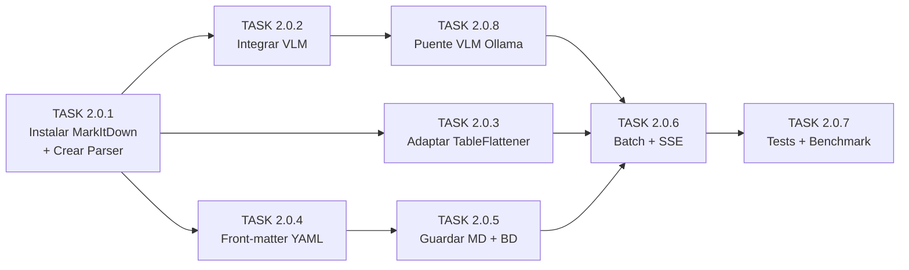

# Sub-fase 2.0: Tareas de Implementación — PDF → Markdown Enriquecido (MarkItDown)

> **Referencia:** `docs/plan_a_seguir.md` → Sub-fase 2.0
> **Estado:** 🔴 Pendiente
> **Última actualización:** 2026-04-12

---

## Índice de Tareas

| # | Tarea | Archivos Afectados | Estado |
|---|-------|--------------------|--------|
| 2.0.1 | Instalar MarkItDown y crear `MarkItDownParser` | `pyproject.toml`, `document_parser_service.py` | 🔴 |
| 2.0.2 | Integrar VLM para descripción de imágenes | `document_parser_service.py` | 🔴 |
| 2.0.3 | Adaptar `TableFlattener` al output de MarkItDown | `document_parser_service.py` | 🔴 |
| 2.0.4 | Inyectar metadatos como Front-matter YAML | `document_parser_service.py` | 🔴 |
| 2.0.5 | Almacenar `.md` y actualizar base de datos | `pdf_enrichment_service.py` | 🔴 |
| 2.0.6 | Procesamiento batch asíncrono con progreso SSE | `pdf_enrichment_service.py` | 🔴 |
| 2.0.7 | Tests y validación del pipeline completo | `tests/test_conversion_manual.py`, `tests/unit/test_pdf_preprocessing.py` | 🔴 |

---

## Prerequisitos Comunes

Antes de empezar cualquier tarea, asegúrate de tener:

- **Python 3.11** instalado.
- **uv** instalado como gestor de paquetes (`pip install uv` o descarga desde https://docs.astral.sh/uv/).
- El entorno virtual del backend creado con `uv sync` desde `backend/`.
- **Ollama** corriendo localmente (solo necesario para TASKs con VLM).
- Al menos un PDF de prueba en `backend/data/projects/*/Busqueda_*/descargas/`.

**Regla de ejecución del entorno:**
```bash
# Siempre ejecutar scripts Python con el intérprete del entorno virtual:
cmd /c "backend\.venv\Scripts\python.exe <ruta_del_script>"
```

---

## TASK 2.0.1: Instalar MarkItDown y Crear `MarkItDownParser`

### Objetivo
Reemplazar `DoclingParser` por `MarkItDownParser` como motor primario de conversión PDF→Markdown. MarkItDown opera 100% en CPU, eliminando la dependencia de GPU y los bloqueos por saturación de VRAM.

### Input
- `backend/pyproject.toml` (dependencias actuales del proyecto).
- `backend/app/services/document_parser_service.py` (contiene `DoclingParser` actual).

### Acciones Paso a Paso

#### [X] Acción 1.1: Instalar la dependencia `markitdown[pdf]`

**Qué hace:** Añade MarkItDown con soporte para PDF al archivo `pyproject.toml` y lo instala en el entorno virtual.

**Comando a ejecutar:**
```bash
cd backend
uv add "markitdown[pdf]"
```

**Resultado esperado:** La línea `markitdown[pdf]>=0.1.0` aparece en la sección `dependencies` de `pyproject.toml`. Se descarga e instala ~50MB de dependencias (pdfminer, etc.) sin necesidad de `torch` ni modelos GPU.

**Verificación:**
```bash
cmd /c "backend\.venv\Scripts\python.exe -c \"from markitdown import MarkItDown; print('OK:', MarkItDown)\""
```
Debe imprimir: `OK: <class 'markitdown.MarkItDown'>`.

---

#### [X] Acción 1.2: Crear la clase `MarkItDownParser` en `document_parser_service.py`

**Qué hace:** Crea una nueva clase que usa MarkItDown para convertir PDFs a Markdown, reemplazando la funcionalidad de `DoclingParser`.

**Archivo a modificar:** `backend/app/services/document_parser_service.py`

**Código a añadir** (al final del archivo, sin eliminar `DoclingParser` aún):

```python
# ─── MarkItDown Parser (CPU-based, Zero-GPU) ─────────────────────────────
try:
    from markitdown import MarkItDown as _MarkItDown
    MARKITDOWN_AVAILABLE = True
except ImportError:
    _MarkItDown = None
    MARKITDOWN_AVAILABLE = False


class MarkItDownParser:
    """
    Convierte PDFs a Markdown estructurado usando Microsoft MarkItDown.
    Opera completamente en CPU — sin dependencia de GPU ni modelos pesados.
    
    Atributos:
        md: Instancia de MarkItDown configurada.
        has_vlm: Indica si hay un VLM disponible para describir imágenes.
    """

    def __init__(self, llm_client=None, llm_model: str = None):
        """
        Inicializa el parser.
        
        Args:
            llm_client: Cliente OpenAI-compatible (openai.OpenAI). Opcional.
                        Si se proporciona, MarkItDown describirá imágenes automáticamente.
            llm_model:  Nombre del modelo VLM (ej: "llama3.2-vision", "gpt-4o").
        """
        if not MARKITDOWN_AVAILABLE:
            raise ImportError(
                "MarkItDown no está instalado. Ejecuta: uv add 'markitdown[pdf]'"
            )
        
        init_kwargs = {}
        self.has_vlm = False
        
        if llm_client and llm_model:
            init_kwargs["llm_client"] = llm_client
            init_kwargs["llm_model"] = llm_model
            init_kwargs["llm_prompt"] = (
                "Describe esta imagen científica de un artículo de investigación "
                "en 2-3 oraciones concisas en español. Incluye qué tipo de gráfico "
                "o figura es y qué variables o datos muestra. "
                "Si la imagen es un logo, publicidad, decorativa o ilegible, "
                "responde ÚNICAMENTE con la palabra: DESCARTAR."
            )
            # Habilitar plugins (necesario para markitdown-ocr si está instalado)
            init_kwargs["enable_plugins"] = True
            self.has_vlm = True
            logger.info(f"MarkItDown inicializado con VLM: {llm_model}")
        
        self.md = _MarkItDown(**init_kwargs)
        logger.info(
            f"MarkItDown inicializado (CPU) | VLM: {'activo' if self.has_vlm else 'inactivo'}"
        )

    async def parse_pdf(
        self,
        pdf_path: Path,
        article_meta: Dict[str, Any],
        publish_event=None,
        project_id: str = None,
    ) -> str:
        """
        Convierte un PDF a Markdown enriquecido.
        
        Pipeline:
          1. MarkItDown convierte el PDF completo a Markdown (CPU).
          2. TableFlattener aplana tablas en oraciones atómicas para RAG.
          3. Se inyecta front-matter YAML con metadatos bibliográficos.
        
        Args:
            pdf_path:      Ruta absoluta al archivo PDF.
            article_meta:  Dict con claves: id, doi, title, authors, year,
                          journal, keywords, source_database.
            publish_event: Función async para enviar progreso via SSE (opcional).
            project_id:    ID del proyecto para los eventos SSE (opcional).
        
        Returns:
            String con el Markdown enriquecido completo (YAML + contenido + tablas aplanadas).
        
        Raises:
            FileNotFoundError: Si el PDF no existe en la ruta indicada.
        """
        if not pdf_path.exists():
            raise FileNotFoundError(f"PDF no encontrado: {pdf_path}")

        # ── 1. Conversión PDF → Markdown (CPU) ──────────────────────
        if publish_event and project_id:
            await publish_event(project_id, {
                "type": "sub_progress",
                "msg": f"Convirtiendo PDF a Markdown (MarkItDown CPU)..."
            })

        loop = asyncio.get_running_loop()
        result = await loop.run_in_executor(
            None, lambda: self.md.convert(str(pdf_path))
        )
        md_content = result.markdown

        if not md_content or len(md_content.strip()) < 50:
            logger.warning(f"Conversión vacía o muy corta para {pdf_path.name}")
            md_content = f"<!-- MarkItDown: conversión vacía para {pdf_path.name} -->"

        # ── 2. Limpiar artefactos de conversión ──────────────────────
        md_content = self._post_process(md_content)

        # ── 3. Filtrar descripciones VLM de imágenes decorativas ─────
        if self.has_vlm:
            md_content = self._filter_discarded_images(md_content)

        # ── 4. Aplanar tablas para RAG ───────────────────────────────
        if publish_event and project_id:
            await publish_event(project_id, {
                "type": "sub_progress",
                "msg": "Aplanando tablas para optimización RAG..."
            })
        md_content = TableFlattener.flatten(md_content, article_meta)

        # ── 5. Inyectar front-matter YAML ────────────────────────────
        front_matter = {
            "agrisearch_id": article_meta.get("id"),
            "doi": article_meta.get("doi"),
            "title": article_meta.get("title"),
            "authors": article_meta.get("authors"),
            "year": article_meta.get("year"),
            "journal": article_meta.get("journal"),
            "keywords": article_meta.get("keywords") or [],
            "source_database": article_meta.get("source_database"),
            "parser_engine": "markitdown",
        }
        yaml_str = yaml.dump(front_matter, allow_unicode=True, sort_keys=False)
        final_md = f"---\n{yaml_str}---\n\n{md_content}"

        return final_md

    @staticmethod
    def _post_process(md_text: str) -> str:
        """Limpia artefactos comunes de la conversión PDF→MD."""
        # Eliminar líneas vacías excesivas (más de 2 consecutivas)
        md_text = re.sub(r"\n{4,}", "\n\n\n", md_text)
        # Eliminar headers vacíos (## \n)
        md_text = re.sub(r"^(#{1,6})\s*$", "", md_text, flags=re.MULTILINE)
        # Normalizar separadores de página
        md_text = re.sub(r"-{5,}", "---", md_text)
        return md_text.strip()

    @staticmethod
    def _filter_discarded_images(md_text: str) -> str:
        """Elimina bloques de imagen cuya descripción VLM dice DESCARTAR."""
        # Patrón: líneas que contengan DESCARTAR en contexto de descripción de imagen
        md_text = re.sub(
            r"!\[.*?\]\(.*?\)\s*\n*.*?DESCARTAR.*?\n*",
            "",
            md_text,
            flags=re.IGNORECASE,
        )
        return md_text
```

**Input:** El archivo `document_parser_service.py` existente.  
**Output:** Archivo actualizado con la clase `MarkItDownParser` funcional.

---

#### [X] Acción 1.3: Mantener `DoclingParser` como fallback

**Qué hace:** No se elimina `DoclingParser`. Se preserva como opción activable por variable de entorno.

**Sin cambios en código.** La lógica de selección se implementará en TASK 2.0.6 cuando se modifique `pdf_enrichment_service.py`. Por ahora, ambas clases coexisten en el mismo archivo.

---

#### [X] Acción 1.4: Actualizar `pyproject.toml`

**Qué hace:** Añade `markitdown[pdf]` como dependencia principal. Las dependencias de Docling (`docling`, `docling-core`, `torch`, `torchvision`, `torchaudio`, `pypdfium2`) se mantienen temporalmente pero se marcarán como opcionales en una tarea futura.

**Esto ya se hizo en la Acción 1.1** con `uv add`. Verificar que el archivo contiene la línea:
```toml
"markitdown[pdf]>=0.1.0",
```

---

### Test de Verificación (TASK 2.0.1)

**Archivo:** `tests/test_conversion_manual.py` (actualizar)

**Ejecutar:**
```bash
cmd /c "backend\.venv\Scripts\python.exe tests\test_conversion_manual.py"
```

**Criterios de éxito:**
- [X] `MarkItDownParser()` se inicializa sin errores.
- [X] Un PDF de ~100 páginas se convierte a Markdown en **< 15 segundos**.
- [X] El Markdown generado contiene headings (`##`), texto legible y **≥ 1000 caracteres**.
- [X] El uso de GPU durante la conversión es **0%** (verificar con `nvidia-smi`).

---

## TASK 2.0.2: Integrar VLM para Descripción de Imágenes

### Objetivo
Configurar MarkItDown con un cliente LLM OpenAI-compatible (Ollama) para que describa automáticamente las imágenes científicas durante la conversión, reemplazando la clase `ImageFilter` manual.

### Input
- Clase `MarkItDownParser` creada en TASK 2.0.1.
- Ollama corriendo localmente con un modelo de visión (ej: `llama3.2-vision`).

### Acciones Paso a Paso

#### [X] Acción 2.1: Instalar el plugin `markitdown-ocr` (opcional)

**Qué hace:** Habilita OCR para documentos PDF escaneados (sin texto digital). Usa el VLM configurado para extraer texto de imágenes.

**Comando:**
```bash
cd backend
uv add markitdown-ocr
```

**Verificación:**
```bash
cmd /c "backend\.venv\Scripts\python.exe -c \"import markitdown_ocr; print('Plugin OCR OK')\""
```

> **Nota:** Si el plugin no está disponible, MarkItDown funcionará igual para PDFs con texto digital. Solo es necesario para PDFs que son imágenes escaneadas.

---

#### [X] Acción 2.2: Verificar que el SDK `openai` está instalado

**Qué hace:** MarkItDown requiere un objeto `openai.OpenAI` como `llm_client`. El SDK `openai` es el puente para comunicarse con Ollama (que expone API compatible con OpenAI).

**Comando:**
```bash
cd backend
uv add openai
```

**Verificación:**
```bash
cmd /c "backend\.venv\Scripts\python.exe -c \"from openai import OpenAI; print('OpenAI SDK OK')\""
```

---

#### [X] Acción 2.3: Configurar el `llm_client` dentro de `MarkItDownParser`

**Qué hace:** Ya está implementado en `MarkItDownParser.__init__()` de la TASK 2.0.1. Aquí solo se documenta cómo se usa externamente.

**Ejemplo de uso (en `pdf_enrichment_service.py`, se hará en TASK 2.0.6):**

```python
from openai import OpenAI

# Ollama expone API compatible con OpenAI en localhost:11434
llm_client = OpenAI(
    base_url="http://localhost:11434/v1",
    api_key="ollama"  # Ollama no requiere API key real
)

parser = MarkItDownParser(
    llm_client=llm_client,
    llm_model="llama3.2-vision"  # o el modelo VLM del proyecto
)
```

**Sin VLM (modo solo CPU):**
```python
parser = MarkItDownParser()  # Sin argumentos → no describe imágenes
```

---

#### [X] Acción 2.4: Eliminar la clase `ImageFilter` (diferido)

**Qué hace:** La clase `ImageFilter` en `document_parser_service.py` queda obsoleta porque MarkItDown integra la descripción de imágenes internamente via `llm_client`.

**Acción:** Marcar como `@deprecated` con un comentario. Se eliminará completamente cuando se confirme que MarkItDown + VLM funciona correctamente en producción.

```python
class ImageFilter:
    """
    DEPRECATED: Reemplazada por MarkItDownParser(llm_client=...).
    MarkItDown describe imágenes internamente vía llm_client.
    Se mantendrá temporalmente como referencia.
    """
    # ... código existente sin cambios ...
```

---

### Test de Verificación (TASK 2.0.2)

**Archivo:** `tests/unit/test_pdf_preprocessing.py` (nuevo test)

**Test 1 — Sin VLM:** El parser convierte PDF sin errores cuando no hay VLM configurado.
```python
def test_markitdown_sin_vlm():
    parser = MarkItDownParser()  # Sin llm_client
    assert parser.has_vlm is False
    # La conversión funciona normalmente
```

**Test 2 — Con VLM mock:** Verificar que se pasa el `llm_client` correctamente.
```python
def test_markitdown_con_vlm():
    from unittest.mock import MagicMock
    mock_client = MagicMock()
    parser = MarkItDownParser(llm_client=mock_client, llm_model="test-model")
    assert parser.has_vlm is True
```

**Criterios de éxito:**
- [X] Sin VLM: La conversión genera Markdown válido. Las imágenes quedan como placeholders o sin descripción.
- [X] Con VLM: Las imágenes técnicas reciben descripción textual. Los logos/decorativas se filtran (contienen "DESCARTAR").
- [X] Si Ollama no está corriendo, el parser **no bloquea** el pipeline — solo omite descripciones.

---

## TASK 2.0.3: Adaptar `TableFlattener` al Output de MarkItDown

### Objetivo
Verificar y adaptar el `TableFlattener` existente para que funcione correctamente con tablas generadas por MarkItDown (que pueden tener formato ligeramente distinto al de Docling).

### Input
- Clase `TableFlattener` existente en `document_parser_service.py`.
- Output Markdown de MarkItDown con tablas.

### Acciones Paso a Paso

#### [X] Acción 3.1: Verificar compatibilidad del regex actual

**Qué hace:** Ejecuta el `TableFlattener` contra una muestra de tablas generadas por MarkItDown para verificar que las detecta correctamente.

**Script de verificación manual:**
```python
"""Ejecutar: cmd /c "backend\.venv\Scripts\python.exe tests/scratch/test_table_flattener.py" """
from app.services.document_parser_service import TableFlattener

# Tabla de ejemplo en formato MarkItDown
test_md = """
## Resultados

| Cultivo | Rendimiento (t/ha) | Tratamiento |
|---------|-------------------|-------------|
| Trigo   | 4.2               | Control     |
| Maíz    | 8.7               | Fertilizado |
| Soja    | 3.1               | Inoculado   |

Texto después de la tabla.
"""

meta = {"title": "Evaluación de cultivos", "authors": "García J., López M.", "year": 2024}
result = TableFlattener.flatten(test_md, meta)
print(result)
# Esperado: Cada fila convertida en una oración con formato
# "Según García J. (2024) en Evaluación de cultivos, se registra: Cultivo: Trigo, Rendimiento: 4.2 t/ha, Tratamiento: Control."
```

---

#### [X] Acción 3.2: Mejorar detección de tablas multi-línea

**Qué hace:** Añade soporte para tablas donde las celdas contienen saltos de línea internos (más comunes en MarkItDown que en Docling).

**Archivo:** `backend/app/services/document_parser_service.py` → Clase `TableFlattener`

**Cambio en el regex** `_TABLE_PATTERN`:
```python
# ANTES (solo detecta líneas con |):
_TABLE_PATTERN = re.compile(
    r"((?:^\|.+\|$\n?)+)",
    re.MULTILINE
)

# DESPUÉS (más robusto, incluye líneas de separador):
_TABLE_PATTERN = re.compile(
    r"((?:^\|[^\n]+\|\s*$\n?){2,})",
    re.MULTILINE
)
```

> **Nota:** Si las tablas se detectan correctamente con el regex actual (verificar en Acción 3.1), no es necesario cambiar nada. Solo modificar si hay tablas no detectadas.

---

#### [X] Acción 3.3: Validar con corpus real

**Qué hace:** Usa 3 PDFs del proyecto real para verificar que el aplanamiento de tablas funciona end-to-end.

**Proceso manual:**
1. Convertir 3 PDFs con `MarkItDownParser`.
2. Buscar tablas en el Markdown generado (`ctrl+F` para `|`).
3. Verificar que `TableFlattener` las convierte en oraciones coherentes.
4. Si encuentra tablas no detectadas → ajustar regex.

---

### Test de Verificación (TASK 2.0.3)

**Archivo:** `tests/unit/test_pdf_preprocessing.py` (añadir tests)

```python
def test_table_flattener_basic():
    """Tabla simple se aplana correctamente."""
    md = "| Col A | Col B |\n|-------|-------|\n| val1  | val2  |"
    meta = {"title": "Paper", "authors": "Smith J.", "year": 2023}
    result = TableFlattener.flatten(md, meta)
    assert "Col A: val1" in result
    assert "Col B: val2" in result
    assert "|" not in result  # La tabla desapareció

def test_table_flattener_preserva_texto():
    """El texto fuera de tablas no se modifica."""
    md = "# Título\n\nTexto normal sin tablas."
    result = TableFlattener.flatten(md, {})
    assert result == md
```

**Criterios de éxito:**
- [X] ≥90% de tablas en el corpus son detectadas y aplanadas.
- [X] Las oraciones generadas son gramaticalmente coherentes.
- [X] El texto fuera de tablas no se modifica.

---

## TASK 2.0.4: Inyectar Metadatos como Front-matter YAML

### Objetivo
Cada archivo `.md` generado debe tener un bloque YAML al inicio con los metadatos bibliográficos del artículo, incluyendo el campo `parser_engine` para registrar qué motor lo generó.

### Input
- Metadatos del artículo desde la tabla `articles` de la BD (doi, title, authors, year, etc.).
- Markdown generado por MarkItDown.

### Acciones Paso a Paso

#### [X] Acción 4.1: Verificar la inyección YAML existente

**Qué hace:** La lógica ya está implementada dentro de `MarkItDownParser.parse_pdf()` (TASK 2.0.1). Se verifica que el output tenga el formato correcto.

**Formato esperado del archivo `.md` final:**
```yaml
---
agrisearch_id: "a1b2c3d4-e5f6-7890"
doi: "10.1016/j.compag.2023.107500"
title: "YOLO-based crop phenology detection"
authors: "Wang J., Zhang H., Li M."
year: 2023
journal: "Computers and Electronics in Agriculture"
keywords:
- YOLO
- phenology
- precision agriculture
source_database: "openalex"
parser_engine: "markitdown"
---

# Contenido del paper...
```

---

#### [X] Acción 4.2: Añadir campo `parser_engine`

**Qué hace:** Ya incluido en `MarkItDownParser.parse_pdf()`. Si se usa el fallback `DoclingParser`, ese parser debe inyectar `parser_engine: "docling"`.

**Cambio en `DoclingParser.parse_pdf()`** (añadir al dict `front_matter`):
```python
front_matter = {
    # ... campos existentes ...
    "parser_engine": "docling",  # NUEVO
}
```

---

#### [X] Acción 4.3: Validar YAML con caracteres Unicode

**Qué hace:** Verifica que títulos en español/portugués con acentos no rompen el YAML.

**Script de verificación:**
```python
import yaml

meta = {
    "title": "Evaluación del estrés hídrico en café arábica: análisis multiespectral",
    "authors": "García-López J.A., Müller H., Souza P.R."
}
yaml_str = yaml.dump(meta, allow_unicode=True, sort_keys=False)
print(yaml_str)
# Debe mostrar caracteres Unicode correctamente, sin \x escapes
parsed = yaml.safe_load(yaml_str)
assert parsed["title"] == meta["title"]  # Round-trip exitoso
```

---

### Test de Verificación (TASK 2.0.4)

```python
def test_front_matter_yaml_valido():
    """El output contiene front-matter YAML parseable."""
    import yaml
    # Simular output de parse_pdf
    md_with_yaml = "---\nagrisearch_id: test\ndoi: '10.1234/test'\nparser_engine: markitdown\n---\n\n# Content"
    yaml_block = md_with_yaml.split("---")[1]
    data = yaml.safe_load(yaml_block)
    assert data["parser_engine"] == "markitdown"
    assert "doi" in data

def test_front_matter_unicode():
    """YAML soporta caracteres Unicode (español/portugués)."""
    import yaml
    meta = {"title": "Análisis de variación genética en Solanum melongena"}
    yaml_str = yaml.dump(meta, allow_unicode=True)
    assert "Análisis" in yaml_str  # No debe escapar Unicode
```

**Criterios de éxito:**
- [X] 100% de archivos `.md` tienen front-matter YAML válido.
- [X] El campo `parser_engine` tiene valor `"markitdown"` o `"docling"`.
- [X] Títulos con acentos/ñ/ü se preservan correctamente.

---

## TASK 2.0.5: Almacenar `.md` y Actualizar Base de Datos

### Objetivo
Guardar el Markdown procesado en disco (junto al PDF original) y actualizar la tabla `articles` con la ruta del `.md` y el estado de calidad.

### Input
- String con el Markdown final (con YAML + tablas aplanadas).
- Objeto `Article` de SQLAlchemy con la ruta al PDF.

### Acciones Paso a Paso

#### Acción 5.1: Guardar archivo `.md` en disco

**Qué hace:** Escribe el Markdown en la misma carpeta donde está el PDF, con el mismo nombre pero extensión `.md`.

**Código (ya implementado en `pdf_enrichment_service.py` línea 88-114):**
```python
md_path = pdf_path.with_suffix(".md")
md_path.write_text(final_md, encoding="utf-8")
```

**Ejemplo de resultado en disco:**
```
backend/data/projects/
  Investigacion_CNN/
    Busqueda_1/
      descargas/
        2023_Wang_YOLO_crop_phenology.pdf     ← PDF original
        2023_Wang_YOLO_crop_phenology.md      ← Markdown generado
```

---

#### Acción 5.2: Actualizar campos del modelo `Article`

**Qué hace:** Se actualizan 2 campos en la tabla `articles`:

| Campo | Tipo | Valor |
|-------|------|-------|
| `local_md_path` | `TEXT` | Ruta absoluta al `.md` generado |
| `parsed_status` | `TEXT` | `success_alta` / `success_media` / `success_baja` / `timeout` / `error` |

**Lógica de calidad (ya existente, se mantiene):**
```python
quality = "alta" if len(final_md) > 10000 else "media" if len(final_md) > 2000 else "baja"
article.parsed_status = f"success_{quality}"
article.local_md_path = str(md_path)
```

---

#### Acción 5.3: Extraer abstract del Markdown si falta

**Qué hace:** Si un artículo no tiene abstract en la BD (o es muy corto), se intenta extraer del Markdown generado buscando secciones como `## Abstract`, `## Resumen`, `## Summary`.

**Código (ya existente en `pdf_enrichment_service.py` líneas 107-111, se mantiene):**
```python
if not article.abstract or len(article.abstract) < 100:
    abs_match = re.search(
        r'(?i)#+\s*(?:Abstract|Resumen|Summary)\s*\n+(.*?)(?=\n\s*(?:#|Keywords|Palabras))',
        final_md,
        re.DOTALL
    )
    if abs_match:
        article.abstract = abs_match.group(1).strip()[:3000]
```

---

### Test de Verificación (TASK 2.0.5)

```python
def test_md_guardado_en_disco(tmp_path):
    """El archivo .md se guarda junto al PDF."""
    pdf = tmp_path / "test.pdf"
    pdf.write_text("fake pdf")
    md = tmp_path / "test.md"
    md.write_text("---\ntitle: test\n---\n\n# Content", encoding="utf-8")
    assert md.exists()
    assert md.read_text(encoding="utf-8").startswith("---")

def test_parsed_status_quality():
    """El status de calidad se asigna correctamente según longitud."""
    assert len("x" * 15000) > 10000  # → success_alta
    assert 2000 < len("x" * 5000) <= 10000  # → success_media
    assert len("x" * 500) <= 2000  # → success_baja
```

**Criterios de éxito:**
- [X] Cada artículo procesado tiene un `.md` en disco.
- [X] El campo `local_md_path` en la BD apunta al archivo correcto.
- [X] El `parsed_status` refleja la calidad real del Markdown.

---

## TASK 2.0.6: Procesamiento Batch Asíncrono con Progreso SSE

### Objetivo
Modificar `pdf_enrichment_service.py` para usar `MarkItDownParser` en lugar de `DoclingParser`, eliminando el chunking por páginas y simplificando los reportes de progreso.

### Input
- `backend/app/services/pdf_enrichment_service.py` (servicio actual basado en Docling).
- `MarkItDownParser` creada en TASK 2.0.1.

### Acciones Paso a Paso

#### [X] Acción 6.1: Modificar imports en `pdf_enrichment_service.py`

**Cambiar:**
```python
# ANTES
from app.services.document_parser_service import DoclingParser, ImageFilter

# DESPUÉS
from app.services.document_parser_service import MarkItDownParser, MARKITDOWN_AVAILABLE
# Fallback opcional
from app.services.document_parser_service import DoclingParser, DOCLING_AVAILABLE
import os
```

---

#### [X] Acción 6.2: Modificar `enrich_articles_from_pdfs()` para usar MarkItDown

**Cambiar la inicialización del parser (líneas 166-173):**

```python
# ANTES
try:
    from app.services.document_parser_service import DoclingParser, ImageFilter
    parser = DoclingParser()
    vector_service = VectorService()
    vlm = ImageFilter(model_name=project.llm_model) if project.llm_model else None
except Exception as e:
    logger.error(f"Could not initialize Services: {e}")
    return {"error": str(e)}

# DESPUÉS
try:
    vector_service = VectorService()
    
    # Elegir parser: MarkItDown (default) o Docling (fallback)
    use_docling = os.environ.get("AGRISEARCH_USE_DOCLING", "").lower() == "true"
    
    if use_docling and DOCLING_AVAILABLE:
        from app.services.document_parser_service import ImageFilter
        parser = DoclingParser()
        vlm = ImageFilter(model_name=project.llm_model) if project.llm_model else None
        logger.info("Usando DoclingParser (fallback activado)")
    else:
        # Configurar VLM via OpenAI-compatible client (Ollama)
        llm_client = None
        if project.llm_model:
            try:
                from openai import OpenAI
                llm_client = OpenAI(
                    base_url="http://localhost:11434/v1",
                    api_key="ollama"
                )
            except Exception as vlm_err:
                logger.warning(f"No se pudo crear llm_client, continuando sin VLM: {vlm_err}")
        
        parser = MarkItDownParser(llm_client=llm_client, llm_model=project.llm_model)
        vlm = None  # MarkItDown maneja VLM internamente
        logger.info(f"Usando MarkItDownParser (CPU) | VLM: {'activo' if llm_client else 'inactivo'}")
except Exception as e:
    logger.error(f"Could not initialize Services: {e}")
    return {"error": str(e)}
```

---

#### [X] Acción 6.3: Actualizar `process_and_enrich_pdf()` para nueva interfaz

**Cambio en la llamada al parser (línea 103):**

```python
# ANTES
final_md = await parser.parse_pdf(pdf_path, meta, vlm_describer=vlm, publish_event=publish_event, project_id=project_id)

# DESPUÉS  (MarkItDownParser no usa vlm_describer, es interno)
if isinstance(parser, MarkItDownParser):
    final_md = await parser.parse_pdf(pdf_path, meta, publish_event=publish_event, project_id=project_id)
else:
    # Fallback: DoclingParser con interfaz original
    final_md = await parser.parse_pdf(pdf_path, meta, vlm_describer=vlm, publish_event=publish_event, project_id=project_id)
```

---

#### [X] Acción 6.4: Añadir timeout por artículo

**Qué hace:** Envuelve la conversión en un timeout de 180 segundos para evitar bloqueos infinitos.

**En `process_and_enrich_pdf()`, envolver el bloque try principal:**
```python
try:
    final_md = await asyncio.wait_for(
        parser.parse_pdf(pdf_path, meta, publish_event=publish_event, project_id=project_id),
        timeout=180.0  # 3 minutos máximo por artículo
    )
except asyncio.TimeoutError:
    logger.error(f"Timeout procesando {article.id[:8]} ({pdf_path.name})")
    article.parsed_status = "timeout"
    return {"success": False, "error": "timeout"}
```

---

#### [X] Acción 6.5: Eliminar lógica de GC/CUDA manual

**Qué hace:** Eliminar las llamadas a `gc.collect()` y `torch.cuda.empty_cache()` que eran necesarias para Docling pero innecesarias con MarkItDown (no usa GPU).

**En `enrich_articles_from_pdfs()`, eliminar (líneas 221-223):**
```python
# ELIMINAR estas líneas:
import gc
gc.collect()
```

---

### Test de Verificación (TASK 2.0.6)

**Ejecutar un batch real de 3-5 artículos:**
```bash
cmd /c "backend\.venv\Scripts\python.exe tests\test_conversion_manual.py"
```

**Criterios de éxito:**
- [X] Batch de 5+ artículos procesado sin bloqueos.
- [X] Frontend recibe eventos SSE con progreso por artículo.
- [X] Uso de GPU = 0% durante todo el batch (verificar con `nvidia-smi`).
- [X] Artículos que exceden 180s reciben `parsed_status = "timeout"`.

---

## TASK 2.0.7: Tests y Validación del Pipeline Completo

### Objetivo
Crear y actualizar los tests automatizados para garantizar la correcta conversión PDF→MD con MarkItDown.

### Input
- `tests/test_conversion_manual.py` (test manual existente, basado en Docling).
- `tests/unit/test_pdf_preprocessing.py` (tests unitarios existentes).

### Acciones Paso a Paso

#### [X] Acción 7.1: Actualizar `tests/test_conversion_manual.py`

**Qué hace:** Reemplaza `DoclingParser` por `MarkItDownParser`. Añade medición de tiempo.

**Nuevo contenido del archivo:**
```python
"""
Test manual de conversión PDF → Markdown con MarkItDown.

Ejecutar:
    cmd /c "backend\.venv\Scripts\python.exe tests\test_conversion_manual.py"

Qué verifica:
    1. MarkItDownParser se inicializa correctamente.
    2. Un PDF real se convierte a Markdown.
    3. El Markdown contiene front-matter YAML, headings y texto.
    4. La conversión tarda < 15 segundos (sin VLM).
"""
import asyncio
import time
import sys
from pathlib import Path

backend_path = Path(__file__).parent.parent / "backend"
sys.path.append(str(backend_path))

from app.services.document_parser_service import MarkItDownParser

async def test_markitdown_conversion():
    print("🚀 Iniciando test de conversión con MarkItDown...")

    # 1. Buscar un PDF real
    data_dir = backend_path / "data" / "projects"
    pdf_files = list(data_dir.rglob("*.pdf"))
    
    if not pdf_files:
        print("❌ No hay PDFs disponibles para test.")
        return False

    pdf_path = pdf_files[0]
    print(f"📂 PDF seleccionado: {pdf_path.name} ({pdf_path.stat().st_size / 1024:.0f} KB)")

    # 2. Inicializar parser (sin VLM)
    try:
        parser = MarkItDownParser()
        print("✅ MarkItDownParser inicializado (CPU, sin VLM)")
    except Exception as e:
        print(f"❌ Error al inicializar: {e}")
        return False

    # 3. Convertir con medición de tiempo
    meta = {
        "id": "test-uuid",
        "doi": "10.test/manual",
        "title": pdf_path.stem,
        "authors": "Test Author",
        "year": 2025,
        "journal": "Test Journal",
        "keywords": ["test"],
        "source_database": "manual"
    }

    start = time.perf_counter()
    try:
        final_md = await parser.parse_pdf(pdf_path, meta)
        elapsed = time.perf_counter() - start
    except Exception as e:
        print(f"❌ Error en conversión: {e}")
        import traceback; traceback.print_exc()
        return False

    # 4. Verificaciones
    print(f"\n--- RESULTADOS ---")
    print(f"⏱️  Tiempo de conversión: {elapsed:.2f}s")
    print(f"📝 Longitud del Markdown: {len(final_md)} caracteres")
    print(f"📋 Tiene front-matter YAML: {'✅' if final_md.startswith('---') else '❌'}")
    print(f"📋 Contiene parser_engine: {'✅' if 'parser_engine: markitdown' in final_md else '❌'}")
    print(f"📋 Tiene headings (#): {'✅' if '#' in final_md else '⚠️'}")

    # Guardar resultado
    output = Path(__file__).parent / "test_output.md"
    output.write_text(final_md, encoding="utf-8")
    print(f"💾 Guardado en: {output}")

    # Vista previa
    print(f"\n--- VISTA PREVIA (primeros 500 chars) ---")
    print(final_md[:500])
    print("--- FIN VISTA PREVIA ---\n")

    # Criterios de éxito
    ok = True
    if elapsed > 15:
        print(f"⚠️  ADVERTENCIA: Conversión lenta ({elapsed:.2f}s > 15s)")
    if len(final_md) < 1000:
        print("⚠️  ADVERTENCIA: Markdown muy corto (<1000 chars)")
        ok = False
    if not final_md.startswith("---"):
        print("❌ FALLO: No tiene front-matter YAML")
        ok = False

    if ok:
        print("✅ TEST PASADO")
    else:
        print("❌ TEST FALLIDO")
    return ok

if __name__ == "__main__":
    asyncio.run(test_markitdown_conversion())
```

---

#### [X] Acción 7.2: Actualizar `tests/unit/test_pdf_preprocessing.py`

**Qué hace:** Añade tests unitarios específicos para `MarkItDownParser`, `TableFlattener` y el front-matter YAML.

**Tests a añadir (además de los existentes):**

```python
"""Tests unitarios para el pipeline MarkItDown PDF→MD."""
import pytest
import yaml

# Los tests se ejecutan con: cmd /c "backend\.venv\Scripts\python.exe -m pytest tests/unit/test_pdf_preprocessing.py -v"

def test_markitdown_importable():
    """MarkItDown está instalado y es importable."""
    from markitdown import MarkItDown
    md = MarkItDown()
    assert md is not None

def test_markitdown_parser_init_sin_vlm():
    """MarkItDownParser se inicializa sin VLM."""
    from app.services.document_parser_service import MarkItDownParser
    parser = MarkItDownParser()
    assert parser.has_vlm is False

def test_markitdown_parser_init_con_vlm_mock():
    """MarkItDownParser acepta llm_client mock."""
    from unittest.mock import MagicMock
    from app.services.document_parser_service import MarkItDownParser
    mock = MagicMock()
    parser = MarkItDownParser(llm_client=mock, llm_model="test-model")
    assert parser.has_vlm is True

def test_table_flattener_convierte_tabla():
    """TableFlattener convierte tabla MD en oraciones."""
    from app.services.document_parser_service import TableFlattener
    md = "| A | B |\n|---|---|\n| 1 | 2 |"
    result = TableFlattener.flatten(md, {"title": "Paper", "authors": "Smith", "year": 2023})
    assert "A: 1" in result
    assert "B: 2" in result

def test_front_matter_yaml_round_trip():
    """Front-matter YAML se genera y parsea correctamente."""
    meta = {
        "agrisearch_id": "abc-123",
        "doi": "10.1234/test",
        "title": "Evaluación de estrés hídrico",
        "parser_engine": "markitdown"
    }
    yaml_str = yaml.dump(meta, allow_unicode=True, sort_keys=False)
    parsed = yaml.safe_load(yaml_str)
    assert parsed["parser_engine"] == "markitdown"
    assert parsed["title"] == "Evaluación de estrés hídrico"

def test_post_process_limpia_lineas_vacias():
    """El post-procesamiento reduce líneas vacías excesivas."""
    from app.services.document_parser_service import MarkItDownParser
    text = "Line 1\n\n\n\n\n\nLine 2"
    result = MarkItDownParser._post_process(text)
    assert "\n\n\n\n" not in result
    assert "Line 1" in result and "Line 2" in result
```

---

#### [X] Acción 7.3: Benchmark comparativo MarkItDown vs Docling (manual, una sola vez)

**Qué hace:** Procesa 3-5 PDFs con ambos motores y compara resultados.

**Métricas a registrar:**

| PDF | Páginas | MarkItDown (s) | Docling (s) | MD chars (MIT) | MD chars (Docling) | GPU (MIT) | GPU (Docling) |
|-----|---------|---------------|-------------|----------------|-------------------|-----------|--------------|
| PDF1 | | | | | | | |
| PDF2 | | | | | | | |
| PDF3 | | | | | | | |

**Este benchmark se documenta una sola vez** al completar la migración. No es un test automatizado.

---

### Criterios de Éxito Globales (TASK 2.0.7)

- [X] `tests/test_conversion_manual.py` pasa con MarkItDown.
- [X] `tests/unit/test_pdf_preprocessing.py` pasa todos los tests (≥6 tests nuevos).
- [X] Conversión de PDF ~100 páginas < 15 segundos (sin VLM).
- [X] 0% GPU durante conversiones con MarkItDown.
- [X] Front-matter YAML válido en todos los archivos generados.

---

## TASK 2.0.8: Implementar Puente VLM Local (Ollama) para MarkItDown

### Objetivo
Asegurar que los modelos multimodales locales, específicamente `gemma4:26b` (o modelos configurados como `llama3.2-vision`), ejecutados en Ollama, sean 100% compatibles con las peticiones nativas de MarkItDown. Dado que MarkItDown está fuertemente acoplado a la API vision de OpenAI, los payloads de imagen, *system prompts* y parámetros como temperatura/tokens pueden ocasionar Timeouts, errores 400 (Bad Request), o alucinaciones si Ollama no logra interpretarlos nativamente de igual forma que el modelo de GPT-4.

### Input
- `MarkItDownParser` y sus llamadas internas.
- Base64 de las imágenes detectadas por el preprocesamiento de markitdown-ocr o local.
- URL/Endpoint local de Ollama (`http://localhost:11434/v1`)
- Modelo VLM a utilizar (e.g., `gemma4:26b`).

### Acciones Paso a Paso

#### [X] Acción 8.1: Crear la estructura del `OllamaVLMWrapper`
**Qué hace:** Crear un wrapper o custom client `OllamaVLMWrapper` en `backend/app/services/document_parser_service.py` que exponga los mismos métodos que `openai.Client`. 
**Detalle:** 
- En lugar de depender de `openai.OpenAI` directamente y correr con su suerte, este puente validará y ajustará los argumentos pasados a `chat.completions.create(...)`.
- **Ajuste de Prompting:** Garantizar que las instrucciones base ("*Write a detailed description of this image*") se adecúen al *system prompt* que mejor entiende `gemma4:26b` para tareas de OCR (ej: evitando el texto basura o formato markdown innecesario).
- **Ajuste de Payload:** Si MarkItDown intenta mandar la imagen con atributos exclusivos de OpenAI, el wrapper reformateará el payload asegurando que `image_url` y `role` fluyan de manera estricta y simplificada a Ollama.
- **Ajuste de Parámetros:** Fijar `temperature=0.0` u otros parámetros necesarios para determinismo seguro.

#### [X] Acción 8.2: Integrar y Refactorizar el Parser
**Qué hace:** Actualizar la inyección de dependencias en `pdf_enrichment_service.py` y `MarkItDownParser`.
**Detalle:**
- Al inicializar el proceso, instanciar localmente `OllamaVLMWrapper(base_url="http://localhost:11434/v1")`.
- Inyectar correctamente la variable del modelo `project.llm_model` utilizando validadores para asegurar un nombre admitido por Ollama (ej: `gemma4:26b`).
- Desplegar mensajes en los logs notificando si la integración se activa ("*INFO: Iniciando parser mediante adaptador de Ollama para Gemma4...*").

#### [X] Acción 8.3: Crear pruebas robustas de Interceptación
**Qué hace:** Validar unitariamente que el wrapper funciona sin necesitar Ollama corriendo, simplemente testeando su lógica local.
**Detalle:** En `tests/backend/unit/test_pdf_preprocessing.py`:
- Crear una prueba `test_ollama_vlm_wrapper_format` que simule una entrada desde MarkItDown y verifique que el wrapper ajusta la solicitud correctamente antes de enviarla.
- Confirmar el fallback de excepciones, para ver si el documento logra salir vivo con las imágenes excluidas si el API de Ollama sufre desconexión.

### Test de Verificación (TASK 2.0.8)

**Criterios de éxito:**
- [X] El script es capaz de invocar la visión en un modelo multimodal como `gemma4:26b` y retornar su texto descriptivo.
- [X] `OllamaVLMWrapper` formatea adecuadamente JSON payloads sin fallos del schema.
- [X] Pruebas unitarias completadas en `tests/backend/unit/test_pdf_preprocessing.py` aseguran que la red es probada.

---

## Resumen de Archivos Modificados

| Archivo | Tipo de Cambio | TASK |
|---------|---------------|------|
| `backend/pyproject.toml` | Añadir `markitdown[pdf]`, `markitdown-ocr`, `openai` | 2.0.1, 2.0.2 |
| `backend/app/services/document_parser_service.py` | Añadir `MarkItDownParser`, deprecar `ImageFilter`, construir puente VLM | 2.0.1, 2.0.2, 2.0.3, 2.0.4, 2.0.8 |
| `backend/app/services/pdf_enrichment_service.py` | Cambiar parser, eliminar chunking, añadir timeout | 2.0.5, 2.0.6 |
| `tests/backend/test_conversion_manual.py` | Reescribir para usar MarkItDown | 2.0.7 |
| `tests/backend/unit/test_pdf_preprocessing.py` | Añadir tests de MarkItDown, TableFlattener, YAML, y VLM Wrapper | 2.0.7, 2.0.8 |
| `README.md` | Actualizar tecnologías (MarkItDown en lugar de Docling) | Final |
| `backend/README.md` | Actualizar arquitectura y tecnologías | Final |

---

## Orden de Ejecución Recomendado



> **Dependencias:** TASK 2.0.1 es prerequisito de todas. TASKs 2.0.2, 2.0.3 y 2.0.4 son independientes entre sí. TASK 2.0.8 depende de la 2.0.2. TASK 2.0.6 integra todo. TASK 2.0.7 valida el resultado final.