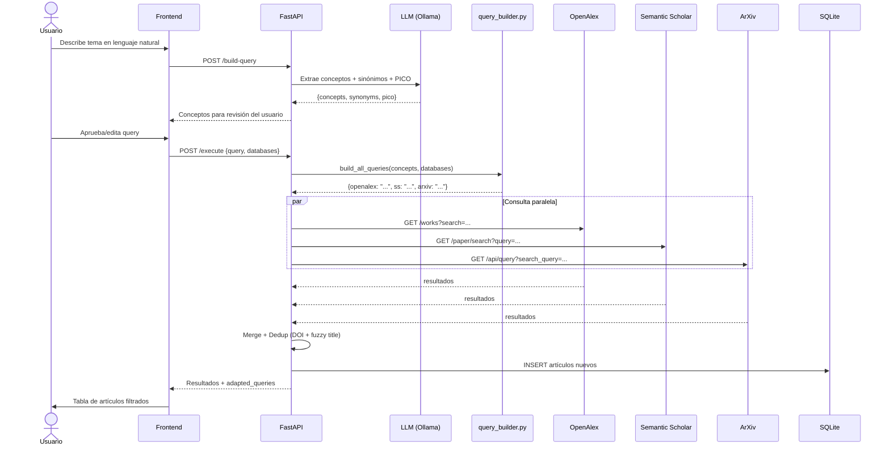

# Documentación Técnica - AgriSearch

Este documento contiene el registro de cambios funcionales, decisiones técnicas, flujos de datos relevantes y posibles errores para mantener la trazabilidad de la aplicación AgriSearch.

---

## Registro de Cambios y Funcionalidades

### Búsqueda y Obtención de PDFs (Fase 1)
- **Extracción Inteligente:** Ejecuta queries a OpenAlex, Semantic Scholar y Arxiv, deduplica e inserta en SQLite.
- **Adaptación Determinista por Base de Datos:** Para evitar fallos de sintaxis en búsquedas complejas (ej. consultas booleanas con paréntesis que rompen las APIs), el backend usa un módulo determinista (`query_builder.py`) que construye la query óptima para cada API. No depende de un LLM para la adaptación, eliminando la impredecibilidad.
  - **OpenAlex**: Texto plano con keywords separados por espacios (su API `search` no soporta booleanos complejos).
  - **Semantic Scholar**: Keywords concisas (no acepta nested boolean logic).
  - **ArXiv**: Formato `all:"concepto1" AND all:"concepto2"` con sinónimos agrupados por OR.
- **Extracción de Conceptos por LLM:** El LLM (Ollama) se usa **solo una vez** para extraer conceptos, sinónimos y desglose PICO del input del usuario. Retorna un JSON estructurado (no una query booleana libre).
- **Descarga Múltiple Open Access:** El servicio `download_service.py` obtiene automáticamente los PDFs vía requests asíncronas de las URLs enlazadas, los guarda en `data/projects/{id}/pdfs` y los nombra automáticamente usando la convención `[Año]_[PrimerAutor]_[Slug_Titulo].pdf`.
- **Subida Manual (Upload):** Endpoint `POST /search/upload-pdf/{article_id}`. Para los artículos que están bloqueados por un paywall, el usuario puede subir localmente su archivo PDF desde el dashboard de resultados. El archivo se enlaza directamente a su base de datos.
- **API Response:** `ArticleResponse` incluye `local_pdf_path` para que el frontend pueda mostrar el nombre del archivo local en la tabla de resultados. `SearchResultsResponse` incluye `adapted_queries` que muestra la query enviada a cada API para transparencia.

#### Flujo de Búsqueda (Diagrama de Secuencia)

#### Archivos clave del flujo
| Archivo | Responsabilidad |
|---------|----------------|
| `services/query_builder.py` | Genera queries deterministas por API |
| `services/llm_service.py` | Extrae conceptos del input (solo 1 llamada LLM) |
| `services/search_service.py` | Orquesta búsqueda, dedup y almacenamiento |
| `services/mcp_clients/openalex_client.py` | Cliente OpenAlex REST API |
| `services/mcp_clients/semantic_scholar_client.py` | Cliente Semantic Scholar API |
| `services/mcp_clients/arxiv_client.py` | Cliente ArXiv Atom API |

### Screening (Cribado PRISMA) (Fase 2)

#### Reglas de Negocio
- **Solo artículos con PDF** (`download_status = SUCCESS`) se incluyen en una sesión de screening.
- **1 sesión activa por proyecto.** Se retorna HTTP 409 si se intenta crear una segunda.
- **Identidad de sesión:** Cada sesión tiene `name` (requerido) y `goal` (opcional) para darle contexto descriptivo.

#### Endpoints Relevantes
| Endpoint | Método | Descripción |
|----------|--------|-------------|
| `/screening/sessions` | POST | Crea sesión (solo PDFs, max 1 por proyecto) |
| `/screening/sessions/{session_id}` | GET | Detalle de sesión |
| `/screening/sessions/{session_id}` | DELETE | Elimina sesión y todas sus decisiones (cascade) |
| `/screening/sessions/project/{project_id}` | GET | Lista sesiones del proyecto |
| `/screening/sessions/{session_id}/articles` | GET | Artículos en la sesión con sus decisiones |
| `/screening/sessions/{session_id}/articles/{article_id}/pdf` | GET | Retorna el archivo PDF asociado en formato `application/pdf` |
| `/screening/decisions/{decision_id}` | PUT | Actualizar decisión (include/exclude/maybe) |
| `/screening/translate` | POST | Traducir abstract vía LLM |
| `/screening/enrich/{project_id}` | POST | Enriquecimiento pre-screening desde PDFs |
| `/screening/sessions/{session_id}/articles/{article_id}/suggestion` | GET | Obtener sugerencia IA de relevancia (AI Assist) |

#### Flujo del Frontend (`ScreeningSetup.tsx`)
1. Al entrar a `/screening?id=X`, se verifica si hay sesión existente.
2. **Si hay sesión:** Muestra tarjeta resumen con estadísticas → Continuar o Eliminar.
3. **Si no hay:** Formulario de creación con nombre, objetivo, selección de búsquedas, idioma y modelo.
4. Al crear, ejecuta enriquecimiento automático (PyMuPDF) y luego crea la sesión (filtrada solo PDFs).

#### Pantalla Previa `ScreeningSetup`
- Permite elegir qué consultas integrar en el proceso actual y con qué modelo traducir los resúmenes.
-    *   **Enriquecimiento Automático:** Se mejoró sustancialmente la extracción de abstracts desde PDFs en `pdf_enrichment_service.py`. En caso de no hallar formalmente el *Abstract* con regex debido a PDFs sin un formato estándar (proceedings, revistas antiguas), se extrae inteligentemente el primer bloque extenso o un pasaje limpio inicial, reemplazando con éxito textos previos demasiado breves, resolviendo fallas con algunos archivos MCP.
    *   **Traducción de Abstracts**: Se llama a LLMs en tiempo real para traducir la versión enriquecida del abstract del PDF, sin depender de datos faltantes iniciales. Es posible elegir el modelo de LLM al crear **o continuar** una sesión de screening.
#### Proceso Interactivo (`ScreeningSession`)
Interfaz interactiva para screening:
- **Botones de decisión**: "Incluir", "Excluir" (con sub-razones), "Tal vez".
- **Visualizador Integrado**: Mediante el botón "Ver PDF" (atajo `P`), se invoca el endpoint `/pdf` para renderizar el documento PDF mediante un iframe de tamaño adaptable en la misma pantalla.
- **Asistencia Inteligente (AI Assist)**: Después de 10 decisiones manuales, el sistema genera sugerencias de inclusión/exclusión usando *Few-shot learning*. El LLM analiza el progreso y ayuda a mantener consistencia en los criterios.
- **Formateos automáticos**: Autores largos se truncan y abstracts se traducen con Ollama local.

#### Intención Futura: Multi-persona
> En versiones posteriores se permitirá tener múltiples sesiones para que varias personas trabajen simultáneamente en el screening de un mismo proyecto, cada una con sus artículos asignados. Por ahora, la restricción de 1 sesión simplifica el flujo.

---

## Dependencias Críticas
- **PyMuPDF**: Necesario en el backend para la extracción limpia de texto de archivos PDF durante la fase pre-screening. (`pip install PyMuPDF`).
- **Ollama**: Requiere tener en ejecución instancias de modelos LLM. Por ejemplo, `aya-expanse` como opción multilingüe óptima de 8B.

## Modelos LLM Sugeridos (Ollama)
1. **Aya 8B (`aya:8b`)** — Recomendado. Modelo multilingüe optimizado de Cohere. Excelente para traducciones EN↔ES/PT.
2. **Llama 3.1 8B (`llama3.1:8b`)** — Rendimiento general sólido.
3. **Qwen 2.5 7B (`qwen2.5:7b`)** — Alternativa rápida y eficiente.

> **Nota:** Se utiliza `aya:8b` como tag preferente por su disponibilidad y rendimiento estable en entornos locales.

## UI/UX Global
- **Modo claro/oscuro:** Toggle global persistente (localStorage) en la barra de navegación, disponible en todas las páginas.

---

*Nota: Este documento debe ser actualizado iterativamente al realizar modificaciones importantes, en cumplimiento con el flujo `update-documentation.md`.*
